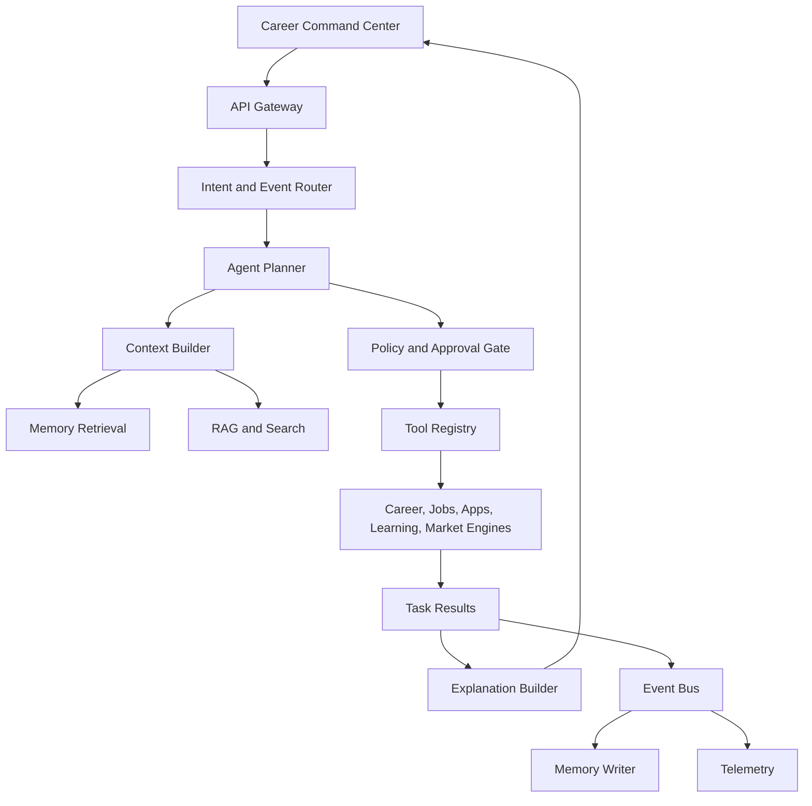

# Agent Orchestration Architecture

## Purpose

The Agent Orchestration Layer is the control plane for CareerOS AI. It interprets user intent, retrieves memory, selects tools, coordinates domain engines, requests approvals, executes approved actions, and writes auditable outcomes.

This is not a chatbot loop. It is a workflow orchestration system with AI planning inside explicit product and safety boundaries.

## Responsibilities

- Route user and system events to the correct agent mode.
- Build context packs from profile, memory, applications, jobs, learning, market signals, and recent activity.
- Select tools from approved tool registries.
- Produce plans with required approvals.
- Execute deterministic service calls and AI-assisted generation.
- Persist task state and reasoning traces.
- Emit events for downstream analytics, memory updates, recommendations, and notifications.

## Logical Architecture

## Core Runtime Objects

- `agent_session`: short-lived interaction context.
- `agent_task`: durable unit of work, such as "tailor resume for job".
- `agent_plan`: ordered steps, selected tools, expected outputs, approval requirements.
- `tool_call`: deterministic or AI-assisted capability invocation.
- `approval_request`: user authorization record for sensitive actions.
- `reasoning_summary`: concise user-safe explanation, not raw chain-of-thought.
- `execution_trace`: internal audit record for debugging and compliance.

## Execution Pattern

1. Receive user command, scheduled event, or integration event.
2. Classify intent, domain, urgency, and risk.
3. Load user context and relevant memories.
4. Create a bounded plan.
5. Validate plan against policy.
6. Execute safe steps or request approval.
7. Persist outputs and emit events.
8. Update recommendations, memory, and analytics.

## MVP Version

For MVP, implement a modular monolith orchestration service:

- Synchronous user-initiated workflows.
- Background jobs for monitoring and reminders.
- Hard-coded tool registry with typed functions.
- Basic plan schema stored in the primary database.
- Approval required for external actions.
- One primary LLM provider with abstraction boundary.

Recommended MVP workflows:

- Generate career analysis.
- Explain job match.
- Tailor resume draft.
- Create cover letter draft.
- Create learning plan.
- Update application tracker.

## Future Scale Version

For millions of users, split orchestration into dedicated services:

- Intent router service.
- Planner service.
- Context builder service.
- Tool execution workers.
- Approval service.
- Event processing workers.
- Model gateway with routing, fallback, rate limits, and cost controls.

Use an event bus for durable async workflows and a workflow engine for long-running, retryable tasks.

## Implementation Recommendations

- Define tool contracts with typed input/output schemas.
- Treat all external actions as side effects requiring policy checks.
- Store structured plans and task state in the primary database.
- Store large generated artifacts separately from task metadata.
- Build idempotency keys for tool calls.
- Separate user-visible explanations from internal traces.
- Add model evaluation fixtures for every high-value workflow.
- Support cancellation and retry for agent tasks.

## Tradeoffs and Alternatives

- Modular monolith first: faster development, simpler transactions, lower operational overhead. Harder to scale teams later.
- Microservices first: cleaner scaling boundaries, more operational complexity, slower MVP.
- Workflow engine first: robust retries and visibility, more setup cost.
- Custom job queue first: simpler MVP, less expressive for complex multi-step workflows.

## Complexity

- MVP complexity: High.
- Scale complexity: Very high.
- Main risks: unreliable tool outputs, unclear approvals, model cost, difficult debugging, context overload.

## Implementation Order

1. Define agent task, plan, tool call, and approval schemas.
2. Build typed tool registry.
3. Build context builder.
4. Implement MVP planner prompt and deterministic validators.
5. Add approval gate.
6. Add execution trace and event emission.
7. Add retry, cancellation, and evaluation harness.

