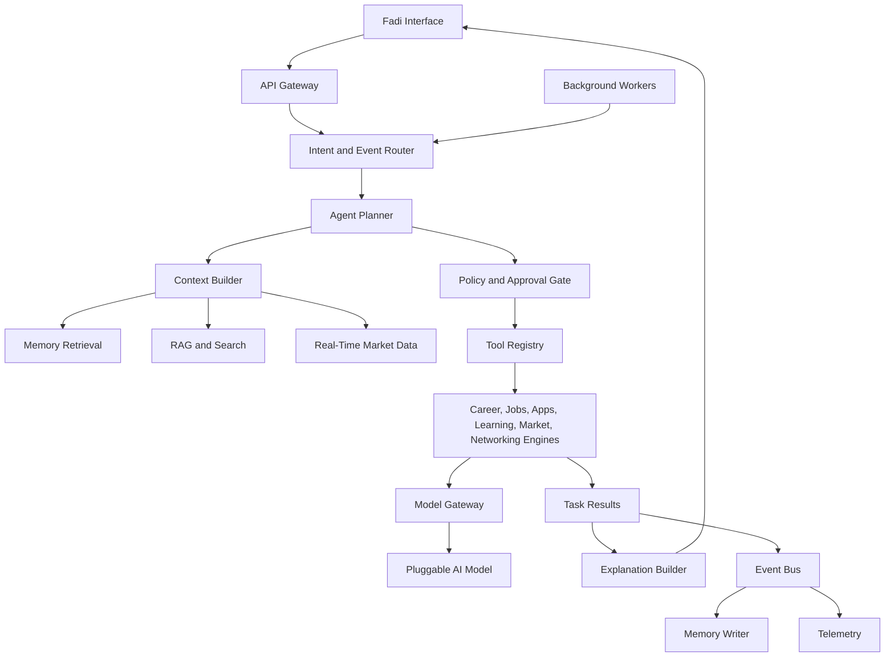

# Agent Orchestration Architecture

## Purpose

The Agent Orchestration Layer is the control plane for Fadi. It interprets user intent, retrieves memory, selects tools, coordinates domain engines, requests approvals, executes approved actions, and writes auditable outcomes.

This is not a chatbot loop. It is a workflow orchestration system with AI planning inside explicit product and safety boundaries. Fadi is the product; this layer is what makes Fadi intelligent and proactive.

## Responsibilities

- Route user and system events to the correct agent mode.
- Build context packs from profile, memory, applications, jobs, learning, market signals, and recent activity.
- Select tools from approved tool registries.
- Produce plans with required approvals.
- Validate plans against policy and safety rules.
- Execute deterministic service calls and AI-assisted generation through the model gateway.
- Persist task state and reasoning traces.
- Emit events for downstream analytics, memory updates, recommendations, and notifications.
- Run proactive background tasks (24x7 monitoring, opportunity discovery, market signal processing).

## Logical Architecture

## Core Runtime Objects

- `agent_session`: short-lived interaction context.
- `agent_task`: durable unit of work, such as "validate niche" or "tailor resume for job".
- `agent_plan`: ordered steps, selected tools, expected outputs, approval requirements.
- `tool_call`: deterministic or AI-assisted capability invocation through the model gateway.
- `approval_request`: user authorization record for sensitive external actions.
- `reasoning_summary`: concise user-safe explanation with evidence sources, not raw chain-of-thought.
- `execution_trace`: internal audit record for debugging and compliance.
- `market_context_pack`: real-time market signals assembled for a planning context.

## Execution Pattern

1. Receive user command, scheduled event, or integration event.
2. Classify intent, domain, urgency, and risk.
3. Load user context and relevant memories.
4. Fetch relevant real-time market data if applicable.
5. Create a bounded plan through the model gateway.
6. Validate plan against policy.
7. Execute safe steps or request approval.
8. Persist outputs and emit events.
9. Update recommendations, memory, and analytics.

## Model Gateway

All AI calls route through the model gateway. The gateway:

- Abstracts provider-specific SDK calls.
- Supports switching between OpenAI, Claude, Gemini, and local models.
- Manages routing, cost controls, rate limits, and fallbacks.
- Logs metadata (model name, operation type, token estimates) without sensitive content.
- Supports evaluation fixtures per workflow.

No orchestration code, tool, or engine imports a model provider SDK directly. Everything goes through the model gateway interface.

## MVP Version

For MVP, implement a modular monolith orchestration service:

- Synchronous user-initiated workflows.
- Background workers for monitoring and proactive discovery.
- Hard-coded tool registry with typed functions.
- Basic plan schema stored in the primary PostgreSQL database.
- Approval required for all external actions.
- Model gateway with one current provider (OpenAI).

Recommended MVP workflows:

- Validate user niche against current market data.
- Generate career analysis report.
- Explain job match and gaps.
- Tailor resume draft.
- Create cover letter draft.
- Create learning plan.
- Update application tracker.
- Surface proactive market signals.

## Future Scale Version

For millions of users, split orchestration into dedicated services:

- Intent router service.
- Planner service.
- Context builder service.
- Tool execution workers.
- Approval service.
- Event processing workers.
- Model gateway with multi-provider routing, fallback, rate limits, and cost controls.
- Background monitoring fleet.

Use an event bus for durable async workflows and a workflow engine for long-running, retryable tasks.

## Background Monitoring Architecture

Fadi works 24x7. Background workers:

- Check job sources for new opportunities matching the user's profile.
- Monitor market signal sources for relevant changes.
- Track geo-political and economic signals for the user's target sector.
- Detect deadlines approaching.
- Identify when previously validated niche assessments may have shifted.
- Surface relevant events and communities.

Background tasks emit events that feed into the recommendation engine and user notification system.

## Implementation Recommendations

- Define tool contracts with typed input/output schemas.
- Treat all external actions as side effects requiring policy checks.
- Store structured plans and task state in the primary database.
- Store large generated artifacts separately from task metadata.
- Build idempotency keys for tool calls.
- Separate user-visible explanations from internal traces.
- Add model evaluation fixtures for every high-value workflow.
- Support cancellation and retry for agent tasks.
- Never cache market signals indefinitely — respect freshness requirements.

## Tradeoffs and Alternatives

- Modular monolith first: faster development, simpler transactions, lower operational overhead.
- Microservices first: cleaner scaling boundaries, more operational complexity, slower MVP.
- Workflow engine first: robust retries and visibility, more setup cost.
- Custom job queue first: simpler MVP, less expressive for complex multi-step workflows.

## Complexity

- MVP complexity: High.
- Scale complexity: Very high.
- Main risks: unreliable tool outputs, unclear approvals, model cost, difficult debugging, context overload, stale market data.

## Implementation Order

1. Define agent task, plan, tool call, and approval schemas.
2. Build typed tool registry.
3. Build context builder with market data integration.
4. Implement model gateway abstraction.
5. Implement MVP planner prompt and deterministic validators.
6. Add approval gate.
7. Add background worker foundation.
8. Add execution trace and event emission.
9. Add retry, cancellation, and evaluation harness.
