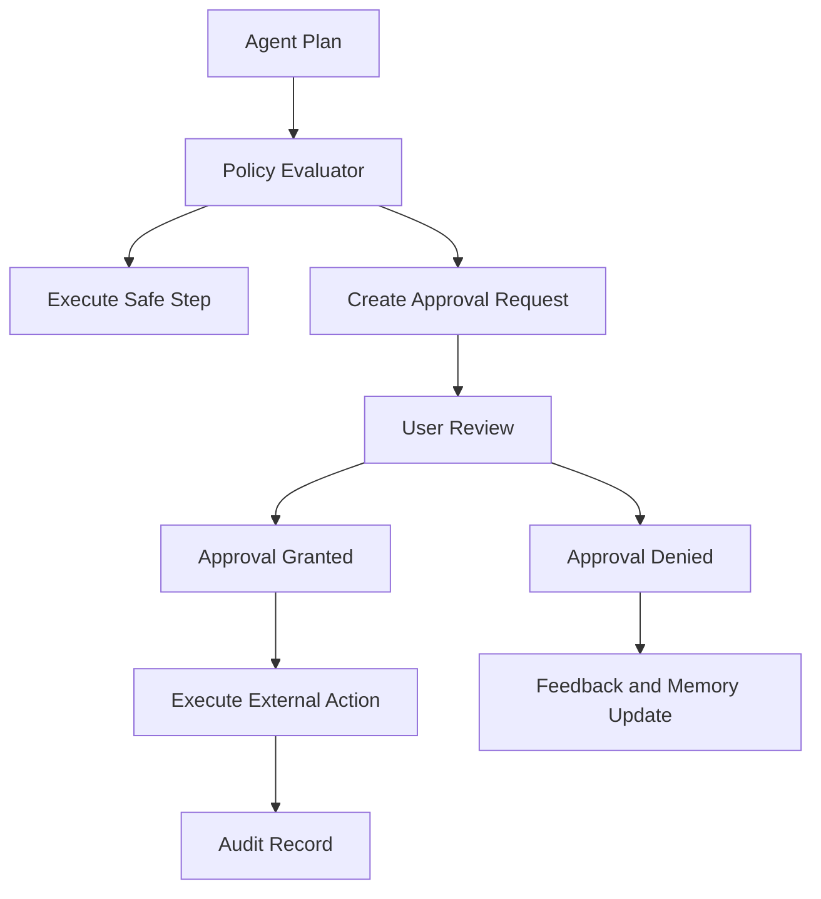

# AI Safety and Approval System

## Purpose

The AI Safety and Approval System ensures CareerOS AI remains user-controlled, auditable, and safe when analyzing sensitive data or preparing external actions.

The system must prevent unauthorized submission, messaging, profile updates, data sharing, and unsupported claims.

## Safety Boundaries

Always require approval for:

- Submitting applications.
- Sending emails or messages.
- Uploading resumes.
- Updating external profiles.
- Scheduling events.
- Connecting external accounts.
- Sharing personal data with third parties.

## Architecture

## Risk Levels

- Low: internal analysis, drafting, summarization.
- Medium: updating internal tracker, creating reminders.
- High: preparing external communication or documents.
- Critical: external submission, message sending, profile update, third-party data sharing.

## MVP Version

For MVP:

- Implement hard-coded policy rules.
- Require approval for all external actions.
- Show preview of content and destination.
- Store approval records.
- Block unsupported or fabricated claims in generated assets where detectable.

## Future Scale Version

At scale:

- Add policy engine.
- Add model output classifiers.
- Add anomaly detection.
- Add risk-based review paths.
- Add organization-level policies for enterprise customers.
- Add safety evaluation suites.

## Implementation Recommendations

- Make approval records immutable.
- Store who approved, what was approved, when, and exact content version.
- Use deterministic policy checks before AI generation and before action execution.
- Add content validation for fabricated credentials, salary claims, and unsupported experience.
- Keep user-visible explanations concise and specific.

## Tradeoffs and Alternatives

- Strict approvals reduce automation but build trust.
- Broad preauthorization increases convenience but raises risk.
- Policy-as-code improves consistency but adds implementation cost.
- Manual review does not scale for consumer workflows.

## Complexity

- MVP complexity: Medium.
- Scale complexity: High.
- Main risks: accidental external action, unclear consent, unsafe generated claims, audit gaps.

## Implementation Order

1. Define risk taxonomy.
2. Add approval request schema.
3. Add policy evaluator.
4. Add review UI requirements.
5. Add immutable audit records.
6. Add model safety evaluators later.

