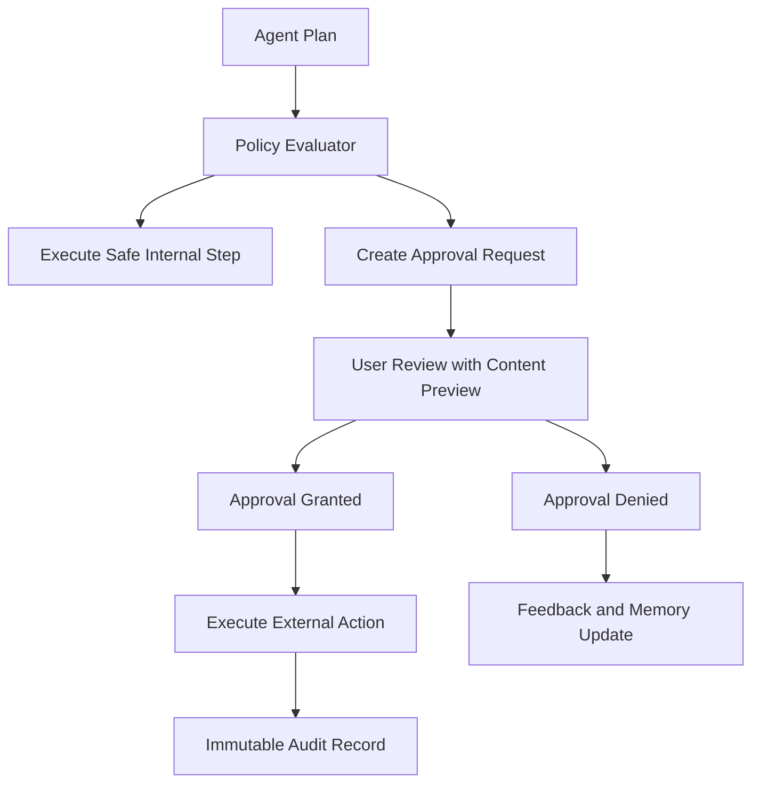

# AI Safety and Approval System

## Purpose

The AI Safety and Approval System ensures Kai remains user-controlled, auditable, and safe when analyzing sensitive data or preparing external actions.

The system must prevent unauthorized submission, messaging, profile updates, data sharing, fabricated claims, and unreviewed external actions. This is non-negotiable regardless of how autonomous Kai becomes.

## Safety Principles

- Kai is approval-gated for all external actions.
- Kai never fabricates data, credentials, skills, or market claims.
- Kai never takes irreversible external action without explicit user approval.
- All approvals are logged immutably.
- Users can always review, revise, or cancel prepared actions before they execute.

## Safety Boundaries

Always require approval before:

- Submitting applications.
- Sending emails or messages.
- Uploading resumes to external platforms.
- Updating external profiles.
- Scheduling events.
- Connecting external accounts.
- Sharing personal data with third parties.

Never requires approval (internal only):

- Analysis, drafting, summarization.
- Updating internal tracker.
- Creating reminders.
- Generating assets for user review.
- Running background monitoring.

## Architecture

## Risk Levels

- **Low**: internal analysis, drafting, summarization, monitoring.
- **Medium**: updating internal tracker, creating reminders, generating assets for review.
- **High**: preparing external communication or documents (user must review before anything is sent).
- **Critical**: external submission, message sending, profile update, third-party data sharing.

## Content Validation

Before generating any external-facing content, the engine validates:

- No fabricated credentials or certifications.
- No invented work experience or skills.
- No inflated salary claims.
- No fabricated market data or job statistics.
- No unsupported claims about the user's qualifications.

Validation failures block generation and surface a clear explanation to the user.

## Phase 1 MVP Version

- Hard-coded policy rules (no policy engine required yet).
- Approval required for all external actions.
- Show full preview of content and destination before approval.
- Store approval records with: who approved, what was approved, when, and exact content version.
- Block unsupported or fabricated claims in generated assets where detectable.

## Future Scale Version

At scale:

- Policy engine (rules-as-code).
- Model output classifiers for safety evaluation.
- Anomaly detection for unusual agent behavior.
- Risk-based review paths.
- Organization-level policies for enterprise customers.
- Safety evaluation suites with regression testing.

## Implementation Recommendations

- Make approval records immutable — they are a legal and trust record.
- Store who approved, what was approved, when, and exact content version.
- Use deterministic policy checks before AI generation and before action execution.
- Add content validation for fabricated credentials, salary claims, and unsupported experience.
- Keep user-visible approval copy concise and specific about what will happen.
- Log safety evaluations and policy decisions for debugging.

## Complexity

- Phase 1 complexity: Medium.
- Scale complexity: High.
- Main risks: accidental external action, unclear consent, unsafe generated claims, audit gaps.

## Implementation Order

1. Define risk taxonomy.
2. Add approval request schema.
3. Add policy evaluator (hard-coded Phase 1).
4. Add content validation for fabricated claims.
5. Add approval review UI.
6. Add immutable audit records.
7. Add model safety evaluators in later phases.
8. Add policy engine and organization-level policies in enterprise phase.
