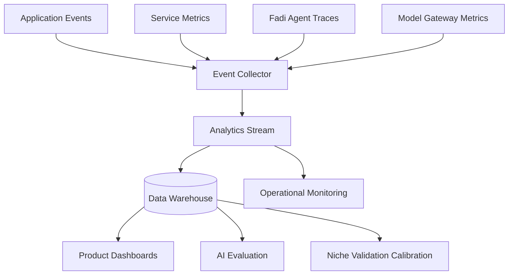

# Analytics and Telemetry

## Purpose

Analytics and telemetry help CareerOS improve product quality, Fadi's intelligence quality, recommendation usefulness, system performance, and business health — while respecting user privacy.

## Measurement Categories

- Product analytics
- Fadi task and agent telemetry
- Recommendation analytics
- AI quality metrics
- Model gateway cost and performance metrics
- Operational metrics
- Billing and usage metrics
- Safety and approval metrics

## Architecture

## Phase 1 Metrics

Product:

- Onboarding completion
- Profile completion
- Niche discovery engagement rate
- Niche validation engagement (read, accepted, challenged, revised)
- Career analysis generated
- Recommendation accepted or dismissed
- Opportunity saved
- Application asset generated
- Learning plan created
- Fadi assistant questions asked

Fadi/Agent:

- Task created
- Task completed
- Task failed
- Model gateway call latency
- Model gateway cost per operation
- Approval requested
- Approval granted or denied

Quality:

- User rating on career analysis
- Niche validation usefulness rating
- Recommendation dismissal reason
- Generated asset edited heavily (indicator of poor quality)
- Match explanation feedback
- Honest-assessment engagement (did user engage with contrarian Fadi output?)

## Phase 1 MVP Version

- Use structured application events with correlation IDs.
- Capture model gateway usage metadata and cost estimates.
- Capture key conversion funnels (onboarding → niche → report → jobs).
- Never store sensitive raw text in analytics: no resume content, LinkedIn text, prompt content, or salary data in events.
- Track niche validation outcomes to calibrate Fadi's honest-mentor accuracy over time.

## Future Scale Version

At scale:

- Data warehouse.
- Experimentation platform.
- AI evaluation dashboards.
- Niche validation calibration pipeline.
- Anomaly detection for Fadi task failures.
- Privacy-preserving aggregate cohort analytics.
- Real-time operational dashboards.

## Implementation Recommendations

- Define analytics event contracts.
- Separate analytics from security audit logs.
- Redact all sensitive content.
- Include user stage, plan, and feature context.
- Track user consent for analytics where required.
- Make telemetry sampling configurable.
- Add niche validation accuracy tracking as a first-class quality metric — it is core to Fadi's identity.

## Complexity

- Phase 1 complexity: Medium.
- Scale complexity: High.
- Main risks: sensitive data leakage in events, metric ambiguity, poor AI cost visibility, niche validation calibration blind spots.

## Implementation Order

1. Define event taxonomy (include niche validation events).
2. Add product and Fadi agent events.
3. Add model gateway usage tracking.
4. Add basic product funnel dashboards.
5. Add niche validation quality metrics.
6. Add warehouse and experimentation later.
