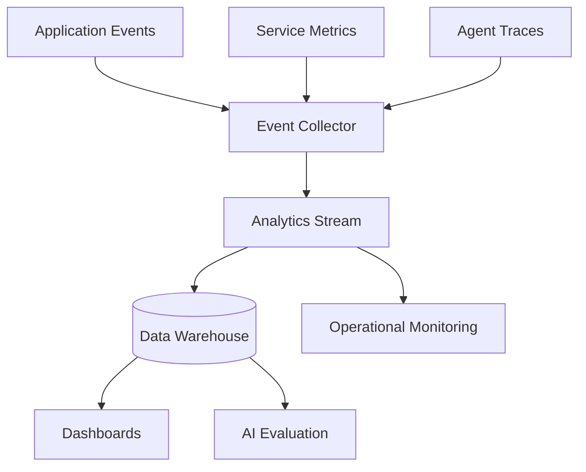

# Analytics and Telemetry

## Purpose

Analytics and telemetry should help CareerOS AI improve product quality, agent reliability, recommendation usefulness, system performance, and business health while respecting user privacy.

## Measurement Categories

- Product analytics
- Agent task telemetry
- Recommendation analytics
- AI quality metrics
- Operational metrics
- Billing and usage metrics
- Safety and approval metrics

## Architecture

## MVP Metrics

Product:

- Onboarding completion
- Profile completion
- Career analysis generated
- Recommendation accepted
- Opportunity saved
- Application asset generated
- Learning plan created

Agent:

- Task created
- Task completed
- Task failed
- Tool call latency
- Model cost
- Approval requested
- Approval granted or denied

Quality:

- User rating
- Recommendation dismissal reason
- Generated asset edited heavily
- Match explanation feedback

## MVP Version

For MVP:

- Use structured application events.
- Add correlation IDs.
- Capture model usage and cost.
- Capture key conversion funnels.
- Avoid storing sensitive raw text in analytics systems.

## Future Scale Version

At scale:

- Add data warehouse.
- Add experimentation platform.
- Add AI evaluation dashboards.
- Add anomaly detection for agent failures.
- Add privacy-preserving aggregate cohort analytics.
- Add real-time operational dashboards.

## Implementation Recommendations

- Define analytics event contracts.
- Separate analytics from audit logs.
- Redact sensitive content.
- Include tenant, region, plan, and feature context.
- Track user consent for analytics where required.
- Make telemetry sampling configurable.

## Tradeoffs and Alternatives

- Full event capture improves insight but increases privacy and cost concerns.
- Minimal analytics reduces risk but slows product learning.
- Session replay is high-risk for sensitive data and should be avoided initially.
- Aggregate analytics are safer but less diagnostic.

## Complexity

- MVP complexity: Medium.
- Scale complexity: High.
- Main risks: sensitive data leakage, metric ambiguity, poor AI cost visibility.

## Implementation Order

1. Define event taxonomy.
2. Add product and agent events.
3. Add model usage tracking.
4. Add basic dashboards.
5. Add warehouse and experimentation later.

