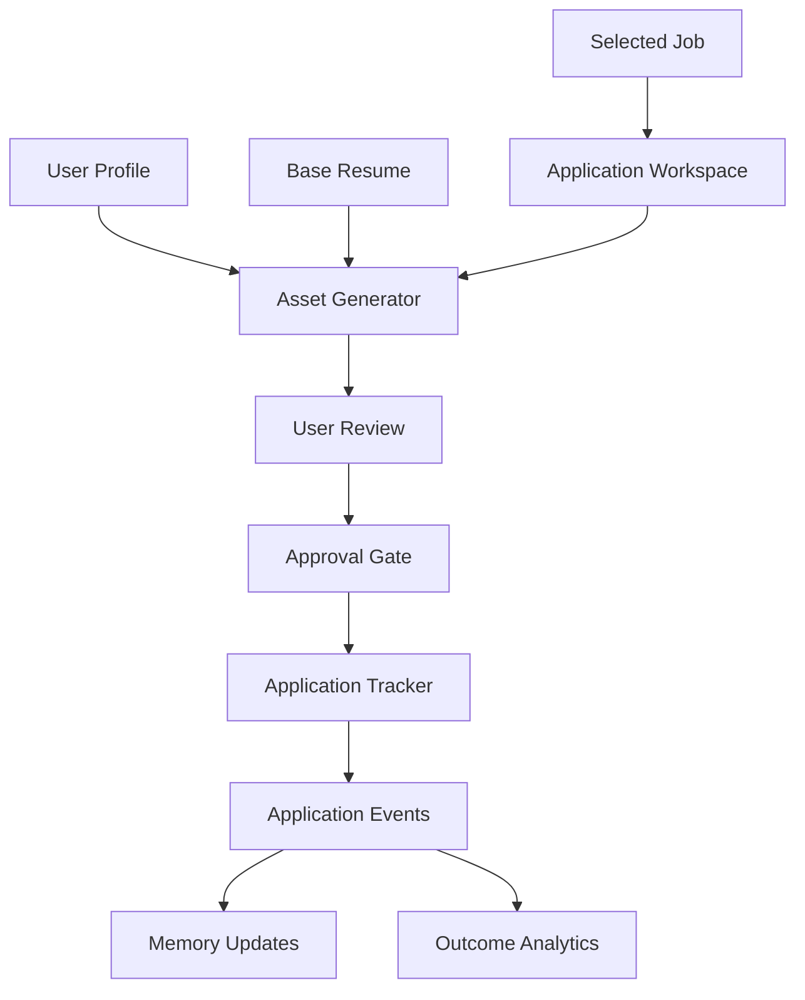

# Application Automation Engine

## Purpose

The Application Automation Engine helps users turn opportunities into high-quality applications. It drafts tailored resumes, cover letters, recruiter messages, interview plans, checklists, and tracking updates.

It must not submit applications or send external messages without explicit user approval.

## Capabilities

- Create application records.
- Tailor resume content to a target role.
- Generate cover letters.
- Draft recruiter or hiring manager messages.
- Build interview preparation plans.
- Track deadlines and next actions.
- Recommend follow-up actions.
- Learn from outcomes and feedback.

## Architecture

## Application Asset Types

- Tailored resume
- Cover letter
- Recruiter message
- Interview preparation plan
- Follow-up message
- Application checklist

## MVP Version

For MVP:

- Generate tailored resume drafts from a base resume and job description.
- Generate cover letter drafts.
- Create application tracker records.
- Add manual status updates.
- Require approval before any external action.
- Store generated asset versions.

## Future Scale Version

At scale:

- Add document rendering and export.
- Add role-specific templates.
- Add interview question prediction.
- Add email and calendar integrations.
- Add browser-assisted form preparation only after safety review.
- Add outcome learning from interviews, offers, and rejections.

## Implementation Recommendations

- Keep generated assets versioned.
- Show job requirements mapped to resume edits.
- Preserve user voice and facts.
- Never fabricate experience.
- Use structured diff summaries for resume changes.
- Store approval records for external submissions.
- Build quality checks for unsupported claims and missing evidence.

## Tradeoffs and Alternatives

- AI-generated documents are fast but need strong fact-checking.
- Template-based documents are consistent but less personalized.
- Hybrid generation with structured constraints is the preferred path.
- Full form automation is powerful but high-risk and should wait.

## Complexity

- MVP complexity: Medium.
- Scale complexity: High.
- Main risks: fabricated claims, weak personalization, accidental external submission, inconsistent document quality.

## Implementation Order

1. Define application and asset schemas.
2. Build application tracker.
3. Build resume tailoring workflow.
4. Build cover letter workflow.
5. Add user review and versioning.
6. Add approval gate for external actions.
7. Add integrations and automation later.

