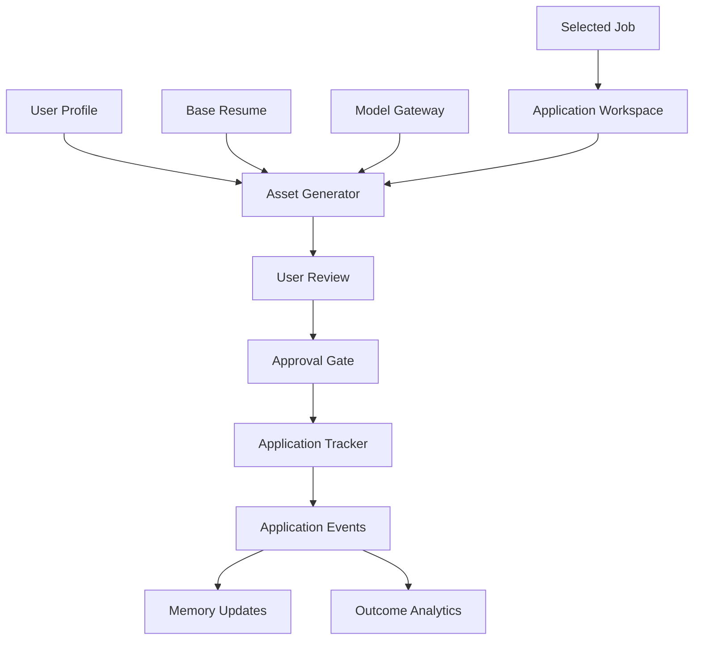

# Application Automation Engine

## Purpose

The Application Automation Engine helps users turn opportunities into high-quality, role-specific applications. It drafts tailored resumes, cover letters, recruiter messages, interview plans, checklists, and tracking updates.

This engine never submits applications or sends external messages without explicit user approval. Every asset is drafted for user review before any external action can occur.

## Capabilities

- Create application records.
- Tailor resume content to the specific requirements of a target role.
- Generate role-specific cover letters.
- Draft recruiter or hiring manager messages (for user approval before sending).
- Build interview preparation plans based on the role and company.
- Track deadlines and next actions.
- Recommend follow-up actions.
- Learn from outcomes and user feedback.

## Architecture

## Model Gateway

All asset generation goes through the model gateway. The engine never imports provider SDKs directly. The gateway supports pluggable model providers: currently OpenAI, designed to switch to Claude, Gemini, or local models.

## Application Asset Types

- Tailored resume (role-specific)
- Cover letter (role and company specific)
- Recruiter or hiring manager message (requires approval before sending)
- Interview preparation plan
- Follow-up message (requires approval before sending)
- Application checklist

## Phase 1 MVP Version

- Generate tailored resume drafts from base resume and job description through model gateway.
- Generate cover letter drafts.
- Create application tracker records.
- Manual status updates.
- Approval gate required before any external action.
- Store generated asset versions.

## Phase 2 Version

- Document rendering and export (PDF, DOCX).
- Role-specific document templates.
- Interview question prediction.
- Email integration with approval gate.

## Future Scale Version

- Browser-assisted form preparation (only after full safety and consent review).
- Outcome learning from interviews, offers, and rejections.
- Calendar integrations.

## Implementation Recommendations

- Keep generated assets versioned — the user should be able to see what changed.
- Show job requirements mapped explicitly to resume edits.
- Preserve the user's voice and facts — never fabricate experience.
- Never generate fake credentials, achievements, or skills.
- Use structured diff summaries for resume changes.
- Store approval records for all external submission actions.
- Build quality checks: flag unsupported claims and missing evidence in generated documents.

## Complexity

- Phase 1 complexity: Medium.
- Phase 2 complexity: Medium-high.
- Main risks: fabricated claims, weak personalization, accidental external submission, inconsistent document quality.

## Implementation Order

1. Define application and asset schemas.
2. Build application tracker.
3. Build resume tailoring workflow through model gateway.
4. Build cover letter workflow.
5. Add user review and versioning.
6. Add approval gate for all external actions.
7. Add integrations and broader automation in later phases.
