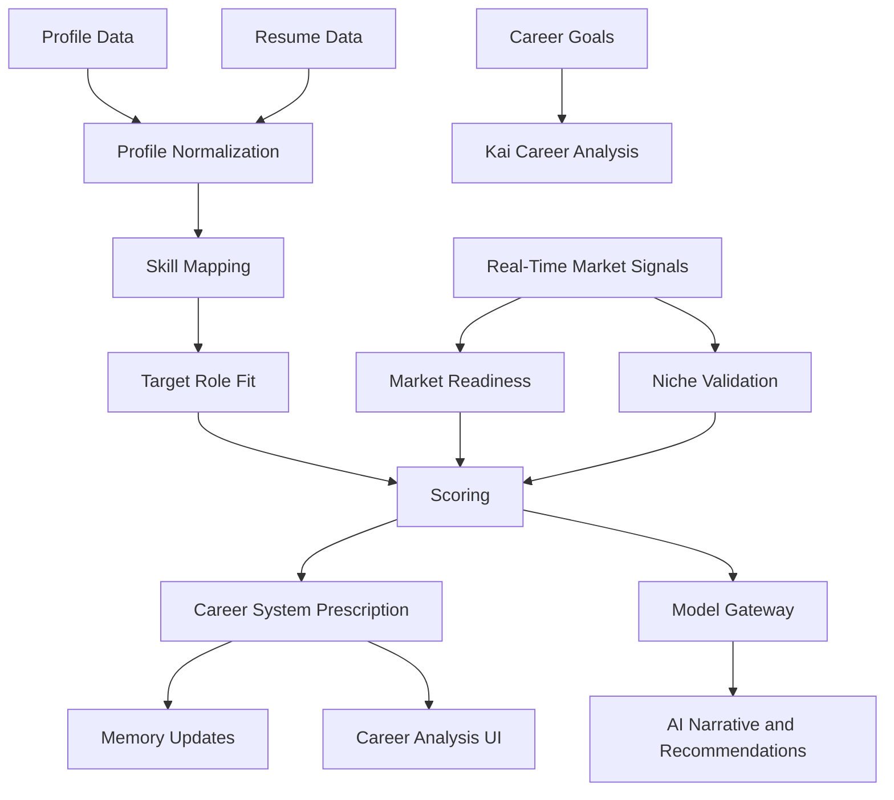

# Career Intelligence Engine

## Purpose

The Career Intelligence Engine is the core analytical brain of Kai. It analyzes the user's professional profile, validates their career direction against real market data, and converts that analysis into structured insight: strengths, evidence gaps, niche viability, career paths, opportunity readiness, market readiness, a prescribed career system, and recommended next actions.

This engine powers onboarding analysis, profile updates, job matching, learning plans, motivation, and long-term career strategy.

## Inputs

- User profile (confirmed fields — highest confidence)
- Resume data
- Work experience
- Education
- Certifications
- Skills
- Career goals
- Niche discovery conversation output
- Preferred industries and locations
- Salary expectations
- Application outcomes
- Interview feedback
- Available market signal data from trusted sources
- Job descriptions for target roles

## Outputs

- Career summary
- Niche assessment (supported, challenged, or redirected with evidence)
- Strengths with evidence
- Weaknesses and evidence gaps
- Transferable skills
- Target role fit
- Opportunity score
- Market readiness score
- Career system prescription: ordered plan for what to do and why
- Recommended career paths
- Growth recommendations
- Learning priorities

## Architecture

## Niche Validation

The niche validation component is critical to Kai's honest-mentor identity. When a user states a career direction, the engine:

1. Retrieves available market signal data for that role, seniority level, and geography.
2. Checks for known market saturation, contraction, geo-political headwinds, or hype patterns.
3. Compares the user's actual profile signal against what is needed for the stated direction.
4. Returns an assessment: supported, needs context, or challenged — each with evidence.

The engine must surface concerns when the data shows them. Suppressing a concern to produce a more comfortable result violates the honest-no-fake principle and destroys Kai's credibility.

## Model Gateway

All narrative generation goes through the model gateway. The engine never imports provider SDKs directly. The gateway provides:

- Pluggable model routing (OpenAI currently; Claude, Gemini, local models by design).
- Prompt versioning.
- Response validation (Zod).
- Cost and usage logging (metadata only — no sensitive content).

## Scoring Model

Initial scores are explainable composites:

- Profile completeness.
- Skill coverage for target roles.
- Experience relevance.
- Seniority alignment.
- Credential relevance.
- Location and remote fit.
- Salary realism.
- Market demand (from available data sources).
- Application outcome trends.

Avoid opaque scores. Every score must show its components.

## Phase 1 Version

Deterministic-plus-model hybrid:

- Deterministic profile completeness scoring.
- Skill extraction from resume and profile.
- Target role comparison against curated role-skill taxonomy.
- Basic niche validation using available directional market data.
- Model-generated career summary and system prescription through model gateway.
- Explainable score components stored with the analysis.

Phase 1 uses a curated role-skill taxonomy rather than a full knowledge graph.

## Phase 3+ Version

When real-time market data APIs are integrated:

- Live market demand data per role and geography.
- Geo-political and economic context.
- Regional labor market signals.
- Live salary intelligence.
- Dynamic niche revalidation triggered by market changes.

At scale:

- Global role and skill taxonomy.
- Outcome-based calibration from user application history.
- Recommendation models trained on anonymized aggregate behavior where permitted.
- Career path simulation.
- Personalization by industry, location, seniority, and user constraints.

## Implementation Recommendations

- Keep raw extraction separate from interpreted analysis.
- Store every score component and input version with the analysis record.
- Re-run analysis after major profile, goal, or market changes.
- Use human-readable evidence for every important claim.
- Never make employment guarantees.
- Build regression tests for career analysis examples — especially niche validation calibration.
- Tag analyses with the market data snapshot date so staleness is visible.

## Complexity

- Phase 1 complexity: Medium-high (niche validation adds complexity above basic profiling).
- Phase 3+ complexity: High.
- Main risks: low-quality skill extraction, biased niche recommendations, suppressed concerns, unsupported career claims.

## Implementation Order

1. Define profile normalization schema.
2. Build resume and profile skill extraction.
3. Create initial role-skill taxonomy.
4. Implement niche validation logic (directional, Phase 1).
5. Implement score components.
6. Generate explainable analysis report and system prescription through model gateway.
7. Connect outputs to memory, recommendations, and learning plans.
8. Wire real-time market data APIs (Phase 3).
9. Add outcome-based calibration later.
