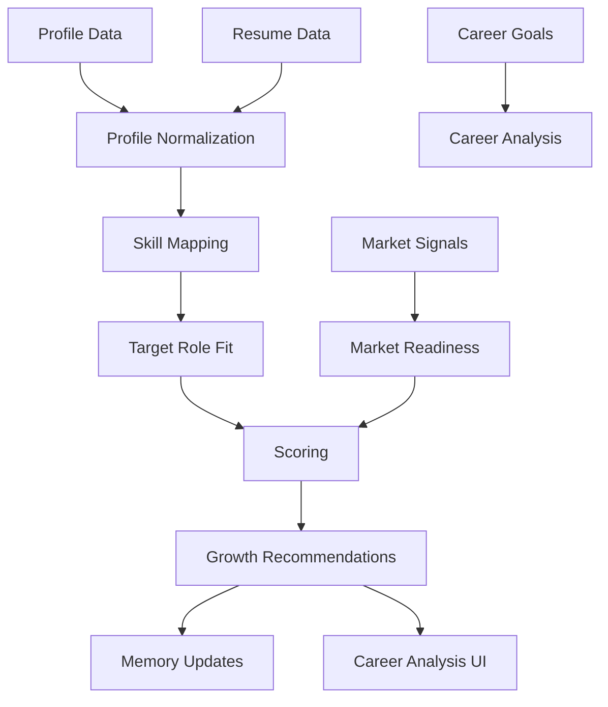

# Career Intelligence Engine

## Purpose

The Career Intelligence Engine analyzes a user's professional profile and converts it into structured insight: strengths, weaknesses, missing skills, career paths, opportunity readiness, market readiness, and recommended next actions.

This engine should power onboarding, profile updates, job matching, learning plans, motivation, and long-term career strategy.

## Inputs

- User profile
- Resume data
- Work experience
- Education
- Certifications
- Skills
- Career goals
- Preferred industries and locations
- Salary expectations
- Application outcomes
- Interview feedback
- Market signals
- Job descriptions for target roles

## Outputs

- Career summary
- Strengths
- Weaknesses
- Missing skills
- Transferable skills
- Target role fit
- Opportunity score
- Market readiness score
- Recommended career paths
- Growth recommendations
- Learning priorities

## Architecture

## Scoring Model

Initial scores should be explainable composites:

- Profile completeness
- Skill coverage for target roles
- Experience relevance
- Seniority alignment
- Credential relevance
- Location and remote fit
- Salary realism
- Market demand
- Application outcome trends

Avoid opaque scores without component explanations.

## MVP Version

Implement a deterministic-plus-LLM hybrid:

- Deterministic profile completeness scoring.
- Skill extraction from resume and profile.
- Target role comparison against a curated role-skill library.
- LLM-generated career summary and recommendations.
- Explainable score components stored with the analysis.

MVP target roles can use a curated taxonomy rather than a full knowledge graph.

## Future Scale Version

At scale:

- Use a global role and skill taxonomy.
- Add region-specific labor market signals.
- Add outcome-based calibration from user applications.
- Use recommendation models trained on anonymized aggregate behavior where permitted.
- Add career path simulations.
- Personalize by industry, location, seniority, and user constraints.

## Implementation Recommendations

- Keep raw extraction separate from interpreted analysis.
- Store every score component and input version.
- Re-run analysis after major profile, market, or goal changes.
- Use human-readable evidence for every important claim.
- Build regression tests for career analysis examples.
- Avoid making employment guarantees.

## Tradeoffs and Alternatives

- LLM-only analysis is fast to prototype but difficult to audit.
- Rule-based scoring is explainable but can be brittle.
- Hybrid scoring gives the best MVP balance.
- ML ranking improves over time but requires enough clean outcome data.

## Complexity

- MVP complexity: Medium.
- Scale complexity: High.
- Main risks: low-quality skill extraction, biased recommendations, unsupported career claims.

## Implementation Order

1. Define profile normalization schema.
2. Build resume and profile skill extraction.
3. Create initial role-skill taxonomy.
4. Implement score components.
5. Generate explainable analysis report.
6. Connect outputs to memory, recommendations, and learning plans.
7. Add outcome-based calibration later.

