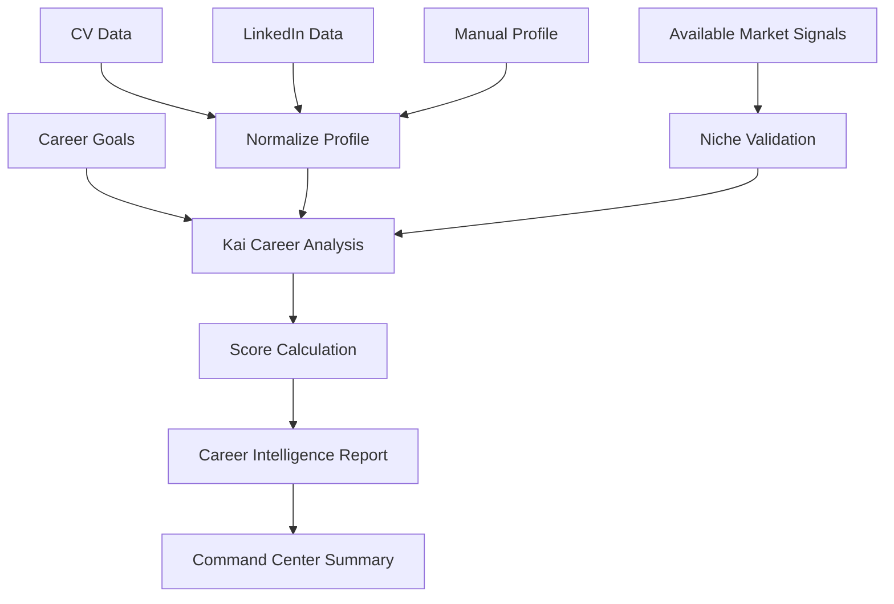

# Career Intelligence Report Spec

## Purpose

The Career Intelligence Report is the first major Kai value moment. It should feel like a personal career strategist and honest mentor has reviewed the user's CV, LinkedIn profile, and goals — and returned an accurate, specific, actionable assessment. The report does not just validate goals; it challenges them where the data warrants it.

## Report Inputs

- CV parsed text and summary.
- LinkedIn pasted or imported context.
- Manual profile fields (highest confidence).
- Career goals.
- Target role.
- Preferred locations.
- Remote preference.
- Salary expectation if provided.
- Extracted skills.
- Niche discovery conversation output.
- Available market signal data for the target role and geography.

## Report Generation Flow



## Report Sections

### 1. Kai Summary Card

Purpose:

- Deliver the honest-mentor opening: who the user is, where they want to go, and what the data says.

Content:

- Current career identity.
- Target direction.
- Niche assessment: supported, challenged, or redirected.
- Evidence basis for the assessment.

Kai copy pattern:

> I see you as a [career identity] with strengths in [strengths]. Your target direction is [target role]. [Honest assessment based on available market data]. The most important thing I noticed is [specific, evidence-grounded insight].

### 2. Niche Assessment

Purpose:

- Communicate Kai's honest view of the user's career direction, grounded in data.

Content:

- Direction status: Supported / Needs Context / Challenged.
- Evidence summary: what market data shows.
- Source attribution and confidence level.
- Next step given the assessment.

Kai copy patterns:

Supported: > The data supports your direction in [geography]. [Specific evidence from job data and market signals]. Here is what the realistic path looks like.

Challenged: > The data I am seeing tells a more specific story about this direction. [Market reality with evidence]. I want you to have an accurate picture before you invest heavily. Here is what I recommend given this context.

### 3. Skill Analysis

Purpose:

- Show skills the user already demonstrates with evidence.

Content:

- Core skills with evidence source and confidence.
- Supporting skills with evidence source.

Wireframe:

```text
[Skill Analysis]
Core Skills
- Skill name | Evidence | Confidence

Supporting Skills
- Skill name | Evidence | Confidence
```

### 4. Missing Skills and Evidence Gaps

Purpose:

- Identify blockers between current profile and target roles. Presented constructively.

Content:

- Missing skill or evidence gap.
- Why it matters for the target role.
- Severity.
- Suggested concrete action.

Kai copy pattern:

> The biggest gap for your target role is [skill or evidence]. This matters because hiring teams for [role] typically expect [requirement]. The fastest way to address it is [specific action].

### 5. Career Opportunities

Purpose:

- Show realistic opportunity categories, not just a job list.

Content:

- Best-fit role titles.
- Stretch role titles with what is missing.
- Adjacent role titles worth exploring.
- Roles to avoid for now with honest reasoning.

### 6. Market Demand

Purpose:

- Provide grounded demand context from available data sources.

Content:

- Demand level: high, medium, low, or uncertain.
- Evidence basis: job data sample, known skill demand, or limited data.
- Source attribution and date.
- Confidence caveat.

Kai copy pattern:

> From the data available for your geography, demand for [target role] appears [level] based on [source summary]. This is a directional signal. I will update this as better data becomes available in Phase 3.

### 7. Recommended Learning Path

Purpose:

- Convert gaps into practical learning — prioritized by market demand.

Content:

- Priority skill or evidence type.
- Learning objective.
- Suggested resource or portfolio project.
- Estimated time.
- Why it matters given the market.

Wireframe:

```text
[Learning Path]
1. Skill
   Goal:
   Resource or project:
   Estimated time:
   Why it matters now:
```

### 8. Resume Quality Score

Purpose:

- Show how well the CV communicates career value.

Score components:

- Completeness.
- Clarity.
- Evidence of impact (measurable outcomes).
- Skill visibility.
- Target-role alignment.

Score range: 0-100.

Kai copy pattern:

> Your resume quality score is [score]/100. The strongest area is [strength]. The biggest improvement is [specific, actionable improvement].

### 9. Career Readiness Score

Purpose:

- Show how ready the user appears for their target roles.

Score components:

- Target role skill fit.
- Experience relevance.
- Profile completeness.
- Resume quality.
- Learning gap severity.
- Available market fit data.

Score range: 0-100.

Kai copy pattern:

> Your career readiness score is [score]/100 for [target role]. You are strongest in [strength]. The fastest path to improvement is [specific action].

### 10. Career System Prescription

Purpose:

- Give the user a concrete ordered plan, not just a score. This is Kai's system prescription.

Content:

- Step 1 through 3 (or more) in priority order.
- Each step tied to a specific goal, action, and expected outcome.
- Timeline recommendation.

Kai copy pattern:

> Based on your analysis, here is the system I recommend: First, [specific action and why]. Second, [specific action and why]. Third, [specific action and why]. Follow this for [timeframe] and your readiness score should improve significantly.

## Report Wireframe

```text
------------------------------------------------
Career Intelligence Report
Generated from: CV + LinkedIn + Profile + Market Signals

[Kai Summary Card]
"I see you as..." + niche assessment

[Scores]
Career Readiness: [score]/100
Resume Quality: [score]/100

[Niche Assessment]
Direction status + evidence + source attribution

[Strengths]
3-5 bullets with evidence

[Skill Analysis]
Core skills and evidence

[Missing Skills and Evidence Gaps]
Ranked gaps with why they matter

[Career Opportunities]
Best fit / stretch / adjacent / avoid

[Market Demand]
Available signal with source and confidence caveat

[Learning Path]
3 recommended actions (market prioritized)

[Career System Prescription]
1. [Action]
2. [Action]
3. [Action]
------------------------------------------------
```

## Quality Rules

- Use evidence from user inputs.
- Never produce generic career advice that could apply to anyone.
- Never fabricate market data, job numbers, or salary figures.
- Surface concerns and challenges — do not hide them.
- Make gaps constructive: state the gap and the fastest way to close it.
- Keep scores explainable: show the components.
- Let the user correct assumptions.
- Source attribution must appear on every market claim.

## Report Success Metrics

- Report generated successfully.
- User scrolls through the full report.
- User rates report useful.
- User engages with niche assessment (reads it, does not immediately dismiss).
- User clicks a recommended next action or system step.
- User asks Kai a report-related question.
