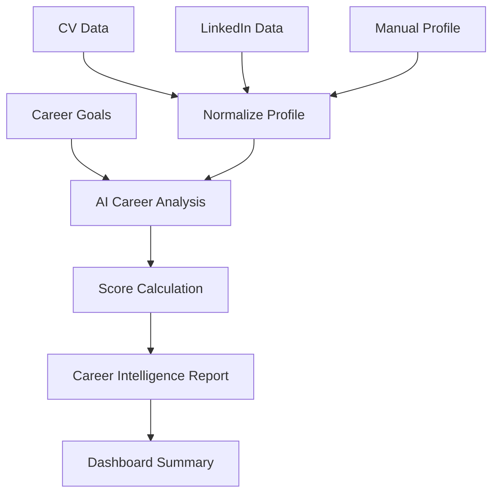

# Career Intelligence Report Spec

## Purpose

The Career Intelligence Report is the first major value moment in CareerOS AI. It should feel like a personal career strategist has reviewed the user's CV, LinkedIn profile, and goals, then produced a practical, honest, actionable report.

## Report Inputs

- CV parsed text and summary.
- LinkedIn pasted/imported context.
- Manual profile fields.
- Career goals.
- Target role.
- Preferred locations.
- Remote preference.
- Salary expectation if provided.
- Extracted skills.

## Report Generation Flow



## Report Sections

### 1. Career Summary

Purpose:

- Explain who the user is professionally in plain language.

Content:

- Current career identity.
- Experience level.
- Primary domain strengths.
- Likely next career direction.

AI copy pattern:

> Based on your CV and profile, you are currently positioned as a [career identity] with strengths in [strengths]. Your next best direction appears to be [target direction], especially if you strengthen [gap].

### 2. Skill Analysis

Purpose:

- Show skills the user already demonstrates.

Content:

- Core skills.
- Supporting skills.
- Evidence source.
- Confidence level.

Wireframe:

```text
[Skill Analysis]
Core Skills
- Skill name | Evidence | Confidence

Supporting Skills
- Skill name | Evidence | Confidence
```

### 3. Missing Skills

Purpose:

- Identify blockers between current profile and target roles.

Content:

- Missing skill.
- Why it matters.
- Severity.
- Suggested action.

AI copy pattern:

> The biggest gap for your target role is [skill]. This matters because many relevant job descriptions expect evidence of [requirement]. The fastest way to address it is [action].

### 4. Career Opportunities

Purpose:

- Show realistic opportunity categories, not only job listings.

Content:

- Best-fit role titles.
- Stretch role titles.
- Adjacent role titles.
- Roles to avoid for now.

Wireframe:

```text
[Career Opportunities]
Best Fit
- Role: Why it fits

Stretch
- Role: What is missing

Adjacent
- Role: Why it may be worth exploring
```

### 5. Market Demand

Purpose:

- Provide lightweight demand context without pretending to have real-time market intelligence in MVP.

Content:

- Demand level: high, medium, low, or uncertain.
- Evidence basis: current job source sample, role frequency, known skill demand, or unavailable.
- Caveat.

AI copy pattern:

> From the job data available in this MVP, demand for [target role] appears [level]. This is a directional signal, not a complete market forecast.

### 6. Recommended Learning Path

Purpose:

- Convert gaps into practical learning.

Content:

- Priority skill.
- Learning objective.
- Suggested resource or project.
- Estimated time.
- Career impact.

Wireframe:

```text
[Learning Path]
1. Skill
   Goal:
   Resource:
   Estimated time:
   Why it matters:
```

### 7. Resume Quality Score

Purpose:

- Show how well the CV communicates career value.

Score components:

- Completeness.
- Clarity.
- Evidence of impact.
- Skill visibility.
- Target-role alignment.

Score range:

- 0-100.

AI copy pattern:

> Your resume quality score is [score]/100. The strongest area is [strength]. The biggest improvement is [specific improvement].

### 8. Career Readiness Score

Purpose:

- Show how ready the user appears for target roles.

Score components:

- Target role skill fit.
- Experience relevance.
- Profile completeness.
- Resume quality.
- Learning gap severity.
- Job market fit from available data.

Score range:

- 0-100.

AI copy pattern:

> Your career readiness score is [score]/100 for [target role]. You are strongest in [strength], and the fastest path to improvement is [action].

## Report Wireframe

```text
------------------------------------------------
Career Intelligence Report
Generated from: CV + LinkedIn + Profile Goals

[AI Summary Card]
"I see you as..."

[Scores]
Career Readiness: 72/100
Resume Quality: 68/100

[Strengths]
3-5 bullets with evidence

[Skill Analysis]
Core skills and evidence

[Missing Skills]
Ranked gaps with why they matter

[Career Opportunities]
Best fit / stretch / adjacent roles

[Market Demand]
Directional market signal with caveat

[Learning Path]
3 recommended learning actions

[Recommended Next Actions]
1. Review recommended jobs
2. Improve profile gap
3. Save a learning action
------------------------------------------------
```

## Quality Rules

- Use evidence from user inputs.
- Avoid generic career advice.
- Avoid unsupported market claims.
- Make gaps constructive.
- Keep scores explainable.
- Let the user correct assumptions.

## Report Success Metrics

- Report generated successfully.
- User scrolls through report.
- User rates report useful.
- User clicks a recommended next action.
- User asks the assistant a report-related question.

