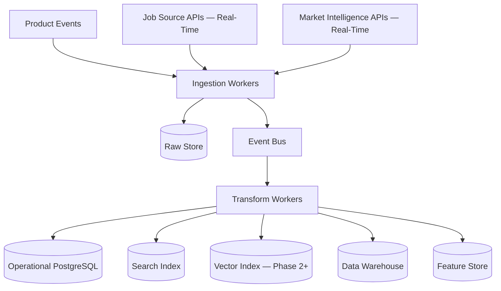

# Data Pipeline Architecture

## Purpose

The Data Pipeline Architecture moves data from product events, third-party integrations, job sources, market intelligence sources, AI outputs, and user feedback into operational stores, analytics stores, search indexes, vector indexes, and recommendation features.

Real-time data pipelines are what make Scout's market intelligence and proactive job discovery credible. Data pipelines are the infrastructure backbone of the honest-mentor promise.

## Pipeline Types

- Operational ingestion (user actions, onboarding, applications)
- Job source ingestion (continuous, 24x7)
- Market intelligence ingestion (continuous, from trusted third-party APIs)
- Event processing
- Search indexing
- Vector embedding
- Analytics ingestion
- Recommendation feature generation

## Architecture

## Real-Time Data Requirements

Job source pipelines:

- Poll or subscribe to job source APIs.
- Normalize and deduplicate incoming jobs.
- Mark stale/closed jobs quickly.
- Emit `job.discovered` events to trigger matching workers.

Market intelligence pipelines:

- Ingest from trusted government, economic, and industry sources.
- Tag every signal with source name, publication date, and confidence.
- Emit `market_signal.ingested` events to trigger niche validation updates and recommendation refreshes.

## Phase 1 MVP Version

- Use background workers for job ingestion (scheduled, hourly or more frequently).
- Use PostgreSQL as the primary operational source of truth.
- Use an event table for domain events.
- Use scheduled jobs for initial market signal collection (directional, Phase 1).
- Use batch embedding jobs for documents (Phase 2).
- Export analytics events to a warehouse later if needed.

## Phase 3 Scale Version

- Streaming ingestion from multiple job source APIs.
- Real-time market intelligence API integration.
- Raw immutable data store for compliance and replay.
- Warehouse transformations for analytics.
- Feature store for recommendation models.
- Backfill and replay systems.
- Regional data processing.
- Pipeline observability and data quality checks.

## Freshness Requirements

Market data freshness requirements:

- Job data: freshness within 24 hours; stale jobs removed within 48 hours.
- Market signals: freshness tags required; signals older than 90 days flagged as potentially outdated.
- Salary data: freshness within the source's stated update cycle.

Scout never presents stale data as current without explicitly flagging it.

## Implementation Recommendations

- Store raw external payloads where legally permitted.
- Normalize into canonical schemas before use.
- Add source versioning.
- Make ingestion idempotent.
- Track pipeline lineage.
- Monitor freshness and failure rates.
- Avoid embedding or indexing data before consent checks.
- Log ingestion errors without logging sensitive payload content.

## Complexity

- Phase 1 complexity: Medium (scheduled workers, directional data).
- Phase 3 complexity: Very high (real-time, multi-source, regional).
- Main risks: stale data presented as current, duplicate records, source schema changes, privacy mistakes.

## Implementation Order

1. Define source and canonical schemas.
2. Build Phase 1 job ingestion workers (scheduled).
3. Build Phase 1 market signal ingestion (directional sources).
4. Add event publication.
5. Phase 3: add real-time APIs for job and market data.
6. Add indexing and embedding jobs (Phase 2).
7. Add analytics export.
8. Add streaming and feature store later.
