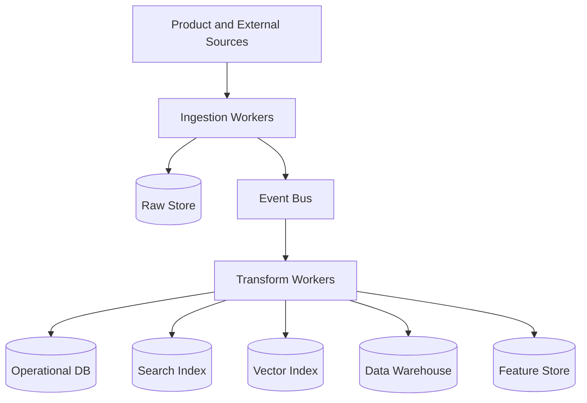

# Data Pipeline Architecture

## Purpose

The Data Pipeline Architecture moves data from product events, integrations, jobs, market sources, AI outputs, and user feedback into operational stores, analytics stores, search indexes, vector indexes, and recommendation features.

## Pipeline Types

- Operational ingestion
- Event processing
- Search indexing
- Vector embedding
- Analytics ingestion
- Market data ingestion
- Job source ingestion
- Recommendation feature generation

## Architecture

## MVP Version

For MVP:

- Use background workers for ingestion.
- Use an operational database as the primary source of truth.
- Use an event table for domain events.
- Use simple scheduled jobs for market and job ingestion.
- Use batch embedding jobs for documents.
- Export analytics events to a warehouse later if needed.

## Future Scale Version

At scale:

- Use streaming ingestion.
- Add raw immutable data lake.
- Add warehouse transformations.
- Add feature store.
- Add backfill and replay systems.
- Add regional data processing.
- Add pipeline observability and data quality checks.

## Implementation Recommendations

- Store raw external payloads where legally permitted.
- Normalize into canonical schemas.
- Add source versioning.
- Make ingestion idempotent.
- Track pipeline lineage.
- Monitor freshness and failure rates.
- Avoid embedding or indexing data before consent checks.

## Tradeoffs and Alternatives

- Batch jobs are simpler but less real-time.
- Streaming improves freshness but increases complexity.
- Raw data lake supports replay but increases governance needs.
- Feature store is unnecessary until recommendations need ML scale.

## Complexity

- MVP complexity: Medium.
- Scale complexity: Very high.
- Main risks: stale data, duplicate records, source schema changes, privacy mistakes.

## Implementation Order

1. Define source and canonical schemas.
2. Build ingestion workers.
3. Add event publication.
4. Add indexing and embedding jobs.
5. Add analytics export.
6. Add streaming and feature store later.

