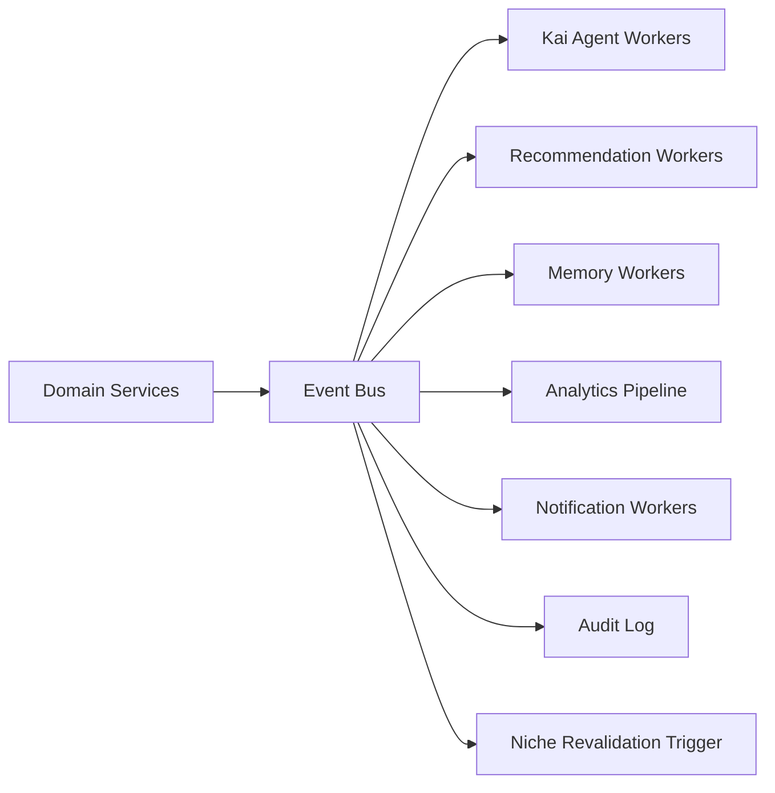

# Event-Driven Architecture

## Purpose

CareerOS needs event-driven architecture because Kai is proactive. Profile changes, new job discoveries, market signal changes, deadline arrivals, learning progress, and agent task completions should trigger Kai recommendations and workflows — without requiring the user to manually refresh or ask.

This is what makes Kai feel like it is working for the user around the clock.

## Event Principles

- Events represent facts that happened.
- Events are immutable.
- Consumers are idempotent.
- Events include user scope.
- Sensitive payloads are minimized — no resume text, prompt content, or raw personal data in events.
- Long-running workflows persist state separately from event payloads.

## Architecture

## Key Events

User lifecycle:

- `user.created`
- `profile.updated`
- `onboarding.completed`

Career intelligence:

- `resume.parsed`
- `niche.discovery.completed`
- `niche.validated`
- `niche.challenged`
- `career_analysis.completed`
- `career_analysis.failed`

Job discovery:

- `job.discovered`
- `job.expired`
- `job.match.created`
- `opportunity.saved`
- `opportunity.rejected`

Market intelligence:

- `market_signal.ingested`
- `market_signal.niche_relevance_updated`

Applications:

- `application.created`
- `application.status_changed`
- `application.asset_generated`
- `approval.requested`
- `approval.granted`
- `approval.denied`

Learning:

- `learning_plan.created`
- `learning_item.completed`
- `proof_of_work.submitted`

Agent:

- `recommendation.created`
- `recommendation.accepted`
- `agent_task.completed`

## Phase 1 MVP Version

- Use a durable job queue plus an append-only event table.
- Publish domain events after committed database writes.
- Use background workers for recommendations, memory updates, and notifications.
- Keep event payloads small and reference entity IDs.

## Phase 3+ Version

At scale:

- Managed event bus or streaming platform.
- Partition by user, region, and event type.
- Dead-letter queues.
- Schema registry.
- Event replay for analytics and recommendation rebuilding.
- Consumer lag monitoring.
- Niche revalidation triggered by significant market signal changes.

## Implementation Recommendations

- Use the outbox pattern for reliable publication.
- Version event schemas.
- Include idempotency keys.
- Do not put full resumes, prompts, or sensitive documents in event payloads.
- Build replay-safe consumers.
- Track event causality with correlation IDs.
- When market signals change significantly, emit events that trigger niche revalidation for affected users.

## Complexity

- Phase 1 complexity: Medium.
- Phase 3 complexity: High.
- Main risks: duplicate processing, event schema drift, hard-to-debug async chains.

## Implementation Order

1. Define event naming and schema conventions.
2. Add event table and outbox.
3. Add workers for memory, recommendation, and notification updates.
4. Add niche revalidation trigger events.
5. Add dead-letter handling.
6. Add event replay and schema registry later.
