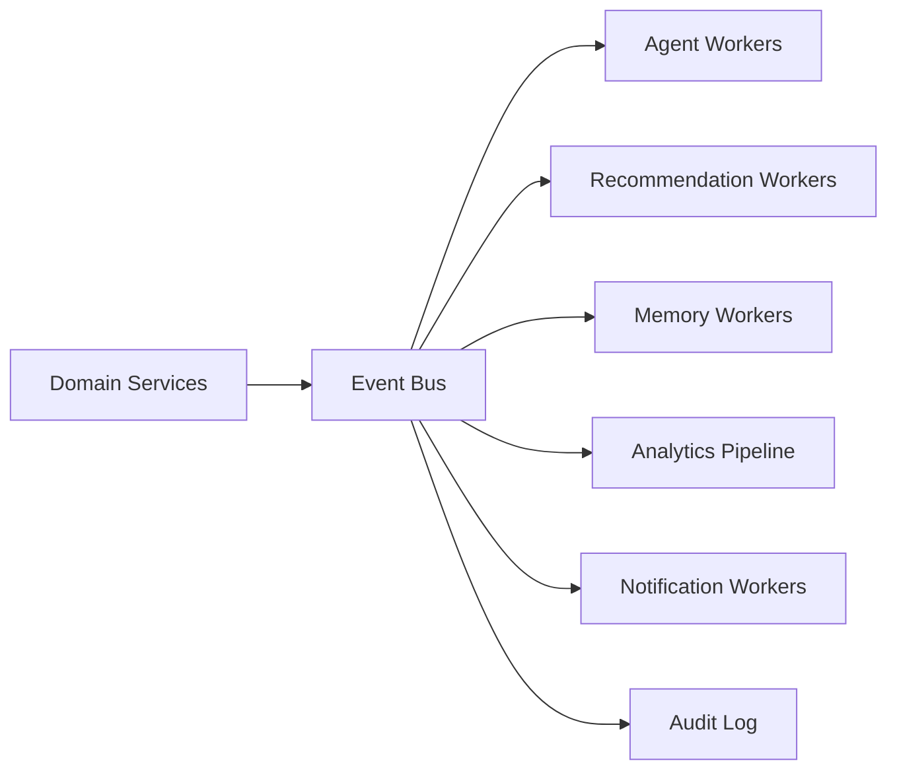

# Event-Driven Architecture

## Purpose

CareerOS AI needs event-driven architecture because the product is proactive. Profile changes, new jobs, deadlines, learning progress, market signals, and agent task outcomes should trigger recommendations and workflows without requiring the user to manually refresh or ask.

## Event Principles

- Events represent facts that happened.
- Events should be immutable.
- Consumers should be idempotent.
- Events should include tenant and user scope where applicable.
- Sensitive payloads should be minimized.
- Long-running workflows should persist state separately from event payloads.

## Architecture

## Key Events

- `user.created`
- `profile.updated`
- `resume.parsed`
- `career_analysis.completed`
- `job.discovered`
- `job.match.created`
- `opportunity.saved`
- `opportunity.rejected`
- `application.created`
- `application.status_changed`
- `application.asset_generated`
- `learning_plan.created`
- `learning_item.completed`
- `market_signal.ingested`
- `recommendation.created`
- `recommendation.accepted`
- `approval.requested`
- `approval.granted`
- `agent_task.completed`

## MVP Version

For MVP:

- Use a durable job queue plus an append-only event table.
- Publish domain events after committed database writes.
- Use background workers for recommendations, memory updates, and notifications.
- Keep event payloads small and reference entity IDs.

## Future Scale Version

At scale:

- Use a managed event bus or streaming platform.
- Partition by tenant, region, and event type.
- Add dead-letter queues.
- Add schema registry.
- Add event replay for analytics and recommendation rebuilding.
- Add consumer lag monitoring.

## Implementation Recommendations

- Use the outbox pattern for reliable publication.
- Version event schemas.
- Include idempotency keys.
- Do not put full resumes or sensitive generated documents in event payloads.
- Build replay-safe consumers.
- Track event causality with correlation IDs.

## Tradeoffs and Alternatives

- Synchronous workflows are simpler but limit proactivity.
- Queue-based async is good for MVP but less analytical.
- Streaming platforms scale well but add operational complexity.
- Event sourcing all entities is powerful but excessive for MVP.

## Complexity

- MVP complexity: Medium.
- Scale complexity: High.
- Main risks: duplicate processing, event schema drift, hard-to-debug async chains.

## Implementation Order

1. Define event naming and schema conventions.
2. Add event table and outbox.
3. Add workers for memory and recommendation updates.
4. Add dead-letter handling.
5. Add event replay and schema registry later.

