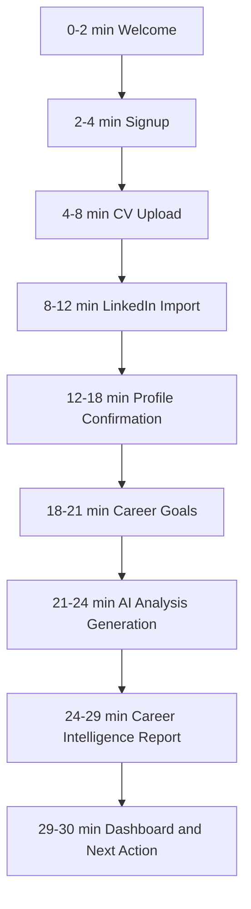

# First-Time User Experience

## Purpose

The first 30 minutes must convince the user that CareerOS AI understands their career context and can turn it into practical next steps. The MVP should create trust before asking users to return, pay, or rely on deeper automation.

## Experience Promise

Within 30 minutes, the user should feel:

- "The AI understood my background."
- "It identified gaps I had not organized clearly."
- "It found realistic opportunities."
- "It gave me a plan I can act on today."

## First 30 Minutes

## Minute-by-Minute Design

| Time | User Action | System Response | Success Outcome |
| --- | --- | --- | --- |
| 0-2 | Lands on welcome screen | AI explains what it will do | User understands product value |
| 2-4 | Creates account | Account created, onboarding starts | User enters guided flow |
| 4-8 | Uploads CV | AI parses and summarizes career facts | User sees immediate extraction |
| 8-12 | Adds LinkedIn context | AI enriches profile | User sees profile become more complete |
| 12-18 | Reviews profile | User corrects fields | Data quality improves |
| 18-21 | Sets goals | AI focuses analysis | Recommendations become relevant |
| 21-24 | Waits during analysis | AI shows what it is analyzing | Trust is maintained during wait |
| 24-29 | Reads report | AI presents summary, gaps, opportunities, learning path, scores | First wow moment happens |
| 29-30 | Enters dashboard | AI gives one next action | User knows what to do next |

## Global AI Tone During First Session

The AI should sound calm, specific, and useful. It should avoid exaggerated claims.

Default voice:

> I will use your CV, LinkedIn context, and career goals to build your first Career Intelligence Report. You can edit anything I infer before I use it.

## Onboarding Screen Sequence

1. Welcome
2. Authentication
3. CV Upload
4. LinkedIn Import
5. Manual Profile Confirmation
6. Career Goals
7. Analysis Generation
8. Career Intelligence Report
9. Career Dashboard

## What Happens After Each Input Path

### After CV Upload

The system:

- Stores the file.
- Extracts text.
- Identifies roles, companies, education, skills, and achievements.
- Produces a short CV summary.
- Highlights uncertain extracted fields for review.

AI says:

> I found your recent roles, core skills, and education history. I will use this as a starting point, but I want you to review it before I make recommendations.

If parsing fails:

> I could not read this file cleanly. You can try another version or continue by entering your profile manually.

### After LinkedIn Import

The system:

- Accepts pasted LinkedIn profile text and optional profile URL.
- Extracts headline, experience, skills, certifications, and summary.
- Compares LinkedIn context with CV context.
- Flags conflicts for review.

AI says:

> Your LinkedIn profile adds useful context about how you present yourself publicly. I will compare it with your CV and show you anything that looks incomplete or inconsistent.

If official import is unavailable:

> Direct LinkedIn import is not available in this MVP. Paste your LinkedIn profile text here and I can still use it to improve your analysis.

### After Manual Profile Creation

The system:

- Saves user-entered profile fields.
- Marks user-entered data as higher confidence than inferred data.
- Uses manual fields to focus the report.

AI says:

> Thanks. I will treat the details you entered as the most reliable version of your profile. Now I can analyze your career direction more accurately.

## First Trust Milestones

- The AI extracts correct career facts from the CV.
- The AI identifies a real mismatch between current profile and target role.
- The AI explains skill gaps without sounding discouraging.
- The AI recommends realistic next roles and learning actions.
- The user can edit profile assumptions.

## First Session End State

At the end of the first session, the user lands on the dashboard with:

- Career readiness score.
- Resume quality score.
- Three recommended next actions.
- Three job recommendations where possible.
- Three learning recommendations.
- Application tracker empty state.
- AI assistant prompt grounded in their report.

## First Session Success Metrics

- Signup completion rate.
- CV upload completion rate.
- LinkedIn import or skip rate.
- Profile confirmation completion rate.
- Career report generation rate.
- Time to first report.
- Report usefulness rating.
- Dashboard next action click rate.
- First assistant question rate.

## MVP Guardrails

The first-time experience must not promise:

- Automatic applications.
- Recruiter outreach.
- Browser automation.
- Voice interaction.
- Salary negotiation.
- Guaranteed jobs.

