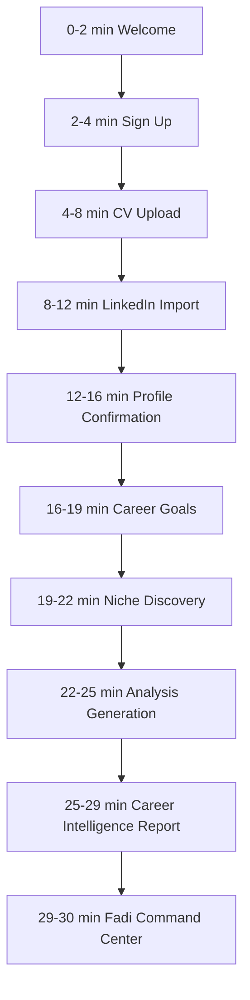

# First-Time User Experience

## Purpose

The first 30 minutes must make the user feel that Fadi genuinely understood their career context — and was honest with them about it. The MVP should earn trust through accuracy, evidence, and honest guidance, not through empty enthusiasm.

## Experience Promise

Within 30 minutes, the user should feel:

- "Fadi understood my background and my actual goals."
- "Fadi identified gaps I knew existed but hadn't faced directly."
- "Fadi told me something honest about my direction — including something I needed to hear."
- "It gave me a concrete plan I can act on today."

## First 30 Minutes

## Minute-by-Minute Design

| Time | User Action | Fadi Response | Success Outcome |
| --- | --- | --- | --- |
| 0-2 | Lands on welcome screen | Fadi explains who it is and what it will do | User understands Fadi is different from a job board |
| 2-4 | Creates account | Account created; onboarding starts with Fadi guiding | User enters guided Fadi flow |
| 4-8 | Uploads CV | Fadi parses and summarizes career facts | User sees immediate intelligent extraction |
| 8-12 | Adds LinkedIn context | Fadi enriches profile and flags conflicts | User sees profile become more complete and accurate |
| 12-16 | Reviews and corrects profile | User edits fields; Fadi confirms what it will use | Data quality improves; user feels in control |
| 16-19 | Sets goals | Fadi focuses analysis toward stated direction | Recommendations become relevant |
| 19-22 | Answers Fadi's niche questions | Fadi validates direction against available data | User gets honest, evidence-grounded niche assessment |
| 22-25 | Waits during analysis | Fadi narrates what it is analyzing | Trust maintained during wait |
| 25-29 | Reads Fadi's report | Fadi presents summary, gaps, niche assessment, scores, plan | First honest-mentor moment happens |
| 29-30 | Enters Fadi command center | Fadi gives one specific next action | User knows exactly what to do next |

## Fadi's Tone During the First Session

Fadi sounds calm, specific, honest, and grounded. It avoids exaggerated positivity. When the data shows concerns, Fadi raises them clearly and constructively.

Default voice:

> I will use your CV, LinkedIn context, and career goals to build your first Career Intelligence Report. I will also check your stated direction against current market signals — I want to give you an accurate picture, not just confirm what you want to hear.

## Onboarding Screen Sequence

1. Welcome
2. Authentication (Better Auth)
3. CV Upload
4. LinkedIn Import
5. Manual Profile Confirmation
6. Career Goals
7. Niche Discovery Conversation
8. Analysis Generation
9. Career Intelligence Report
10. Fadi Command Center

## What Happens After Each Input Path

### After CV Upload

Fadi:

- Stores the file in object storage.
- Extracts text.
- Identifies roles, companies, education, skills, and achievements.
- Produces a short CV summary through the model gateway.
- Highlights uncertain extracted fields for review.

Fadi says:

> I found your recent roles, core skills, and education history. I will use this as a starting point, but I want you to review it before I make recommendations.

If parsing fails:

> I could not read this file cleanly. You can try another version or continue by entering your profile manually.

### After LinkedIn Import

Fadi:

- Accepts pasted LinkedIn profile text and optional profile URL.
- Extracts headline, experience, skills, certifications, and summary.
- Compares LinkedIn context with CV context.
- Flags conflicts for user resolution.

Fadi says:

> Your LinkedIn profile adds useful context about how you present yourself publicly. I will compare it with your CV and flag anything that looks incomplete or inconsistent.

### After Niche Discovery

Fadi asks about the user's interests, goals, and direction. After the user responds:

If direction is supported by data:

> The data I have access to supports this direction in your geography. [Role] is actively hiring, and the key signals hiring teams look for are [signals]. Your profile already shows [strengths]. The gaps are [specific gaps] — and they are closeable.

If direction has concerns:

> I want to give you honest context here. [Stated direction] has a different hiring picture than most people expect, especially in [geography]. The data I am seeing shows [specific market reality]. This does not mean it is the wrong path, but I want you going in with accurate expectations. Here is what the path actually looks like: [specific insight].

### After Manual Profile Creation

Fadi:

- Saves user-entered profile fields.
- Marks user-entered data as higher confidence than inferred data.
- Uses confirmed fields to focus the report.

Fadi says:

> Thanks. I will treat the details you entered as the reliable version of your profile. Now I can analyze your direction more accurately.

## First Trust Milestones

- Fadi extracts correct career facts from the CV without hallucinating.
- Fadi identifies a real, specific mismatch between current profile and target direction.
- Fadi's niche assessment references actual evidence — not generic market commentary.
- Fadi explains skill gaps constructively without deflating the user.
- Fadi recommends realistic next roles and learning actions.
- The user can edit profile assumptions and see Fadi incorporate the corrections.

## First Session End State

At the end of the first session, the user lands on the Fadi command center with:

- Career readiness score with component breakdown.
- Resume quality score with component breakdown.
- Niche validation result (supported, modified, or challenged with evidence).
- Three to five recommended next actions with reasoning.
- Three job recommendations where possible.
- Three learning recommendations tied to market demand.
- Application tracker in empty state with Fadi guiding next steps.
- Fadi assistant prompt grounded in their specific report.

## First Session Success Metrics

- Sign-up completion rate.
- CV upload completion rate.
- LinkedIn import or skip rate.
- Profile confirmation completion rate.
- Niche discovery engagement rate.
- Career report generation rate.
- Time to first report.
- Report usefulness rating.
- Niche validation engagement: did the user read and engage with the assessment?
- Dashboard next action click rate.
- First Fadi assistant question rate.

## Phase 1 Guardrails

The first-time experience must not promise:

- Automatic applications.
- Recruiter outreach.
- Browser automation.
- Salary negotiation.
- Guaranteed jobs.

Voice interaction is not promised for Phase 1. Voice is Phase 2. Phase 1 UI must be designed so voice can be added without structural changes.
