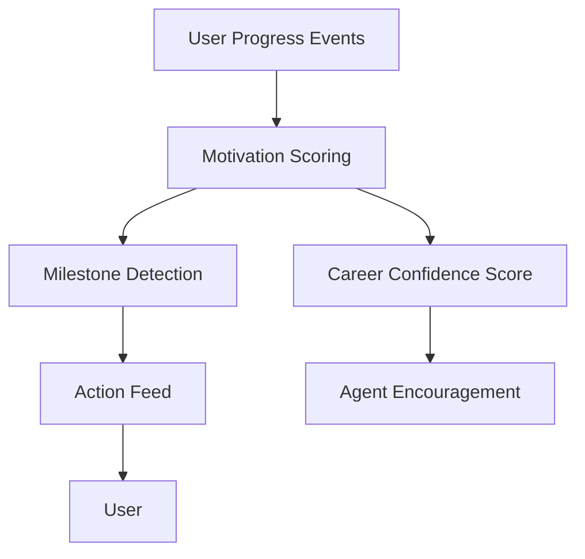

# Gamification and Motivation Engine

## Purpose

The Motivation Engine helps users sustain effort during career growth and job search. It should encourage momentum without trivializing serious career challenges.

## Motivation Principles

- Ground encouragement in real progress.
- Recommend small next actions.
- Avoid manipulative streak pressure.
- Avoid shame-based feedback.
- Connect progress to career outcomes.

## Features

- Career confidence score
- Progress milestones
- Streaks
- Achievements
- Small next actions
- Weekly progress summaries
- Momentum recovery prompts

## Architecture

## MVP Version

For MVP:

- Track progress events.
- Show a simple career confidence score with explanation.
- Add small next action recommendations.
- Add weekly progress summary.
- Avoid heavy achievement systems.

## Future Scale Version

At scale:

- Add personalized motivation patterns.
- Add streaks by healthy behavior category.
- Add cohort or program goals for organizations.
- Add adaptive pacing based on user behavior.
- Add burnout and stalled-progress detection.

## Implementation Recommendations

- Keep scores explainable.
- Reward meaningful actions, not vanity activity.
- Let users pause reminders.
- Use motivational tone from persona guidelines.
- Avoid comparing unemployed users harshly against others.

## Tradeoffs and Alternatives

- Gamification can increase engagement but can feel unserious.
- Minimal progress tracking is calmer but may be less motivating.
- Confidence scores are useful if transparent and harmful if opaque.
- Social comparison should be avoided in MVP.

## Complexity

- MVP complexity: Low-medium.
- Scale complexity: Medium-high.
- Main risks: patronizing tone, unhealthy pressure, misleading scores.

## Implementation Order

1. Define progress events.
2. Build simple confidence score.
3. Add weekly summary.
4. Add small next actions.
5. Add adaptive motivation later.

