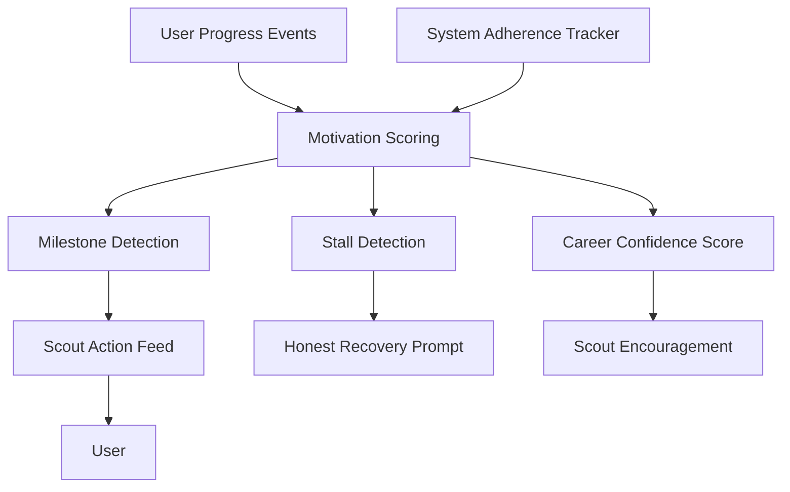

# Gamification and Motivation Engine

## Purpose

The Motivation Engine helps users sustain effort during career growth and job search. It should encourage momentum without trivializing serious career challenges. Scout's honest-mentor identity applies here too — motivation is grounded in real progress, not empty positivity.

## Motivation Principles

- Ground encouragement in real, measurable progress.
- Connect system adherence to outcomes: did the user follow the prescribed plan?
- Recommend small next actions tied to actual career goals.
- Avoid manipulative streak pressure.
- Avoid shame-based feedback.
- Be honest when progress has stalled — and suggest a realistic recovery path.
- Connect progress to career outcomes, not gamification points.

## Features

- Career confidence score
- System adherence tracking (is the user following the prescribed plan?)
- Progress milestones
- Achievements tied to real career actions
- Small next actions
- Weekly progress summaries
- Momentum recovery prompts when progress has stalled
- Honest check-ins from Scout when the system detects effort has dropped

## Architecture

## Honest Motivation Examples

When the user has made real progress:

> You have applied to three well-matched roles and completed the SQL portfolio project this week. That is the highest-leverage combination you could have done. The next step is to follow up on the application to [Company].

When the user has stalled:

> I noticed you have not taken any actions in your career system this week. That is fine — everyone stalls. The fastest way to re-engage is to do one small thing today: review one new job recommendation. Want me to surface one?

When the market is genuinely hard:

> The market for [role] in your geography is competitive right now. That means your targeting needs to be more precise, not more desperate. The data shows that candidates with [specific signal] are getting more responses. Let me help you focus there.

## Phase 1 MVP Version

- Track progress events.
- Show a career confidence score with component breakdown.
- Add system adherence tracking.
- Add small next action recommendations.
- Add weekly progress summary.
- Avoid heavy achievement systems.

## Future Scale Version

At scale:

- Personalized motivation patterns based on user behavior.
- Streaks by healthy behavior category.
- Cohort goals for organizations or bootcamp programs.
- Adaptive pacing based on user behavior.
- Burnout detection.
- Stalled-progress detection and honest recovery prompts.

## Implementation Recommendations

- Keep scores explainable.
- Reward meaningful career actions, not vanity activity.
- Let users pause reminders.
- Use Scout's persona voice for all motivation copy — honest, specific, calm.
- Avoid comparing unemployed users harshly against each other.
- Make system adherence visible.

## Complexity

- Phase 1 complexity: Low-medium.
- Scale complexity: Medium-high.
- Main risks: patronizing tone, unhealthy pressure, misleading scores, motivation that ignores genuine market difficulty.

## Implementation Order

1. Define progress events (including system adherence events).
2. Build simple confidence score with component breakdown.
3. Add weekly summary.
4. Add small next actions.
5. Add stall detection and recovery prompts.
6. Add adaptive motivation patterns later.
