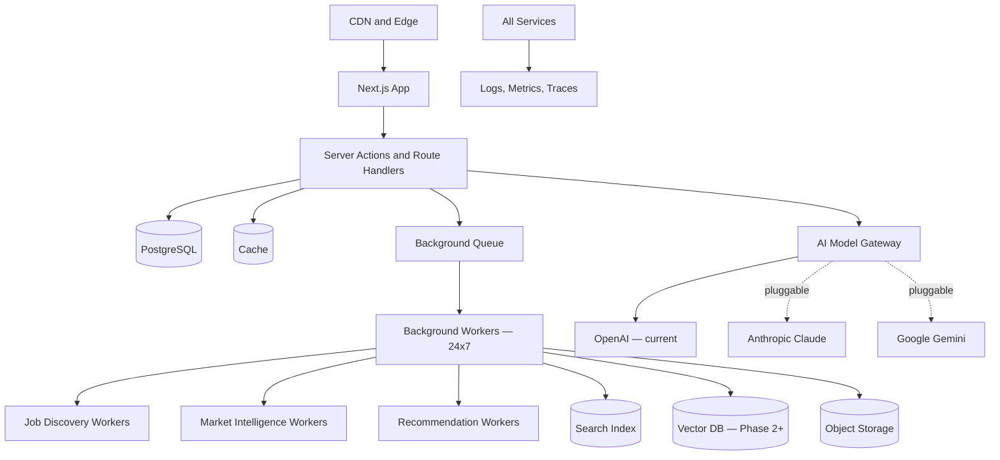

# Infrastructure and Deployment

## Purpose

CareerOS infrastructure must support secure global SaaS delivery, AI workloads through the model gateway, background monitoring workers, event processing, search, vector retrieval, analytics, observability, and future regional data residency.

## Core Infrastructure Components

- Web application hosting (Vercel)
- API layer (Next.js server actions and route handlers)
- Background workers (proactive monitoring, job discovery, market signals)
- Workflow or job queue
- Relational database (PostgreSQL)
- Object storage (resumes, documents)
- Search service
- Vector database (Phase 2+)
- Event bus (Phase 3+)
- Cache
- Secrets management
- Observability stack
- CI/CD pipeline

## Architecture

## AI Model Gateway

All AI calls route through the model gateway abstraction. Infrastructure must support:

- Configurable model provider endpoints (OpenAI, Anthropic, Google, local).
- API key management per provider via secrets manager.
- Cost tracking and rate limiting per provider.
- Fallback routing when a provider is unavailable.
- Evaluation fixture execution.

## Phase 1 MVP Version

- Deploy a modular monolith (Next.js on Vercel).
- Managed relational database (PostgreSQL — provider TBD).
- Managed object storage for resumes and documents.
- Simple background job queue for monitoring workers.
- One region initially.
- CI/CD from the start.
- Secrets management via deployment platform (Vercel environment variables).

## Phase 3 Version (When Real-Time Data Arrives)

- Background workers for job source ingestion (24x7).
- Market intelligence ingestion workers.
- Job matching recommendation workers.
- Queue for async report generation.

## Future Scale Version

At scale:

- Multi-region deployment.
- Regional data partitions.
- Autoscaled worker fleets.
- Dedicated ingestion workers for each job source and market data source.
- Dedicated model gateway with multi-provider routing.
- Blue-green or canary deployments.
- Infrastructure as code.
- Disaster recovery and backup testing.

## Implementation Recommendations

- Use managed services where possible to minimize operations.
- Keep secrets in a secrets manager — never in code or env files committed to git.
- Add health checks and readiness checks.
- Use infrastructure as code before production.
- Track cost by service.
- Separate production, staging, and development.
- Add backup and restore drills.

## Tradeoffs and Alternatives

- Serverless lowers ops but complicates long-running background workers.
- Containers provide portability but need orchestration.
- Managed databases reduce operational risk but add vendor dependency.
- Multi-region early is costly; design for it but launch single-region.

## Complexity

- Phase 1 complexity: Medium.
- Phase 3 complexity: High (background workers, real-time ingestion).
- Scale complexity: Very high.
- Main risks: AI model gateway cost spikes, background job failures, weak observability, data residency retrofits.

## Implementation Order

1. Choose cloud provider and baseline architecture.
2. Configure managed PostgreSQL, object storage, and secrets management.
3. Set up Vercel project and environments.
4. Add CI/CD pipeline.
5. Add observability (structured logging, error monitoring).
6. Add background queue and monitoring workers (Phase 3).
7. Add search and vector services.
8. Add multi-region scaling later.
