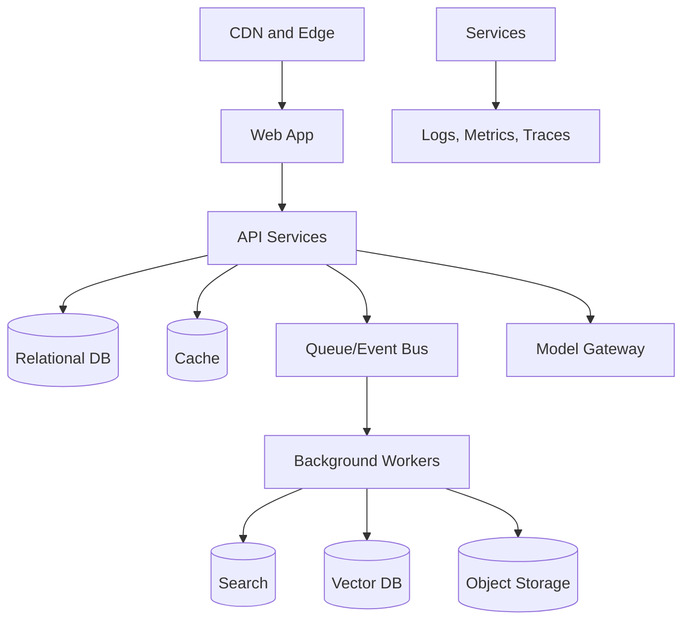

# Infrastructure and Deployment

## Purpose

CareerOS AI infrastructure must support secure global SaaS delivery, AI workloads, background automation, event processing, search, vector retrieval, analytics, observability, and future regional data residency.

This document defines infrastructure architecture without selecting a final cloud provider.

## Core Infrastructure Components

- Web application hosting
- API services
- Background workers
- Workflow or job queue
- Relational database
- Object storage
- Search service
- Vector database
- Event bus
- Cache
- Secrets management
- Observability stack
- CI/CD pipeline

## Architecture

## MVP Version

For MVP:

- Deploy a modular monolith API.
- Use managed relational database.
- Use managed object storage.
- Use managed queue or background jobs.
- Use managed vector/search if possible.
- Use one region initially, with region abstraction in data model.
- Add CI/CD from the start.

## Future Scale Version

At scale:

- Multi-region deployment.
- Regional data partitions.
- Autoscaled worker fleets.
- Dedicated ingestion workers.
- Dedicated model gateway.
- Blue-green or canary deployments.
- Infrastructure as code.
- Disaster recovery and backup testing.

## Implementation Recommendations

- Use managed services where possible.
- Keep secrets in a secret manager.
- Add health checks and readiness checks.
- Use infrastructure as code before production.
- Track cost by service and tenant segment.
- Separate production, staging, and development.
- Add backup and restore drills.

## Tradeoffs and Alternatives

- Serverless lowers ops but can complicate long-running workflows.
- Containers provide portability but need orchestration.
- Managed databases reduce risk but add vendor dependency.
- Multi-region early is costly; design for it but launch single-region.

## Complexity

- MVP complexity: Medium.
- Scale complexity: Very high.
- Main risks: AI cost spikes, background job failures, weak observability, data residency retrofits.

## Implementation Order

1. Choose cloud and baseline architecture.
2. Set up environments.
3. Add database, object storage, queue, and secrets.
4. Add CI/CD.
5. Add observability.
6. Add search/vector services.
7. Add multi-region scaling later.

