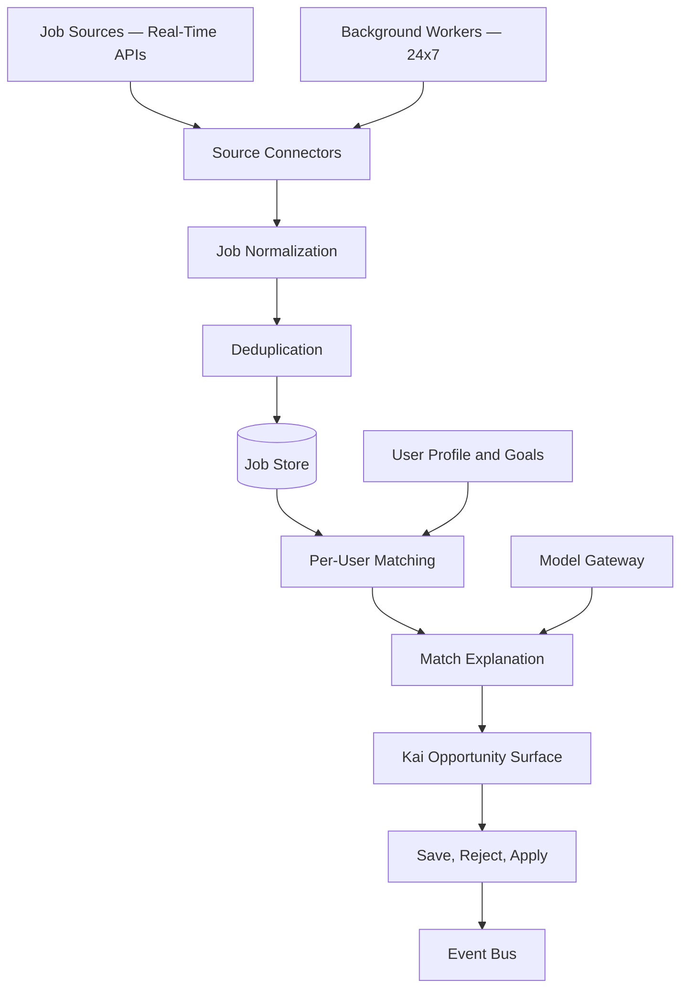

# Job Discovery Engine

## Purpose

The Job Discovery Engine is Kai's always-on opportunity radar. It proactively finds, normalizes, deduplicates, monitors, ranks, and explains job opportunities for each user — continuously, not only when the user is logged in.

This is not a search feature the user triggers. Kai monitors the job market 24x7 on the user's behalf and surfaces what matters.

## Sources

Potential sources:

- LinkedIn Jobs
- Indeed
- IrishJobs
- Glassdoor
- Wellfound
- Reed
- TotalJobs
- EURES
- Company career pages
- Curated company watchlists
- Partner or aggregator APIs

All source access must be reviewed for API availability, terms, rate limits, and data permissions before implementation. Only compliant access paths are acceptable.

## Architecture

## Normalized Job Fields

- title
- company
- location
- remote mode
- salary range
- currency
- seniority
- employment type
- description
- required skills
- preferred skills
- source
- source URL
- posted date
- expiry date
- discovered date

## Matching Signals

- Skill overlap
- Missing required skills
- Experience relevance
- Seniority fit
- Location fit
- Remote preference fit
- Salary fit
- Company preference
- Industry preference
- User feedback history
- Application outcome history

## Proactive Discovery

The job discovery engine runs in the background:

- Scheduled ingestion workers poll sources at appropriate intervals.
- New high-fit jobs trigger a notification to the Kai action feed.
- Market shifts (sudden hiring surges or layoffs) are surfaced via the market intelligence integration.
- The engine learns from user save/reject feedback to improve future matches.

Background workers emit events to the event bus, which triggers Kai recommendation updates without user input.

## Phase 1 MVP Version

- Use one or two reliable, compliant job data sources.
- Add manual company watchlist as a supplement if APIs are limited.
- Implement normalized job storage and deduplication.
- Match jobs against user profile and target roles.
- Generate match explanations through the model gateway.
- Track save, reject, and prepare application actions.
- Background workers run on a scheduled basis (hourly or more).

## Phase 3 Scale Version

- Distributed ingestion workers.
- Multiple job sources running in parallel.
- Partitioned job data by region and source.
- Source-specific rate limiting and compliance checks.
- Global deduplication by company, title, location, description hash, and source metadata.
- Near-real-time opportunity alerts.
- Personalized ranking models trained on outcome data.

## Implementation Recommendations

- Only use official APIs and licensed datasets.
- Keep source attribution visible on every job card.
- Store original source payload separately from normalized records.
- Build deduplication early — duplicate jobs damage user trust.
- Track stale and closed jobs; remove them from active surfaces.
- Use user feedback to improve ranking.
- Never invent salary, requirement, or job details.
- Never scrape without full legal and platform policy review.

## Complexity

- Phase 1 complexity: Medium-high.
- Phase 3 complexity: Very high.
- Main risks: source access restrictions, stale postings, duplicate jobs, weak match explanations.

## Implementation Order

1. Choose first compliant source.
2. Define normalized job schema.
3. Build ingestion and deduplication.
4. Build basic matching and explanation through model gateway.
5. Add background workers.
6. Add feedback loop.
7. Add monitoring and alerts.
8. Expand sources and ranking sophistication.
