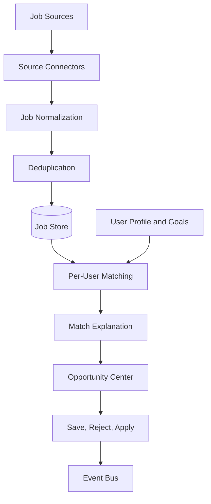

# Job Discovery Engine

## Purpose

The Job Discovery Engine finds, normalizes, deduplicates, monitors, ranks, and explains job opportunities for each user. It should feel proactive: the user should receive relevant opportunities without manually searching every platform.

## Sources

Potential sources:

- LinkedIn Jobs
- Indeed
- IrishJobs
- Glassdoor
- Wellfound
- Reed
- TotalJobs
- EURES
- Company career pages
- Curated company watchlists
- Partner or aggregator APIs

All source access must be reviewed for API availability, terms, rate limits, and data permissions.

## Architecture

## Normalized Job Fields

- title
- company
- location
- remote mode
- salary range
- currency
- seniority
- employment type
- description
- required skills
- preferred skills
- source
- source URL
- posted date
- expiry date
- discovered date

## Matching Signals

- Skill overlap
- Missing required skills
- Experience relevance
- Seniority fit
- Location fit
- Remote preference fit
- Salary fit
- Company preference
- Industry preference
- User feedback history
- Application outcome history

## MVP Version

For MVP:

- Use one or two reliable job data sources.
- Add manual company career page watchlist if APIs are limited.
- Implement normalized job storage and deduplication.
- Match jobs against user profile and target roles.
- Generate explanations for fit and gaps.
- Track save, reject, and prepare application actions.

## Future Scale Version

For millions of users:

- Use distributed ingestion workers.
- Partition job data by region and source.
- Apply source-specific rate limiting.
- Use global deduplication by company, title, location, description hash, and source metadata.
- Use near-real-time opportunity alerts.
- Build personalized ranking models.

## Implementation Recommendations

- Prefer official APIs and licensed datasets.
- Keep source attribution visible.
- Store original source payload separately from normalized records.
- Build dedupe early to avoid user trust damage.
- Track stale and closed jobs.
- Use user feedback to tune ranking.
- Never invent salary or job details.

## Tradeoffs and Alternatives

- Aggregator API: faster coverage, vendor dependency, recurring cost.
- Direct integrations: better control, higher maintenance.
- Company career pages: valuable but legally and technically varied.
- User-submitted jobs: easy MVP supplement, less proactive.

## Complexity

- MVP complexity: Medium-high.
- Scale complexity: Very high.
- Main risks: source access restrictions, stale postings, duplicate jobs, poor matching explanations.

## Implementation Order

1. Choose first compliant source.
2. Define normalized job schema.
3. Build ingestion and deduplication.
4. Build basic matching and explanation.
5. Add feedback loop.
6. Add monitoring and alerts.
7. Expand sources and ranking sophistication.

