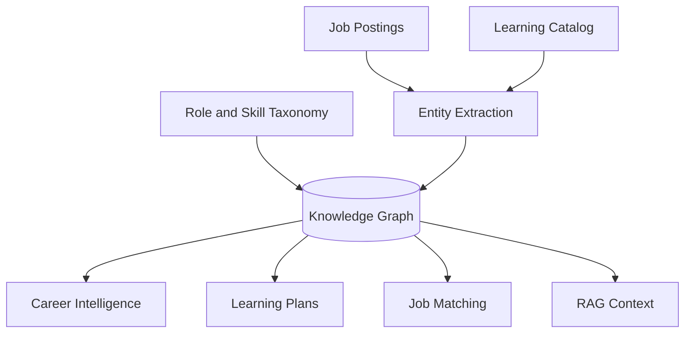

# Knowledge Graph Architecture

## Purpose

The CareerOS AI knowledge graph models relationships between roles, skills, industries, companies, credentials, learning resources, jobs, and career paths. It gives the platform a structured career intelligence layer beyond isolated documents or embeddings.

## Graph Concepts

Nodes:

- Skill
- Role
- Industry
- Company
- Credential
- Course
- Job posting
- User goal
- Career path

Edges:

- requires skill
- prefers skill
- belongs to industry
- offered by company
- teaches skill
- validates skill
- leads to role
- similar to role
- user targets role

## Architecture

## MVP Version

For MVP:

- Start with relational tables for roles, skills, and role-skill mappings.
- Curate initial target roles and common skills.
- Use graph-like queries through relational joins.
- Avoid introducing graph database infrastructure until needed.

## Future Scale Version

At scale:

- Add a graph database or graph layer.
- Add entity extraction from jobs and learning resources.
- Add global taxonomy versioning.
- Add relationship confidence.
- Add regional variations in skill demand.
- Add graph embeddings for recommendations.

## Implementation Recommendations

- Start with a clean taxonomy.
- Version taxonomy changes.
- Store relationship confidence and source.
- Keep user-specific graph edges separate from global graph.
- Use graph outputs to explain recommendations.

## Tradeoffs and Alternatives

- Relational graph model is simpler for MVP.
- Dedicated graph database improves traversal but adds operational complexity.
- Embeddings capture similarity but are less explainable.
- Hybrid graph plus vector search is preferred long term.

## Complexity

- MVP complexity: Medium.
- Scale complexity: High.
- Main risks: taxonomy drift, noisy extracted entities, expensive graph maintenance.

## Implementation Order

1. Define role and skill taxonomy.
2. Build relational mapping tables.
3. Use mappings in career, learning, and job matching.
4. Add entity extraction.
5. Add graph infrastructure later.

