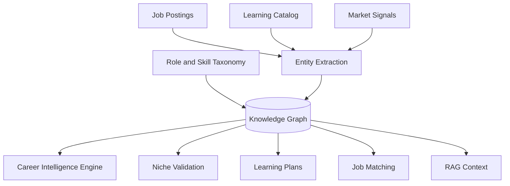

# Knowledge Graph Architecture

## Purpose

The CareerOS knowledge graph models relationships between roles, skills, industries, companies, credentials, learning resources, jobs, and career paths. It gives Scout a structured career intelligence layer beyond isolated documents or embeddings.

The knowledge graph enables Scout to understand career adjacencies, explain role transitions, identify transferable skills, and validate niche directions with structured reasoning.

## Graph Concepts

Nodes:

- Skill
- Role
- Industry
- Company
- Credential
- Course
- Portfolio project type
- Job posting
- User goal
- Career path
- Geo-political context signal

Edges:

- requires skill
- prefers skill
- belongs to industry
- offered by company
- teaches skill
- validates skill
- leads to role
- similar to role
- user targets role
- market_supports (with confidence and date)
- market_challenges (with confidence and date)

## Architecture

## Phase 1 MVP Version

For Phase 1:

- Start with relational tables for roles, skills, and role-skill mappings.
- Curate initial target roles and common skills.
- Use graph-like queries through relational joins.
- Avoid introducing graph database infrastructure until needed.
- Add basic market support/challenge signals as relational records.

## Future Scale Version

At scale:

- Dedicated graph database or graph layer.
- Entity extraction from jobs, learning resources, and market signals.
- Global taxonomy versioning.
- Relationship confidence and source attribution.
- Regional variations in skill demand.
- Graph embeddings for recommendations.
- Niche-specific career path modeling.
- Geo-political context integration.

## Implementation Recommendations

- Start with a clean, curated taxonomy.
- Version taxonomy changes.
- Store relationship confidence and source.
- Keep user-specific graph edges separate from global graph.
- Use graph outputs to explain niche assessments and career recommendations.
- Tag market support/challenge signals with dates and sources.

## Complexity

- Phase 1 complexity: Medium.
- Scale complexity: High.
- Main risks: taxonomy drift, noisy extracted entities, expensive graph maintenance, market signal staleness.

## Implementation Order

1. Define role and skill taxonomy.
2. Build relational mapping tables.
3. Use mappings in career analysis, learning, and job matching.
4. Add basic market support/challenge signal records.
5. Add entity extraction.
6. Add graph infrastructure later.
