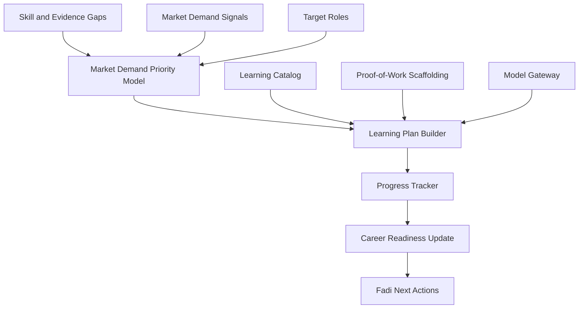

# Learning Intelligence Engine

## Purpose

The Learning Intelligence Engine turns skill gaps and evidence gaps into practical learning plans. It connects the user's target roles, missing skills, market demand signals, time constraints, and preferred learning style into prioritized learning actions.

Critically, this engine does not just recommend courses. It identifies what proof-of-work matters for the user's target direction and suggests concrete portfolio projects, GitHub repos, and case studies — not only certifications.

## Inputs

- Career analysis
- Target roles
- Skill and evidence gaps
- Current skills
- Niche validation output
- Market demand signals (what skills are actually valued now)
- User availability
- Preferred learning formats
- Budget preference
- Certifications
- Application outcomes

## Outputs

- Learning plan
- Skill and evidence priorities (market demand ordered)
- Course recommendations
- Certification recommendations
- Portfolio project and proof-of-work suggestions
- GitHub repo scaffolding recommendations
- Case study templates
- Progress updates
- Readiness score improvements

## Architecture

## Proof-of-Work Priority

For many career roles, demonstrable evidence matters more than certificates. The engine distinguishes:

- **High certificate value**: roles where formal credentials carry hiring weight (finance, legal, medical, certain engineering roles).
- **High portfolio value**: roles where demonstrated output matters more than certificates (engineering, design, product, data, content).
- **Mixed value**: roles where both credentials and portfolio projects are expected.

Fadi surfaces the right mix for the user's specific target role.

## Model Gateway

All plan generation and project scaffolding narratives go through the model gateway. The engine never imports provider SDKs directly.

## Phase 1 MVP Version

- Use a curated learning catalog.
- Map missing skills to recommended resources.
- Support learning plans by target role.
- Include proof-of-work project suggestions for roles where portfolio value is high.
- Track manual completion status.
- Connect completed learning back to career readiness score.
- Prioritize recommendations by available market demand data.

## Phase 5 Version

- Portfolio project and GitHub repo scaffolding (Fadi generates a starting structure for the user).
- Case study templates based on the user's industry and target role.
- Personalized sequencing based on the user's time and constraints.
- Learning provider integrations.
- Certification ROI scoring by role and geography.
- Outcome data used to improve recommendations.
- Region-specific credential relevance.

## Implementation Recommendations

- Separate skill priority from resource recommendation.
- Rank learning by career impact, time cost, credibility, and user constraints.
- Include free and paid alternatives.
- Track completion evidence.
- Avoid recommending excessive courses when a portfolio project would be stronger evidence.
- Align proof-of-work suggestions to the role's actual hiring norms.
- Never recommend a certification that the market data does not support for the user's specific target.

## Complexity

- Phase 1 complexity: Medium.
- Phase 5 complexity: High.
- Main risks: low-quality resource recommendations, overlearning, weak connection to job outcomes, proof-of-work suggestions that miss the mark.

## Implementation Order

1. Define skill gap to learning item mapping.
2. Build curated resource catalog.
3. Build learning plan schema.
4. Add basic proof-of-work project suggestions for high-portfolio-value roles.
5. Add progress tracking.
6. Update career readiness from progress.
7. Add provider integrations and outcome calibration in Phase 5.
8. Add full proof-of-work scaffolding and repo generation in Phase 5.
