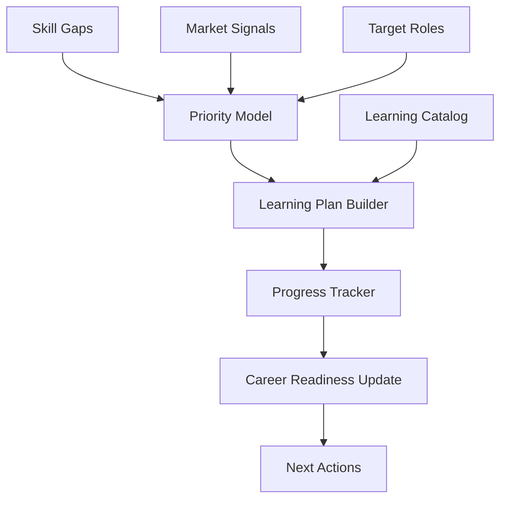

# Learning Intelligence Engine

## Purpose

The Learning Intelligence Engine turns skill gaps into practical learning plans. It connects the user's target roles, missing skills, market demand, time constraints, and preferred learning style into prioritized learning actions.

## Inputs

- Career analysis
- Target roles
- Skill gaps
- Current skills
- User availability
- Preferred learning formats
- Budget preference
- Certifications
- Market demand signals
- Application outcomes

## Outputs

- Learning plan
- Skill priorities
- Course recommendations
- Certification recommendations
- Practice projects
- Progress updates
- Readiness improvements

## Architecture

## MVP Version

For MVP:

- Use a curated learning catalog.
- Map missing skills to recommended resources.
- Support learning plans by target role.
- Track manual completion status.
- Connect completed learning back to career readiness.

## Future Scale Version

At scale:

- Integrate learning providers.
- Add personalized sequencing.
- Add project-based portfolio recommendations.
- Add certification ROI scoring.
- Use outcome data to improve recommendations.
- Support region-specific credential relevance.

## Implementation Recommendations

- Separate skill priority from resource recommendation.
- Rank learning by career impact, time cost, credibility, and user constraints.
- Include free and paid alternatives where possible.
- Track completion evidence.
- Avoid recommending excessive courses when a portfolio project would be better evidence.

## Tradeoffs and Alternatives

- Curated catalog is reliable but limited.
- Provider integrations scale coverage but can bias recommendations.
- AI-generated plans feel personalized but require validation against realistic time estimates.
- Certification-first strategies help some roles but waste time in others.

## Complexity

- MVP complexity: Medium.
- Scale complexity: High.
- Main risks: low-quality resource recommendations, overlearning, weak connection to job outcomes.

## Implementation Order

1. Define skill gap to learning item mapping.
2. Build curated resource catalog.
3. Build learning plan schema.
4. Add progress tracking.
5. Update career readiness from progress.
6. Add provider integrations and outcome calibration later.

