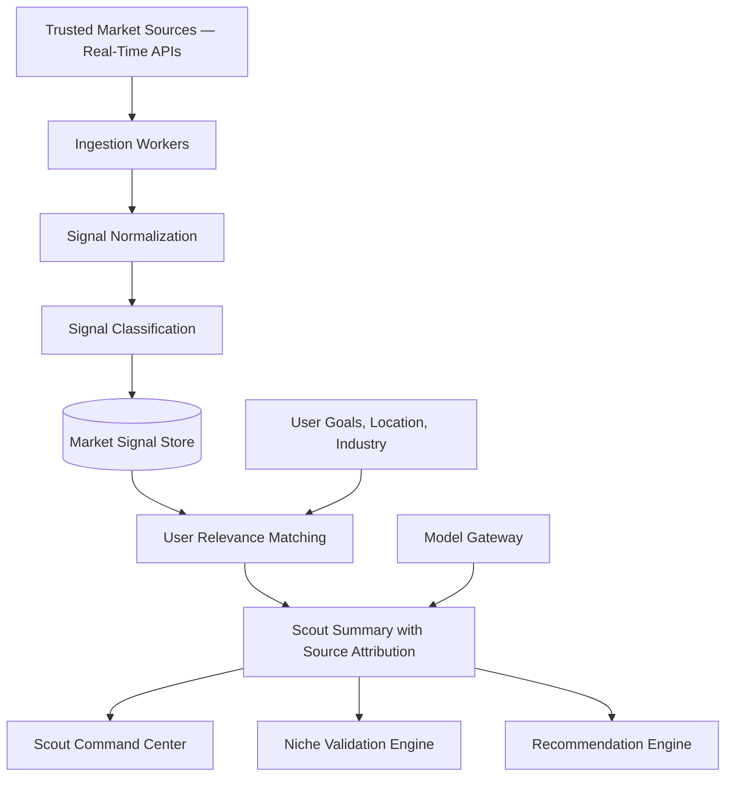

# Market Intelligence Engine

## Purpose

The Market Intelligence Engine gives Scout's recommendations their factual spine. It monitors labor market signals and translates them into user-specific career context: demand trends, salary intelligence, hiring waves, layoff patterns, industry shifts, geo-political signals, and emerging skill demand.

This engine is what separates Scout from a generic career chatbot. Scout's advice is grounded in current data, not static recommendations or fabricated optimism.

## Sources

Trusted third-party data sources include:

- Government labor statistics (CSO, ONS, BLS, Eurostat)
- Economic indicators
- Licensed salary datasets
- Industry reports and publications
- Trusted news and sector feeds
- Company announcements and hiring signals
- Layoff tracking datasets where legally usable
- Geo-political and economic context APIs

All sources must be reviewed for reliability, update frequency, licensing, and attribution requirements. Source attribution and publication dates must be stored with every signal.

## Architecture

## Signal Types

- Hiring trend (role-level, company-level, sector-level)
- Layoff trend
- Salary trend by seniority and geography
- Skill demand shift
- Industry structural change
- Economic indicator
- Geographic labor signal
- Geo-political signal (affects specific sectors or geographies)
- Company health signal

## Real-Time Grounding Requirement

Market intelligence must be grounded in current data. Scout never:

- Presents old data as current.
- Invents market trends that are not sourced.
- Confirms a niche direction without checking actual hiring signals.
- Hypes sectors that the data does not support.

Every market output includes source name, source URL, publication date, observed date, and a confidence level. Users can ask Scout to show the evidence behind any market claim.

## Phase 1 MVP Version

Phase 1 uses curated directional data:

- A small set of reliable public or licensed sources for directional signals.
- Store source name, URL, publication date, observed date, and confidence.
- Generate summaries for user target roles and industries via model gateway.
- Include source attribution and dates in every market output.
- Niche validation uses available directional data with appropriate confidence framing.

## Phase 3+ Version

When real-time API integrations are active:

- Live data pipeline connected to multiple trusted sources.
- Regional market models.
- Role-specific demand forecasting.
- Salary intelligence by seniority and geography.
- Company health signals.
- Geo-political context monitoring.
- Automated market alerts triggered by changes relevant to the user's goals.

At scale:

- Regional signal partitioning.
- Cross-source signal correlation.
- Predictive trend signals.
- Automated niche revalidation when market signals shift significantly.

## Implementation Recommendations

- Never present old data as current — tag every signal with its freshness.
- Store dates and source attribution on every record.
- Separate raw signal ingestion from model gateway summarization.
- Use confidence and freshness scoring for every signal.
- Connect market signals to Scout's recommendations, not generic news feeds.
- Validate that geo-political signals come from authoritative sources.
- Do not allow market summaries to drift toward generic career advice.

## Complexity

- Phase 1 complexity: Medium (directional data, limited sources).
- Phase 3 complexity: High (real-time, multi-source, geo-aware).
- Main risks: outdated signals, source bias, noisy feeds, unsupported salary claims, geo-political signal quality.

## Implementation Order

1. Define signal schema with source attribution fields.
2. Choose initial directional data sources for Phase 1.
3. Build ingestion and freshness scoring.
4. Build relevance matching against user goals and location.
5. Build source-grounded summaries through model gateway.
6. Connect to niche validation engine.
7. Phase 3: integrate real-time APIs and alerts.
8. Add forecasting and geo-political context later.
