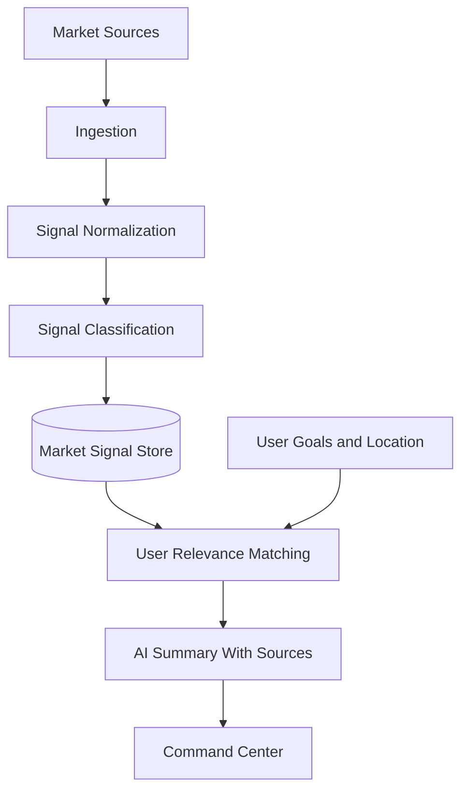

# Market Intelligence Engine

## Purpose

The Market Intelligence Engine monitors labor market signals and translates them into user-specific career context. It should help users understand demand, salary trends, hiring patterns, layoffs, industry shifts, and emerging skills.

## Sources

- Government labor reports
- Economic indicators
- Salary datasets
- Industry reports
- News feeds
- Company announcements
- Hiring trend datasets
- Layoff trackers where legally usable

## Architecture

## Signal Types

- Hiring trend
- Layoff trend
- Salary trend
- Skill demand
- Industry news
- Economic indicator
- Geographic labor signal
- Company-level signal

## MVP Version

For MVP:

- Use a small set of reliable public and licensed sources.
- Store source name, URL, publication date, observed date, and confidence.
- Generate summaries for user target roles and industries.
- Include source attribution and dates in every market output.

## Future Scale Version

At scale:

- Add regional market models.
- Add role-specific demand forecasting.
- Add salary intelligence by seniority and geography.
- Add company health signals.
- Add automated market alerts tied to user goals.

## Implementation Recommendations

- Never present old data as current.
- Store dates and source attribution.
- Separate raw signal ingestion from AI summarization.
- Use confidence and freshness scoring.
- Connect market signals to recommendations, not generic news feeds.

## Tradeoffs and Alternatives

- Public sources are trustworthy but slow.
- News feeds are timely but noisy.
- Licensed datasets improve quality but increase cost.
- AI summarization is useful but must be grounded in citations.

## Complexity

- MVP complexity: Medium.
- Scale complexity: High.
- Main risks: outdated signals, source bias, noisy news, unsupported salary claims.

## Implementation Order

1. Define signal schema.
2. Choose initial sources.
3. Build ingestion and freshness scoring.
4. Build relevance matching.
5. Build source-grounded summaries.
6. Add alerts and forecasting later.

