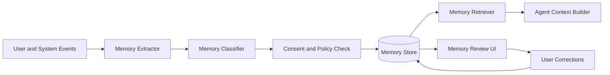

# Memory System Architecture

## Purpose

The Memory System gives CareerOS AI durable understanding of the user. It stores career facts, preferences, goals, application history, learning progress, interview feedback, rejected recommendations, accepted recommendations, and inferred patterns.

Memory must be transparent, editable, permission-aware, and useful across every engine.

## Memory Types

- Explicit memory: user-provided facts and preferences.
- Inferred memory: patterns derived from actions and feedback.
- Episodic memory: interactions, agent tasks, applications, interviews, and outcomes.
- Semantic memory: normalized career concepts such as roles, skills, companies, industries, and credentials.
- Operational memory: task state, reminders, deadlines, and active workflows.

## Architecture

## Data Model

Minimum memory fields:

- `id`
- `tenant_id`
- `user_id`
- `type`
- `key`
- `value`
- `source`
- `confidence`
- `visibility`
- `consent_scope`
- `valid_from`
- `valid_until`
- `created_at`
- `updated_at`
- `deleted_at`

Use soft deletion for auditability, then hard-delete according to retention policy and user deletion requests.

## Retrieval Strategy

Memory retrieval should combine:

- Direct lookup for canonical facts.
- Recency-weighted episodic retrieval.
- Semantic search over long-form documents and prior interactions.
- Graph traversal for skill-role-company relationships.
- Policy filters for consent, tenant, and visibility.

## MVP Version

Use the primary relational database for canonical memory and a vector index for semantic recall:

- Store explicit preferences and career facts as structured rows.
- Store interaction summaries, resume chunks, and generated artifacts as embeddings.
- Let users inspect and edit high-impact memories.
- Use confidence thresholds before inferred memory affects recommendations.

## Future Scale Version

At scale, separate memory into:

- Relational profile and preference store.
- Event log for historical truth.
- Vector database for semantic retrieval.
- Knowledge graph for career relationships.
- Feature store for recommendation and scoring signals.

Add memory compaction, privacy-aware summarization, retention tiers, and regional data residency.

## Implementation Recommendations

- Never store raw sensitive prompts without retention rules.
- Summarize conversations into user-safe memory records.
- Version important memories.
- Mark inferred memory as inferred until confirmed.
- Build memory correction UX early.
- Attach source references to every memory.
- Use tenant and user filters in every memory query.
- Do not allow memories from one user to leak into another user's context.

## Tradeoffs and Alternatives

- Structured memory is reliable and explainable but slower to expand.
- Vector memory is flexible but can retrieve irrelevant or stale context.
- Graph memory is powerful for relationships but costly to maintain.
- Conversation transcript storage improves debugging but increases privacy risk.

## Complexity

- MVP complexity: Medium-high.
- Scale complexity: Very high.
- Main risks: stale memory, privacy leakage, over-personalization, inferred facts treated as truth.

## Implementation Order

1. Define memory schema and consent scopes.
2. Store explicit profile facts and preferences.
3. Add memory extraction from accepted user actions.
4. Add user memory review and correction.
5. Add vector retrieval for documents and summaries.
6. Add confidence scoring and expiry.
7. Add graph and feature-store integration later.

