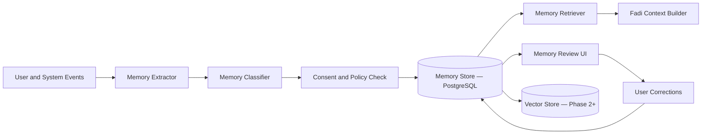

# Memory System Architecture

## Purpose

The Memory System gives Fadi durable understanding of the user across every session and every workflow. It stores career facts, preferences, goals, niche validation history, application history, learning progress, interview feedback, rejected and accepted recommendations, and inferred patterns.

Memory must be transparent, editable, permission-aware, and useful across every engine.

## Memory Types

- **Explicit memory**: user-provided facts and preferences — highest confidence.
- **Inferred memory**: patterns derived from user actions and feedback — marked as inferred until confirmed.
- **Episodic memory**: interactions, agent tasks, applications, niche validations, interviews, and outcomes.
- **Semantic memory**: normalized career concepts — roles, skills, companies, industries, and credentials.
- **Operational memory**: active task state, reminders, deadlines, and pending workflows.

## Architecture

## Important Memory Categories

Fadi should remember across sessions:

- Stated and validated career niche and direction.
- Niche validation history: what was challenged, what was confirmed, what was revised.
- Career goals and timeline.
- Preferred industries, geographies, and remote preferences.
- Salary targets and constraints.
- Target companies and communities.
- Skills, evidence, certifications, and learning progress.
- Application history and outcomes.
- Interview feedback.
- Rejected and accepted recommendations.
- Networking targets.
- Communication and interaction preferences.

## Data Model

Minimum memory fields:

- `id`
- `user_id`
- `type`
- `key`
- `value`
- `source`
- `confidence`
- `visibility`
- `consent_scope`
- `valid_from`
- `valid_until`
- `created_at`
- `updated_at`
- `deleted_at`

Use soft deletion for auditability, then hard-delete according to retention policy and user deletion requests.

## Retrieval Strategy

Memory retrieval combines:

- Direct lookup for canonical facts.
- Recency-weighted episodic retrieval.
- Semantic search over long-form documents and prior interactions (Phase 2+ with vector store).
- Policy filters for consent and visibility.

## Phase 1 MVP Version

- Store explicit preferences and career facts as structured rows in PostgreSQL.
- Store niche validation history and outcomes.
- Store application history and feedback.
- Let users inspect and edit high-impact memories.
- Use confidence thresholds before inferred memory affects recommendations.

## Phase 2+ Version

- Add vector store for semantic recall over documents, summaries, and interaction history.
- Add memory compaction for long-running users.
- Add privacy-aware summarization.

## Future Scale Version

At scale, separate memory into:

- Relational profile and preference store.
- Event log for historical truth.
- Vector database for semantic retrieval.
- Knowledge graph for career relationships.
- Feature store for recommendation and scoring signals.

Add memory compaction, privacy-aware summarization, retention tiers, and regional data residency.

## Implementation Recommendations

- Never store raw sensitive prompts without retention rules.
- Summarize conversations into user-safe memory records.
- Version important memories.
- Mark inferred memory as inferred until confirmed by the user.
- Build memory correction UX early — users must be able to inspect and edit what Fadi remembers.
- Attach source references to every memory.
- Use user filters in every memory query.
- Do not allow memories from one user to leak into another user's context.
- Track niche validation history explicitly — it is load-bearing for Fadi's honest-mentor identity.

## Complexity

- Phase 1 complexity: Medium-high.
- Scale complexity: Very high.
- Main risks: stale memory, privacy leakage, inferred facts treated as truth, niche validation history being lost between sessions.

## Implementation Order

1. Define memory schema and consent scopes.
2. Store explicit profile facts and niche validation history.
3. Add memory extraction from accepted user actions.
4. Add user memory review and correction.
5. Add vector retrieval for documents and summaries (Phase 2).
6. Add confidence scoring and expiry.
7. Add graph and feature-store integration later.
