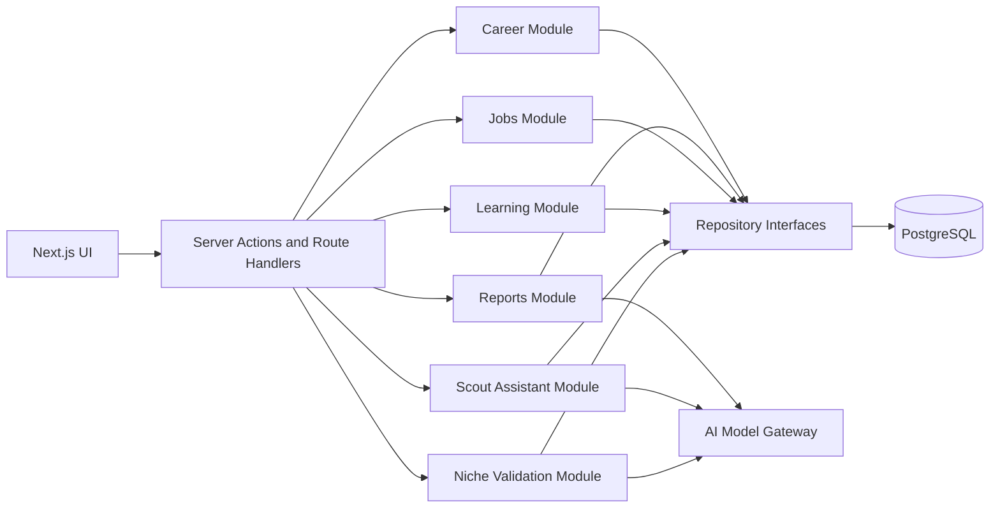

# Microservice Compatibility Plan

## Purpose

CareerOS should remain simple enough for one developer to ship the Phase 1 MVP, while avoiding architectural choices that make future service extraction expensive. The goal is not to create microservices now. The goal is to make today's modular monolith compatible with tomorrow's service boundaries.

## Current State

The current Next.js app has some mixing of responsibilities:

- Authentication actions.
- Session checks.
- Onboarding persistence.
- Career report context loading and AI model gateway calls.
- UI rendering.

This is acceptable for early MVP speed, but it creates extraction friction because business use cases are coupled to route handlers.

## Target Model: Modular Monolith First

CareerOS uses a modular monolith during Phase 1.



Each module exposes service methods and owns its domain language. Route handlers coordinate request/response work, not business workflows.

## Service Boundary Candidates

Do not split these services yet. Design them so they can be split later.

| Future Service | Phase 1 Module | Why It May Split Later | Extraction Trigger |
| --- | --- | --- | --- |
| Identity Service | Auth/session module | Multiple auth providers or enterprise auth | Second auth provider or enterprise SSO |
| Career Profile Service | Career module | Central user career state | Other services need profile snapshots |
| Niche Validation Service | Niche module | AI calls, market data integration, background revalidation | Real-time market data or high revalidation volume |
| Report Generation Service | Career Intelligence module | AI latency, cost control, queueing | Reports become async or high volume |
| Job Discovery Service | Job module | External API scheduling, normalization, 24x7 monitoring | Multiple job sources or background crawling |
| Market Intelligence Service | Market module | Real-time data pipelines, geo-political signals | Phase 3 API integration |
| Recommendation Service | Recommendation module | Ranking, personalization, experimentation | Dedicated scoring pipeline needed |
| Learning Service | Learning module | Content catalog integrations, proof-of-work scaffolding | Multiple learning providers |
| Event/Telemetry Service | Analytics module | Product analytics and model observability | High event volume or compliance needs |

## Module Interface Principles

Service methods should:

- Accept CareerOS app user IDs, not auth session objects.
- Accept validated inputs, not raw form data.
- Return domain result objects.
- Hide persistence details.
- Emit domain events after important state changes.
- Not import Next.js APIs except at the route/action boundary.
- Route all AI calls through the model gateway abstraction.

Example:

```ts
export async function validateNiche(input: {
  userId: string;
  statedDirection: string;
  userLocation: string;
  requestedAt: Date;
}): Promise<NicheValidationResult> {
  // Load profile context, call model gateway, persist result, emit event.
}

export async function generateCareerReport(input: {
  userId: string;
  requestedAt: Date;
}): Promise<GenerateCareerReportResult> {
  // Load context, call model gateway, persist report, emit event.
}
```

## Repository Boundary

Recommended repository groups:

- `UserRepository`
- `ProfileRepository`
- `CareerProfileRepository`
- `ResumeRepository`
- `LinkedInProfileRepository`
- `CareerReportRepository`
- `ApplicationRepository`
- `LearningRecommendationRepository`
- `AgentMessageRepository`
- `ProductEventRepository`
- `MarketSignalRepository`

Repositories must not make authorization decisions silently. They require `userId` for all user-owned operations.

## Domain Events

Phase 1 does not need Kafka, NATS, or a full event bus. It needs a consistent event shape.

Recommended Phase 1 event table:

| Column | Notes |
| --- | --- |
| `id uuid` | Event ID |
| `user_id uuid null` | Nullable for system events |
| `event_type text` | Example: `onboarding.completed`, `niche.validated`, `report.generated` |
| `entity_type text` | Example: `career_report`, `niche_validation` |
| `entity_id uuid null` | Related entity |
| `payload jsonb` | Small metadata only — no sensitive content |
| `created_at timestamptz` | Event time |

## Synchronous vs Asynchronous Work

Phase 1 synchronous:

- Sign in/sign up.
- Onboarding form save.
- Reading dashboard summary.
- Basic niche discovery conversation.

Phase 1 asynchronous-ready (can be moved later):

- Career report generation.
- Niche validation against market data.
- Resume parsing.
- Job discovery refresh.
- Recommendation scoring.
- Learning recommendation refresh.
- Background market signal monitoring (Phase 3+).

## Database Ownership

All modules share one PostgreSQL database in Phase 1, but ownership is clear:

| Table Group | Owning Module |
| --- | --- |
| `users`, `auth_identities` | Identity |
| `profiles`, `career_profiles`, `resumes`, `linkedin_profiles` | Career Profile |
| `career_reports` | Career Intelligence |
| `jobs`, `saved_jobs`, `job_recommendations`, `applications` | Job/Application |
| `learning_recommendations` | Learning |
| `agent_messages` | Scout Assistant |
| `market_signals` | Market Intelligence |
| `events` | Analytics/Telemetry |

## Anti-Patterns To Avoid

- Calling ORM clients directly from React components.
- Putting business workflows inside page files.
- Sharing provider SDK response objects across modules.
- Importing model provider SDKs (OpenAI, Anthropic, etc.) directly in feature code — use the model gateway.
- Using database table names as product-level API contracts.
- Adding microservice infrastructure before product-market signal.
- Building a distributed event platform before there are async workloads that need it.

## Implementation Order

| Order | Change | Complexity | Notes |
| --- | --- | --- | --- |
| 1 | Document module boundaries | Low | This document |
| 2 | Add service directory and interfaces | Low-medium | No behavior change |
| 3 | Move onboarding logic into service | Medium | First real boundary |
| 4 | Move niche validation into service | Medium | Creates AI service boundary |
| 5 | Move report generation into service | Medium | AI model gateway boundary |
| 6 | Add repositories behind services | Medium | Enables ORM portability |
| 7 | Add event append helper | Low-medium | Future async foundation |
| 8 | Add worker-compatible niche and report APIs | Medium | Only when latency requires it |
