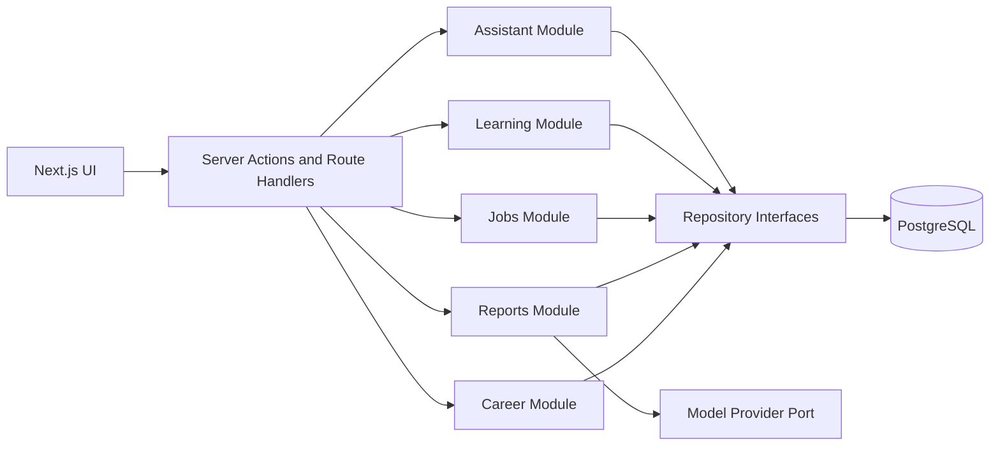
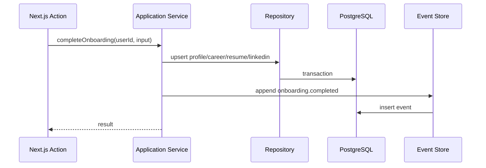
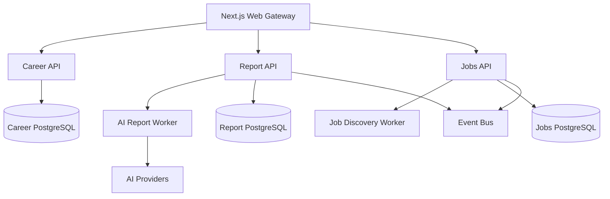

# Microservice Compatibility Plan

## Purpose

CareerOS should remain simple enough for one developer to ship the MVP, while avoiding architectural choices that make future service extraction expensive. The goal is not to create microservices now. The goal is to make today's modular monolith compatible with tomorrow's service boundaries.

## Current State

The current Next.js app mixes several responsibilities:

- Authentication actions.
- Session checks.
- Onboarding persistence.
- Career report context loading.
- AI report generation.
- Direct Supabase data access.
- UI rendering.

This is acceptable for early MVP speed, but it creates extraction friction because business use cases are coupled to route handlers and vendor-specific data access.

## Target Model: Modular Monolith First

CareerOS should use a modular monolith during the MVP.



Each module should expose service methods and own its domain language. Route handlers should coordinate request/response work, not contain business workflows.

## Service Boundary Candidates

Do not split these services yet. Design them so they can be split later.

| Future Service            | MVP Module                 | Why It May Split Later                         | Extraction Trigger                          |
| ------------------------- | -------------------------- | ---------------------------------------------- | ------------------------------------------- |
| Identity Service          | Auth/session module        | Provider changes, enterprise auth, audit needs | Multiple auth providers or enterprise SSO   |
| Career Profile Service    | Career module              | Central user career state                      | Other services need profile snapshots       |
| Report Generation Service | Career Intelligence module | AI latency, cost control, queueing             | Reports become async or high volume         |
| Job Discovery Service     | Job module                 | External API scheduling and normalization      | Multiple job sources or background crawling |
| Recommendation Service    | Recommendation module      | Ranking, personalization, experimentation      | Dedicated scoring pipeline needed           |
| Learning Service          | Learning module            | Content catalog integrations                   | Multiple learning providers                 |
| Event/Telemetry Service   | Analytics module           | Product analytics and model observability      | High event volume or compliance needs       |

## Module Interface Principles

Service methods should:

- Accept application user IDs, not provider session objects.
- Accept validated inputs, not raw form data.
- Return domain result objects, not Supabase/ORM result envelopes.
- Hide persistence details.
- Emit domain events after important state changes.
- Avoid importing Next.js APIs except at the route/action boundary.

Example:

```ts
export async function generateCareerReport(input: {
  userId: string;
  requestedAt: Date;
}): Promise<GenerateCareerReportResult> {
  // Load context, call model service, persist report, emit event.
}
```

## Repository Boundary

Recommended repository groups:

- `UserRepository`
- `ProfileRepository`
- `CareerProfileRepository`
- `ResumeRepository`
- `LinkedInProfileRepository`
- `CareerReportRepository`
- `ApplicationRepository`
- `LearningRecommendationRepository`
- `AgentMessageRepository`
- `ProductEventRepository`

Repositories should not make authorization decisions silently. They should require `userId` for all user-owned operations.

## Domain Events

The MVP does not need Kafka, NATS, or a full event bus. It does need a consistent event shape.

Recommended MVP event table:

| Column                   | Notes                           |
| ------------------------ | ------------------------------- |
| `id uuid`                | Event ID                        |
| `user_id uuid null`      | Nullable for system events      |
| `event_type text`        | Example: `onboarding.completed` |
| `entity_type text`       | Example: `career_report`        |
| `entity_id uuid null`    | Related entity                  |
| `payload jsonb`          | Small metadata only             |
| `created_at timestamptz` | Event time                      |

Future-compatible event flow:



Later, events can be forwarded to a queue without changing the service interface.

## Synchronous vs Asynchronous Work

MVP synchronous:

- Sign in/sign up.
- Onboarding form save.
- Reading dashboard summary.
- Basic report generation if response time is acceptable.

MVP asynchronous-ready:

- Career report generation.
- Resume parsing.
- Job discovery refresh.
- Recommendation scoring.
- Learning recommendation refresh.

For now, report generation can stay in a server action. The service API should be designed so it can later enqueue a job:

```ts
requestCareerReportGeneration(userId): Promise<{ reportId: string; status: "queued" | "ready" }>
```

## Database Ownership

In a modular monolith, all modules may share one PostgreSQL database, but ownership must be clear.

| Table Group                                                   | Owning Module       |
| ------------------------------------------------------------- | ------------------- |
| `users`, `auth_identities`                                    | Identity            |
| `profiles`, `career_profiles`, `resumes`, `linkedin_profiles` | Career Profile      |
| `career_reports`                                              | Career Intelligence |
| `jobs`, `saved_jobs`, `applications`                          | Job/Application     |
| `learning_recommendations`                                    | Learning            |
| `agent_messages`                                              | Assistant           |
| `events`                                                      | Analytics/Telemetry |

Future service extraction can start by moving the owning module and its tables together.

## API Compatibility

Do not expose internal table shapes as external API contracts. Use DTOs.

Recommended DTO pattern:

- `CareerProfileDTO`
- `CareerReportDTO`
- `ApplicationDTO`
- `LearningRecommendationDTO`

DTOs may initially live in `packages/types`, but domain-specific DTOs should eventually move into `packages/domain`.

## Deployment Compatibility

MVP:

- One Next.js deployment.
- One local or managed PostgreSQL database.
- Server actions for mutations.

Scale-ready:

- Next.js remains the web gateway.
- Long-running workflows move to workers.
- Shared domain packages move to service packages.
- Services communicate through HTTP/gRPC for queries and events/queues for async workflows.



This is a future state, not an MVP implementation target.

## Anti-Patterns To Avoid Now

- Calling Supabase or ORM clients directly from React components.
- Putting business workflows inside page files.
- Sharing provider SDK response objects across modules.
- Using database table names as product-level API contracts.
- Adding microservice infrastructure before product-market signal.
- Building a distributed event platform before there are async workloads that need it.

## Implementation Order

| Order | Change                               | Complexity | Notes                                |
| ----- | ------------------------------------ | ---------- | ------------------------------------ |
| 1     | Document module boundaries           | Low        | This phase                           |
| 2     | Add service directory and interfaces | Low-medium | No behavior change                   |
| 3     | Move onboarding logic into service   | Medium     | First real boundary                  |
| 4     | Move report generation into service  | Medium     | Creates AI service boundary          |
| 5     | Add repositories behind services     | Medium     | Enables ORM switch                   |
| 6     | Add event append helper              | Low-medium | Future async foundation              |
| 7     | Add worker-compatible report API     | Medium     | Only when report latency requires it |

## Definition Of Microservice-Compatible

CareerOS is microservice-compatible when:

- Every module has a clear owner and service API.
- Route handlers depend on services, not database clients.
- Services depend on repository interfaces, not provider SDKs.
- User identity is represented by an application-owned user ID.
- Migrations are portable PostgreSQL migrations.
- Async work emits durable events.
- No MVP feature requires Supabase-specific runtime behavior outside the chosen auth adapter.
