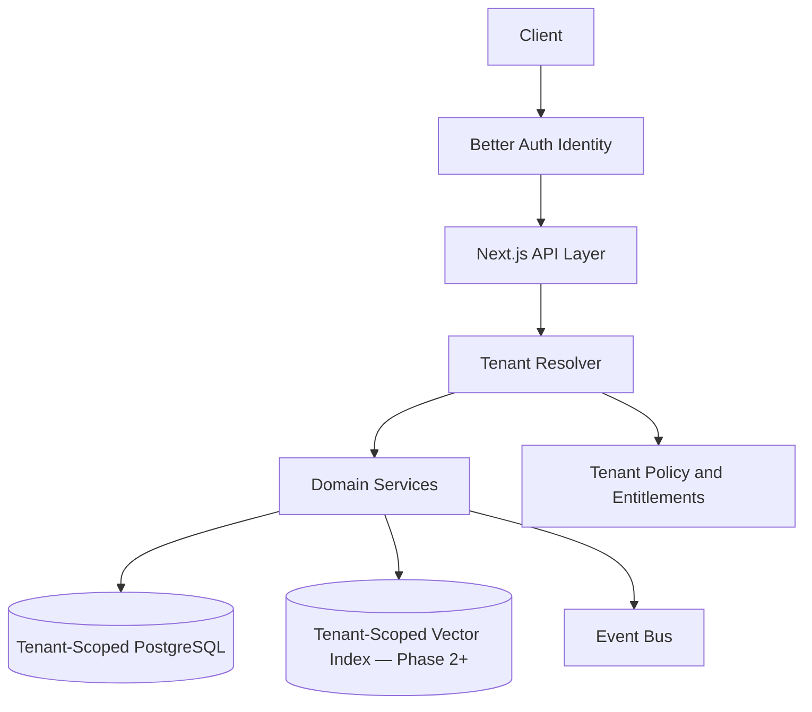

# Multi-Tenant SaaS Architecture

## Purpose

CareerOS is designed to serve global individual users first, with a future path to teams, universities, bootcamps, workforce programs, and enterprise career mobility customers.

Multi-tenancy must protect data boundaries while allowing shared infrastructure and scalable operations.

## Tenant Model

Tenant types:

- Consumer user tenant (Phase 1 — the only type)
- Organization tenant (future)
- Education or workforce program tenant (future)
- Enterprise tenant (future)

Users may belong to multiple tenants in future versions, but Phase 1 assumes one personal account per user.

## Architecture

## Isolation Strategy

Phase 1:

- Shared database with `user_id` on user-owned tables.
- Strict row-level access checks in repository and service code.
- No data from one user can appear in another user's context.

Future:

- Add `tenant_id` on tenant-scoped tables.
- Tenant-aware event payloads.
- Tenant-aware vector metadata filters.
- Row-level security at database layer.
- Regional data partitions.
- Dedicated databases for enterprise or regulated tenants.
- Dedicated encryption keys by tenant tier.

## Phase 1 MVP Version

- Personal account per user.
- Strict user-scoped data access via repositories.
- Add `tenant_id` to core entities early to avoid migration pain later.
- Build entitlement checks even if all users start on a simple plan.
- Keep organization features out of Phase 1 UI.

## Future Scale Version

For millions of users:

- Partition tenants by region.
- Add tenant-level rate limits.
- Add usage metering.
- Add organization roles and permissions.
- Add enterprise audit logs.
- Add regional data residency controls.

## Implementation Recommendations

- Add `tenant_id` to core schemas even in Phase 1 (it costs little now and saves a lot later).
- Apply user and tenant filters in every query path.
- Include user/tenant ID in events, logs, metrics, and traces.
- Keep entitlements separate from billing records.
- Design account deletion and tenant deletion as separate workflows.
- Never allow Fadi's memory, recommendations, or market context for one user to leak into another's context.

## Complexity

- Phase 1 complexity: Medium.
- Scale complexity: High.
- Main risks: tenant data leakage, entitlement confusion, regional compliance gaps.

## Implementation Order

1. Define tenant model (Phase 1: personal user account).
2. Add `tenant_id` to core schemas.
3. Build tenant resolver middleware.
4. Add entitlement service.
5. Add organization support in a future phase.
6. Add regional and dedicated isolation for enterprise.
