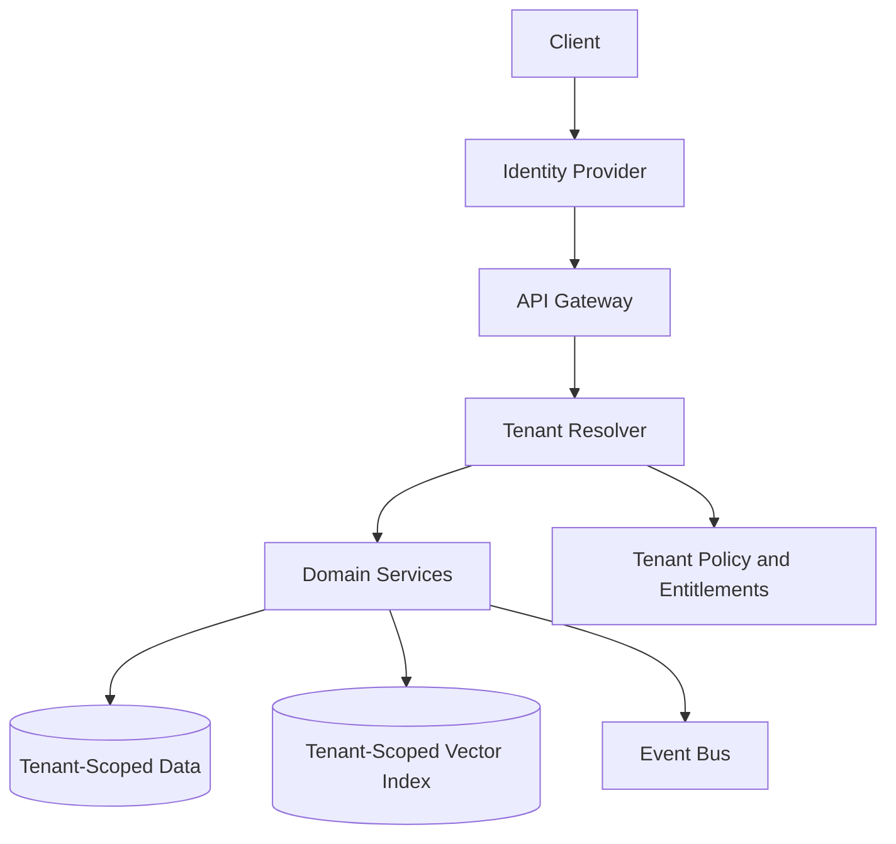

# Multi-Tenant SaaS Architecture

## Purpose

CareerOS AI should be designed to serve global individual users first, with a future path to teams, universities, bootcamps, workforce programs, and enterprise career mobility customers.

Multi-tenancy must protect data boundaries while allowing shared infrastructure and scalable operations.

## Tenant Model

Tenant types:

- Consumer user tenant
- Organization tenant
- Education or workforce program tenant
- Enterprise tenant

Users may belong to multiple tenants in future versions, but MVP can assume one personal account per user.

## Architecture

## Isolation Strategy

MVP:

- Shared database with `tenant_id` on tenant-scoped tables.
- Strict row-level access checks in service code.
- Tenant-aware event payloads.
- Tenant-aware vector metadata filters.

Future:

- Row-level security at database layer.
- Regional data partitions.
- Dedicated databases for enterprise or regulated tenants.
- Dedicated encryption keys by tenant tier.

## MVP Version

For MVP:

- Use a personal tenant for each user.
- Add `tenant_id` to core entities from day one.
- Build entitlement checks even if all users start on a simple plan.
- Keep organization features out of MVP UI.

## Future Scale Version

For millions of users:

- Partition tenants by region.
- Add tenant-level rate limits.
- Add usage metering.
- Add organization roles and permissions.
- Add enterprise audit logs.
- Add regional data residency controls.

## Implementation Recommendations

- Never add user-scoped tables without tenant scope.
- Apply tenant filters in every query path.
- Include tenant ID in events, logs, metrics, and traces.
- Keep entitlements separate from billing records.
- Design account deletion and tenant deletion separately.

## Tradeoffs and Alternatives

- Shared database is efficient but requires strict controls.
- Database per tenant improves isolation but increases operational cost.
- Hybrid isolation is best for consumer plus enterprise growth.
- Building multi-tenancy late is expensive; add core tenant fields early.

## Complexity

- MVP complexity: Medium.
- Scale complexity: High.
- Main risks: tenant data leakage, entitlement confusion, regional compliance gaps.

## Implementation Order

1. Define tenant model.
2. Add `tenant_id` to core schemas.
3. Build tenant resolver middleware.
4. Add entitlement service.
5. Add organization support later.
6. Add regional and dedicated isolation later.

