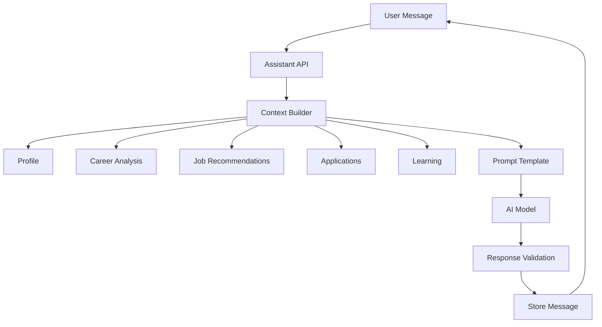

# MVP Agent Design

## Decision

The MVP uses one small AI career assistant, not multi-agent orchestration.

The assistant is a grounded product assistant that can answer questions, explain analysis, recommend next actions, and call a small set of internal functions. It cannot execute external actions.

## Agent Responsibilities

Included:

- Explain career analysis.
- Answer questions about user profile, skills, gaps, jobs, learning, and applications.
- Generate job match explanations.
- Generate learning recommendation reasons.
- Suggest next actions inside the app.

Excluded:

- Autonomous applications.
- Browser control.
- Multi-agent planning.
- External messaging.
- Voice.
- Calendar actions.
- Recruiter simulation.
- Salary negotiation.

## Architecture

## Context Builder

The assistant context should include only:

- User profile summary.
- Current target role and goals.
- Latest career analysis.
- Top skill gaps.
- Top 5 job recommendations.
- Application tracker summary.
- Learning recommendations.
- Last 6 assistant messages.

Do not include full resume text by default. Use resume summary unless the user explicitly asks for resume-specific help.

## Assistant System Rules

- Be calm, professional, honest, and specific.
- Do not claim to apply for jobs.
- Do not claim to contact recruiters.
- Do not fabricate skills, credentials, or experience.
- Ask for missing information when needed.
- Give practical next steps.
- Explain uncertainty.
- Keep answers concise unless the user asks for depth.

## Internal Functions

MVP may expose these internal functions:

- `getProfileSummary`
- `getLatestCareerAnalysis`
- `getJobRecommendations`
- `getApplicationSummary`
- `getLearningRecommendations`
- `createApplicationFromJob`
- `updateApplicationStatus`

Any function that mutates data must be confirmed by the user in the UI flow.

## MVP Prompt Types

- Career analysis prompt.
- Job match explanation prompt.
- Learning recommendation prompt.
- Assistant answer prompt.

## Complexity

MVP complexity: Medium.

Risk:

- Generic advice if context is weak.
- Prompt bloat if full profile and resume are always included.
- User may expect automation that is intentionally excluded.

Mitigation:

- Use structured context summaries.
- Keep assistant scope visible.
- Add product actions outside the chat.

