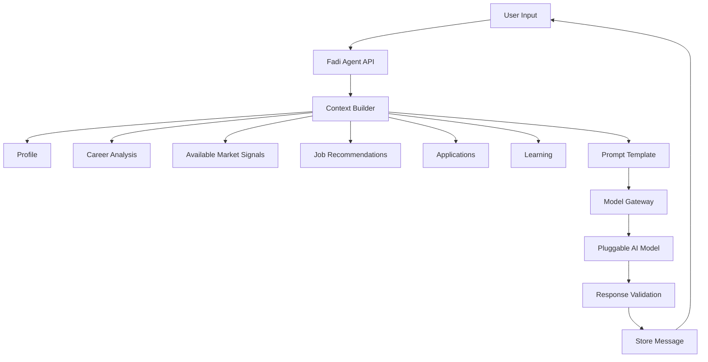

# MVP Agent Design

## Decision

The MVP implements a focused Fadi career agent: grounded, honest, and product-scoped. It does not yet have full multi-agent orchestration or browser automation, but it expresses Fadi's core identity — an honest mentor that validates decisions, explains gaps, and prescribes next steps.

The MVP agent can answer questions, explain analysis, validate career directions against available data, recommend next actions, and call a small set of internal functions. It cannot yet execute external actions autonomously.

## Agent Responsibilities

### Included in MVP

- Explain career analysis with evidence.
- Answer questions about user profile, skills, gaps, jobs, learning, and applications.
- Generate job match explanations grounded in actual job requirements.
- Validate (or challenge) user's career niche using available market data.
- Generate learning recommendation reasoning tied to market demand.
- Suggest next actions inside the app.
- Prescribe a concrete career system: what to do, in what order, why.
- Produce honest assessments — including contrarian positions when data supports them.

### Excluded in MVP

- Autonomous external applications.
- Browser control.
- Full multi-agent planning.
- External messaging send.
- Calendar scheduling.
- Recruiter simulation.
- Salary negotiation execution.

### Phase 2

- Voice input/output via Browser Web Speech API.
- Proactive 24x7 background monitoring.
- Real-time market data integration.

## Architecture

## Model Gateway

All AI calls go through the model gateway abstraction. The current provider is OpenAI, but the design allows swapping to Claude, Gemini, or a local model without changing Fadi's behavior. No agent code imports provider SDKs directly.

## Context Builder

The agent context should include only:

- User profile summary.
- Current target role and goals.
- Niche validation results (with evidence source notes).
- Latest career analysis.
- Top skill gaps.
- Available market signals relevant to the user's target role and geography.
- Top 5 job recommendations.
- Application tracker summary.
- Learning recommendations.
- Last 6 agent messages.

Do not include full resume text by default. Use resume summary unless the user explicitly asks for resume-specific help.

Do not include raw third-party data payloads in the prompt — summarize and attribute.

## Agent System Rules

- Be calm, professional, honest, and specific.
- Do not claim to apply for jobs or send messages.
- Do not fabricate skills, credentials, or experience.
- Do not fabricate job market data or salary figures.
- Distinguish confirmed market data from directional signals.
- Challenge user decisions with data when the evidence warrants it.
- Ask for missing information when needed.
- Give practical next steps tied to real career paths.
- Explain uncertainty honestly.
- Keep answers concise unless the user asks for depth.

## Internal Functions

MVP exposes these internal functions:

- `getProfileSummary`
- `getNicheValidationResult`
- `getLatestCareerAnalysis`
- `getJobRecommendations`
- `getApplicationSummary`
- `getLearningRecommendations`
- `getAvailableMarketSignals`
- `createApplicationFromJob`
- `updateApplicationStatus`

Any function that mutates data must be confirmed by the user in the UI flow.

## MVP Prompt Types

- Niche validation prompt (market data + user direction → assessment with contrarian check).
- Career analysis prompt.
- Job match explanation prompt.
- Learning recommendation prompt (market demand prioritized).
- Agent answer prompt (general career guidance).

## Niche Validation Design

When the user states a career direction, Fadi:

1. Retrieves available market signal data for that role and geography.
2. Checks for known hype patterns, market contraction signals, or saturation.
3. If data supports the direction: confirms with evidence and identifies next steps.
4. If data has concerns: surfaces the concern clearly, explains the market reality, and offers alternatives or a more accurate framing.
5. Never suppresses a concern to make the user feel better.

This is core to Fadi's honest-mentor identity and must never be softened to a generic encouragement response.

## Complexity

MVP complexity: Medium-high.

Risk:

- Generic advice if context is weak or market data is unavailable.
- Prompt bloat if full profile and resume are always included.
- User may expect full automation that is intentionally phased.
- Niche validation quality depends on available market signal data.

Mitigation:

- Use structured context summaries.
- Keep agent scope visible and honest about what it has access to.
- Phase real-time market data in when third-party APIs are integrated.
- Add product actions outside the conversation for complex workflows.
