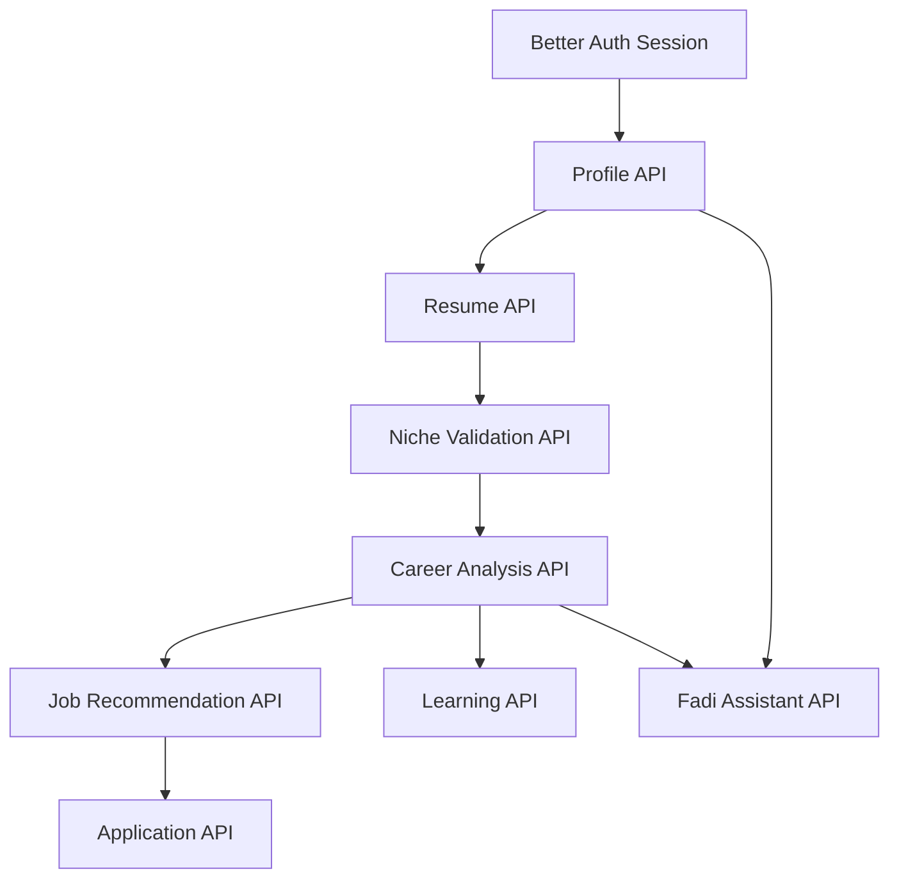

# MVP API Requirements

## Purpose

This document defines the API surface required for the Phase 1 MVP. The API should be small, product-driven, and implementable by one developer using Next.js server actions and route handlers.

## API Style

Use Next.js Route Handlers and Server Actions for all MVP endpoints. Keep endpoint behavior explicit and typed. Avoid building a broad public API until product workflows stabilize.

All AI calls route through the model gateway abstraction — not directly against provider SDKs in route handlers.

## Authentication

All authenticated routes require a valid Better Auth session resolved through `getCurrentAuthUser()`. All domain data access uses the CareerOS app-owned `users.id`, not the auth provider's user ID.

Public routes:

- Landing page
- Sign-in and sign-up pages

Authenticated routes:

- Profile
- Resume upload
- Career analysis
- Niche validation
- Job search
- Recommendations
- Applications
- Learning recommendations
- Fadi assistant

## Endpoint Requirements

### Profile

- `GET /api/profile`: return current profile.
- `POST /api/profile`: create or update profile fields.
- `POST /api/profile/linkedin`: save LinkedIn pasted/imported data and parse profile summary.

### Resume

- `POST /api/resume/upload`: upload resume to object storage and create resume record.
- `POST /api/resume/:id/parse`: parse resume text and update resume record.
- `GET /api/resume/current`: return current resume summary.

### Niche

- `POST /api/niche/discover`: save niche discovery conversation output.
- `POST /api/niche/validate`: validate user's stated direction against available market data.
- `GET /api/niche/latest`: return latest niche validation result.

### Career Analysis

- `POST /api/career-analysis`: generate analysis from profile, resume, LinkedIn data, goals, and niche validation through model gateway.
- `GET /api/career-analysis/latest`: return latest analysis.

### Jobs

- `GET /api/jobs/search`: search jobs by role, location, and remote preference.
- `GET /api/jobs/recommendations`: list recommendations.
- `POST /api/jobs/:id/save`: save recommendation.
- `POST /api/jobs/:id/reject`: reject recommendation.

### Applications

- `GET /api/applications`: list tracked applications.
- `POST /api/applications`: create application.
- `PATCH /api/applications/:id`: update status, notes, next action, deadline.
- `DELETE /api/applications/:id`: delete application.

### Learning

- `POST /api/learning/recommend`: generate learning recommendations from skill gaps, market demand prioritized.
- `GET /api/learning`: list recommendations.
- `PATCH /api/learning/:id`: update status.

### Fadi Assistant

- `POST /api/assistant/message`: send message and receive grounded Fadi response through model gateway.
- `GET /api/assistant/messages`: list recent messages.

### Events

- `POST /api/events`: record product event.

## MVP API Flow

## AI API Requirements

All AI calls must:

- Route through the model gateway abstraction.
- Use versioned prompt templates.
- Log model name and operation type only (no sensitive content).
- Include only necessary user context (summarized, not raw).
- Return structured JSON validated with Zod.
- Fail gracefully with safe user-facing messages and retry option.
- Never expose provider SDK errors directly to users.
- Never log resume text, LinkedIn text, or raw prompt content.

## Error Handling

API responses must distinguish:

- Authentication errors
- Validation errors
- Missing profile data
- AI generation errors (safe user-facing message)
- Job source errors
- File parsing errors
- Database errors

## Excluded API Capabilities in Phase 1

- External job application submission.
- Message sending.
- Calendar scheduling.
- Browser automation.
- Enterprise admin endpoints.
- Billing endpoints.
- Public developer API.
- Voice API (Phase 2 — Browser Web Speech API is client-side).
