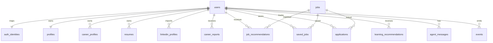

# MVP Database V1

## Purpose

This schema is the smallest database needed for the 8-12 week MVP. It intentionally excludes knowledge graph, enterprise tenancy, advanced event streaming, browser automation, autonomous workflows, and complex billing.

## Database Choice

PostgreSQL with Drizzle ORM.

Active stack:

- PostgreSQL running in Docker locally.
- Production PostgreSQL provider TBD (Neon, Supabase Postgres, RDS, or equivalent).
- Drizzle ORM for type-safe schema access and migration management.
- Committed migrations in `packages/database/migrations`.
- Better Auth owns auth tables (`user`, `session`, `account`, `verification`).
- CareerOS owns domain tables that reference app-owned `users.id`.

Do not use Supabase-specific auth functions (`auth.users`, `auth.uid()`, RLS with Supabase-only context) in domain migrations. All migrations must run against vanilla PostgreSQL.

## Core Tables

### users

CareerOS application identity. Separate from Better Auth user identity.

Fields:

- id (uuid, primary key)
- email (text, not null)
- email_verified_at (timestamptz, nullable)
- created_at (timestamptz)
- updated_at (timestamptz)

### auth_identities

Maps auth provider identity to CareerOS app identity.

Fields:

- id
- user_id (references users.id)
- provider (text: `better_auth`)
- provider_subject (text: Better Auth user.id)
- provider_profile (jsonb: minimal metadata only)
- created_at

### profiles

Stores the user's career profile.

Fields:

- id
- user_id
- full_name
- headline
- current_title
- current_company
- location
- target_role
- target_industries (jsonb)
- preferred_locations (jsonb)
- remote_preference
- salary_expectation (jsonb)
- years_experience
- career_goal
- created_at
- updated_at

### career_profiles

Stores richer career data from onboarding.

Fields:

- id
- user_id
- career_summary
- experience_level
- primary_skills (jsonb)
- industry_focus
- onboarding_status
- created_at
- updated_at

### resumes

Stores uploaded resume metadata and parsed content.

Fields:

- id
- user_id
- file_path (object storage reference)
- file_name
- file_type
- parsed_text
- summary
- parse_status
- created_at
- updated_at

### linkedin_profiles

Stores LinkedIn profile input from paste/import.

Fields:

- id
- user_id
- source_type (pasted_text, profile_url, manual)
- raw_text
- parsed_summary
- imported_at

### career_reports

Stores AI career analysis outputs.

Fields:

- id
- user_id
- career_summary
- niche_assessment_status (text: supported, challenged, redirected)
- niche_assessment_evidence (jsonb)
- strengths (jsonb)
- weaknesses (jsonb)
- missing_skills (jsonb)
- readiness_score
- opportunity_score
- career_system_prescription (jsonb)
- recommendations (jsonb)
- model_name
- prompt_version
- market_data_snapshot_date
- status (text: generating, ready, failed)
- created_at

### jobs

Stores discovered or imported jobs.

Fields:

- id
- source
- external_id
- title
- company
- location
- remote_mode
- description
- url
- salary_text
- posted_at
- discovered_at
- status (text: active, closed, unknown)
- raw_payload (jsonb)

### saved_jobs

Stores user-saved jobs.

Fields:

- id
- user_id
- job_id
- saved_at

### job_recommendations

Stores per-user job match analysis.

Fields:

- id
- user_id
- job_id
- match_score
- matched_skills (jsonb)
- missing_skills (jsonb)
- explanation
- status (text: new, viewed, saved, rejected)
- created_at

### applications

Stores application tracking records.

Fields:

- id
- user_id
- job_id (nullable)
- company
- title
- url
- status (text: saved, preparing, applied, interview, offer, rejected, withdrawn)
- priority
- notes
- next_action
- deadline_at
- applied_at
- created_at
- updated_at

### learning_recommendations

Stores learning recommendations from skill gaps.

Fields:

- id
- user_id
- skill_name
- item_type (text: course, certification, portfolio_project, github_repo, case_study)
- title
- provider
- url
- reason
- market_demand_basis
- estimated_time
- status (text: recommended, saved, completed, dismissed)
- created_at

### agent_messages

Stores Scout conversation messages.

Fields:

- id
- user_id
- role (text: user, scout, system)
- content
- context_summary
- created_at

### events

Stores product and system events.

Fields:

- id
- user_id (nullable)
- event_type
- entity_type
- entity_id (nullable)
- payload (jsonb — small metadata only, no sensitive content)
- created_at

## MVP Entity Diagram

## Implementation Notes

- Add `user_id` indexes to all user-owned tables.
- Store uploaded files in object storage; database stores file path only.
- Store arrays as JSONB for MVP where schema churn is likely.
- Normalize later if usage patterns prove stable.
- Do not use Supabase `auth.users` or `auth.uid()` references — these are vanilla PostgreSQL migrations.
- Status fields should use check constraints or Drizzle enum types (not plain text) before beta launch.
- Avoid storing unnecessary raw AI prompt data or raw provider responses.

## Excluded From V1

- tenants table
- organizations
- billing tables
- approval_requests (add in Phase 2 when external actions are available)
- agent_tasks (add when background workers are active)
- vector indexes
- knowledge graph tables
- market_signals (add in Phase 3 with real-time API integration)
- generated application assets with versioning (Phase 2)
- audit-grade external action logs
