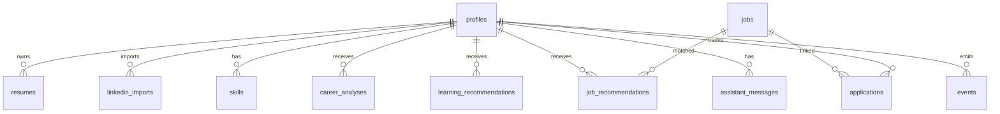

# MVP Database V1

## Purpose

This schema is the smallest database needed for the 8-12 week MVP. It intentionally excludes knowledge graph, enterprise tenancy, advanced event streaming, browser automation, autonomous workflows, and complex billing.

## Database Choice

Use Supabase Postgres for MVP.

Reasons:

- Relational data fits users, profiles, jobs, applications, and analyses.
- Auth and storage integrate well with the database.
- One developer can operate it.
- It can later support row-level security and vector extensions if needed.

## Core Tables

### users

Supabase Auth owns primary identity. Application profile table should reference auth user ID.

### profiles

Stores the user's career profile.

Fields:

- id
- user_id
- full_name
- headline
- current_title
- current_company
- location
- target_role
- target_industries
- preferred_locations
- remote_preference
- salary_expectation
- years_experience
- career_goal
- created_at
- updated_at

### resumes

Stores uploaded resume metadata and parsed content.

Fields:

- id
- user_id
- file_path
- file_name
- file_type
- parsed_text
- summary
- parse_status
- created_at
- updated_at

### linkedin_imports

Stores LinkedIn profile input from paste/import.

Fields:

- id
- user_id
- source_type
- raw_text
- parsed_summary
- imported_at

Source types:

- pasted_text
- profile_url
- manual

### skills

Stores user skills extracted or manually entered.

Fields:

- id
- user_id
- name
- source
- confidence
- created_at

### career_analyses

Stores AI career analysis outputs.

Fields:

- id
- user_id
- profile_id
- resume_id
- summary
- strengths
- weaknesses
- missing_skills
- readiness_score
- opportunity_score
- recommended_actions
- model_name
- prompt_version
- created_at

### jobs

Stores discovered or imported jobs.

Fields:

- id
- source
- external_id
- title
- company
- location
- remote_mode
- description
- url
- salary_text
- posted_at
- discovered_at
- raw_payload

### job_recommendations

Stores per-user job match analysis.

Fields:

- id
- user_id
- job_id
- match_score
- matched_skills
- missing_skills
- explanation
- status
- created_at

Statuses:

- new
- viewed
- saved
- rejected

### applications

Stores manual application tracking records.

Fields:

- id
- user_id
- job_id
- company
- title
- url
- status
- priority
- notes
- next_action
- deadline_at
- applied_at
- created_at
- updated_at

Statuses:

- saved
- preparing
- applied
- interview
- offer
- rejected
- withdrawn

### learning_recommendations

Stores learning recommendations generated from skill gaps.

Fields:

- id
- user_id
- skill_name
- title
- provider
- url
- reason
- estimated_time
- status
- created_at

Statuses:

- recommended
- saved
- completed
- dismissed

### assistant_messages

Stores assistant conversation messages.

Fields:

- id
- user_id
- role
- content
- context_summary
- created_at

Roles:

- user
- assistant
- system

### events

Stores simple product and system events.

Fields:

- id
- user_id
- event_type
- entity_type
- entity_id
- metadata
- created_at

## MVP Entity Diagram

## Excluded From V1

- tenants table
- organizations
- billing tables
- approval requests
- agent tasks
- vector indexes
- knowledge graph tables
- market signals
- generated application assets
- audit-grade external action logs

## Implementation Notes

- Add `user_id` indexes to all user-owned tables.
- Store uploaded files in Supabase Storage; database stores file path only.
- Store arrays as JSONB for MVP where schema churn is likely.
- Normalize later if usage patterns prove stable.
- Add row-level security before production.
- Avoid storing unnecessary raw AI prompt data.

