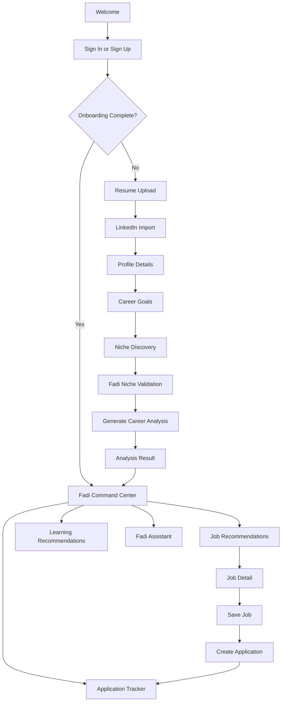

# MVP Screen Flow

## End-to-End Flow

## Screen Details

### Welcome

Purpose:

- Introduce Fadi as the career operating system in one screen.
- Move the user to sign up.

MVP content:

- Fadi introduction in first person.
- Three specific value statements (honest mentoring, proactive discovery, evidence-based guidance).
- Sign up / log in CTA.

### Resume Upload

Purpose:

- Capture career data quickly.

States:

- Empty
- Uploading
- Parsing
- Parsed with extraction preview
- Parse failed with fallback option

### LinkedIn Import

Purpose:

- Add public professional positioning context.

MVP behavior:

- User can paste LinkedIn profile text.
- User can enter LinkedIn URL for reference.
- Official API import is deferred unless easily approved.

Fadi says: "LinkedIn helps me understand how you present yourself publicly. If direct import is unavailable, paste your profile text here and I will still use it."

### Profile Details

Purpose:

- Let the user confirm and correct Fadi's inferences.

Fields:

- Name
- Current title
- Current company
- Location
- Target role
- Industries
- Remote preference
- Salary expectation
- Skills

### Career Goals

Purpose:

- Focus Fadi's analysis and niche validation.

Fields:

- Main goal
- Target role
- Preferred locations
- Career stage
- Timeline
- Constraints

### Niche Discovery and Validation

Purpose:

- Fadi asks about the user's direction and validates it honestly against available data.

Flow:

1. Fadi asks exploratory questions about the user's goals and interests.
2. User states or confirms a direction.
3. Fadi validates the direction against available market data.
4. Fadi returns an honest assessment: supported, challenged, or redirected with evidence.
5. User can accept Fadi's assessment, push back, or revise their direction.

States:

- Fadi asking questions
- User providing direction
- Fadi validating (processing)
- Validation result (supported / challenged / redirect)
- User confirms or revises

### Analysis Generation

Purpose:

- Maintain trust during the generation wait.

Fadi narrates each step:

- Reading your CV.
- Comparing LinkedIn context.
- Mapping your skills.
- Checking target role fit.
- Reviewing available market signals.
- Identifying evidence gaps.
- Preparing your career system.

### Career Analysis Result

Purpose:

- Deliver first major Fadi value moment: the honest, evidence-grounded career intelligence report.

Sections:

- Fadi summary card with niche assessment
- Career readiness score with component breakdown
- Resume quality score with component breakdown
- Strengths (with evidence)
- Skill and evidence gaps (constructive)
- Career opportunities (best-fit, stretch, adjacent)
- Market demand signals with source attribution
- Learning path (market demand prioritized)
- Recommended career system: what to do, in what order

### Fadi Command Center (Dashboard)

Purpose:

- Main operating screen for the user. Fadi's primary surface.

Sections:

- Fadi action feed: what Fadi has prepared, found, or surfaced
- Career readiness snapshot
- Priority next actions with reasoning
- Top job recommendations
- Application tracker summary
- Learning recommendations
- Market signal updates
- Fadi assistant entry point

### Job Recommendations

Purpose:

- Show Fadi-curated, personalized opportunities.

Sections:

- Filters (role, location, remote preference)
- Recommendation cards with match score and explanation
- Skill matches and gaps per role
- Salary and location fit
- Save and reject actions

### Application Tracker

Purpose:

- Track applications manually with Fadi's assistance.

Sections:

- Status columns or list view
- Application detail
- Notes and next action
- Generated assets (resume draft, cover letter) — Phase 2

### Fadi Assistant

Purpose:

- Answer grounded career questions including challenging and contrarian ones.

Fadi is present, honest, and evidence-backed. It will challenge assumptions if data warrants it.

Capabilities:

- Answer career, resume, job targeting, learning, niche, and application tracking questions.
- Push back on decisions the data does not support.
- Suggest specific next actions inside CareerOS.

Phase 1 boundaries:

- No external actions from the assistant.
- No autonomous workflow execution.
- No recruiter simulation.

## Phase 2 Additions

- Voice entry point visible in the Fadi command center and assistant.
- "Speak to Fadi" button that activates Browser Web Speech API.
- Voice responses from Fadi alongside text.
