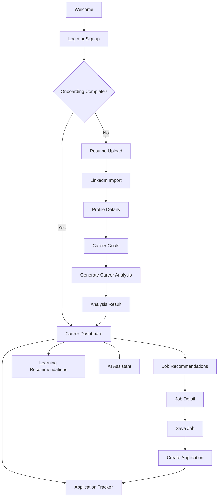

# MVP Screen Flow

## End-to-End Flow

## Screen Details

### Welcome

Purpose:

- Explain CareerOS AI in one screen.
- Move user to signup.

MVP content:

- Product promise.
- Short value bullets.
- Signup/login CTA.

### Resume Upload

Purpose:

- Capture career data quickly.

States:

- Empty
- Uploading
- Parsing
- Parsed
- Parse failed

### LinkedIn Import

Purpose:

- Add profile context.

MVP behavior:

- User can paste LinkedIn profile text.
- User can enter LinkedIn URL for reference.
- Official API import is deferred unless easily approved.

### Profile Details

Purpose:

- Let user confirm and correct data.

Fields:

- Name
- Current title
- Location
- Target role
- Industries
- Remote preference
- Salary expectation
- Skills

### Career Goals

Purpose:

- Focus recommendations.

Fields:

- Main goal
- Target role
- Preferred locations
- Career stage
- Timeline

### Career Analysis Result

Purpose:

- Deliver first value moment.

Sections:

- Career summary
- Strengths
- Skill gaps
- Readiness score
- Recommended next actions

### Career Dashboard

Purpose:

- Main operating screen.

Sections:

- Career readiness
- Next actions
- Top job recommendations
- Application tracker summary
- Learning recommendations
- Assistant entry point

### Job Recommendations

Purpose:

- Show personalized opportunities.

Sections:

- Filters
- Recommendation cards
- Match explanation
- Save/reject actions

### Application Tracker

Purpose:

- Track applications manually.

Sections:

- Status columns or list
- Application detail
- Notes
- Next action

### AI Assistant

Purpose:

- Answer grounded career questions.

Boundaries:

- No external actions.
- No autonomous workflows.
- No recruiter simulation.

