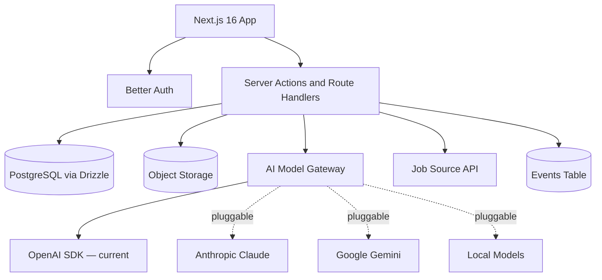

# MVP Tech Stack

## Stack Decision

CareerOS uses a pragmatic full-stack TypeScript architecture optimized for one developer, fast iteration, and low operational overhead.

## Current Stack

| Layer | Technology | Notes |
| --- | --- | --- |
| Web framework | Next.js 16 (App Router) | Full-stack, React Server Components, server actions |
| UI framework | React 19 | |
| Language | TypeScript | Strict throughout |
| Styling | Tailwind v4, shadcn/ui | |
| Authentication | Better Auth with Drizzle adapter | Email/password for Phase 1; OAuth future |
| Database | PostgreSQL | Docker locally, managed provider for production (TBD) |
| ORM | Drizzle ORM | Type-safe, SQL-forward, migration-controlled |
| Migrations | `drizzle-kit`, committed to repo | |
| AI provider | Pluggable model gateway — OpenAI SDK currently wired | Claude, Gemini, or local models can be swapped in |
| Job data | One compliant job API or curated source | Phase 1 |
| File storage | Managed object storage | Provider TBD (S3-compatible) |
| Background jobs | Lightweight queue or scheduled API jobs | |
| Hosting | Vercel (Next.js) | Production TBD |
| Voice | Browser Web Speech API | Phase 2 |
| Real-time market data | Trusted third-party APIs | Phase 3+ |

## Monorepo Structure

```
apps/
  web/         — Next.js 16 application
packages/
  database/    — Drizzle schema, migrations, repositories
  shared/      — Framework-independent utilities and constants
  types/        — Shared TypeScript contracts
  ui/           — Reusable presentational components
```

## Why This Stack

Next.js 16 App Router provides full-stack TypeScript in one codebase, supports server-rendered routes, server actions for mutations, and React Server Components for data access. This removes the need for a separate API backend during MVP.

Better Auth provides first-party TypeScript auth with a Drizzle adapter. It does not lock CareerOS into a specific hosting provider or auth platform. The auth layer is application-owned.

Drizzle ORM gives type-safe SQL access with committed migration history. Schema is visible, portable PostgreSQL and can run against any PostgreSQL-compatible provider. This is the right fit for a system that may split into services later.

The AI model gateway abstracts the specific provider. Currently wired to the OpenAI SDK, but the design allows swapping to Claude, Gemini, or a local model without changing product code. No feature should hard-code model provider assumptions.

## MVP Architecture Diagram



## AI Stack

MVP uses a single model gateway service. No multi-agent orchestration yet.

Components:

- `modelGateway`: pluggable interface wrapping provider SDKs; currently implements OpenAI.
- `promptTemplates`: career analysis, niche validation, job match, assistant answer, learning recommendation.
- `contextBuilder`: gathers user profile, resume summary, career analysis, goals, and market signals.
- `aiLogs`: stores request metadata, model name, operation type, and output references (no sensitive prompt text).

Do not build in Phase 1:

- Full multi-agent workflow engine.
- Tool marketplace.
- Multi-agent planner.
- Browser automation.

Do build in Phase 2:

- Voice input/output via Browser Web Speech API.
- Background proactive monitoring workers.

## Infrastructure Requirements for MVP

Minimum:

- Vercel project (Next.js deployment).
- PostgreSQL provider (Neon, Supabase Postgres, RDS, or Railway — all compliant options).
- OpenAI API key (server-side only, never exposed to browser).
- Job source credentials if using an API.
- Object storage bucket (S3 or compatible).
- Domain name.
- Error monitoring.

Estimated monthly infrastructure for first 100 users:

- Low usage: USD 25-100.
- Moderate AI usage: USD 100-300.
- Higher document and assistant usage: USD 300-600.

Actual AI cost depends on model choice, prompt size, and usage frequency. Add cost tracking from week one.

## Alternatives Considered

| Option | Pros | Cons | Decision |
| --- | --- | --- | --- |
| Next.js + Drizzle + Better Auth | Full TypeScript, provider-independent | More initial setup than Supabase | Chosen — more portable |
| Supabase (as platform) | Fast setup | Auth and DB lock-in, PostgREST coupling | Rejected — decoupled by design |
| Django + Postgres | Stable backend | Slower TypeScript ecosystem iteration | Defer |
| Rails | Productive CRUD | Less aligned with AI TypeScript ecosystem | Defer |
| Separate frontend/backend | Cleaner separation | More overhead for one developer | Defer |
| Firebase | Fast auth/storage | Less relational fit for career data | Defer |

## Stack Risks

- OpenAI usage can become expensive without usage limits and cost tracking.
- Job API access may be constrained or require licensing.
- Vercel serverless execution limits may affect long AI-generation jobs.
- Resume parsing may require a third-party parser.
- PostgreSQL connection pooling must be configured for serverless deployment.

## What Is Intentionally Out of Scope for Phase 1

- Vector database (add in Phase 2 when semantic search is needed).
- Knowledge graph (add later when taxonomy demands it).
- Streaming event platform (add when async volumes require it).
- Enterprise SSO.
- Multi-region infrastructure.
- Browser agent runtime.
- Voice interaction (Phase 2).
