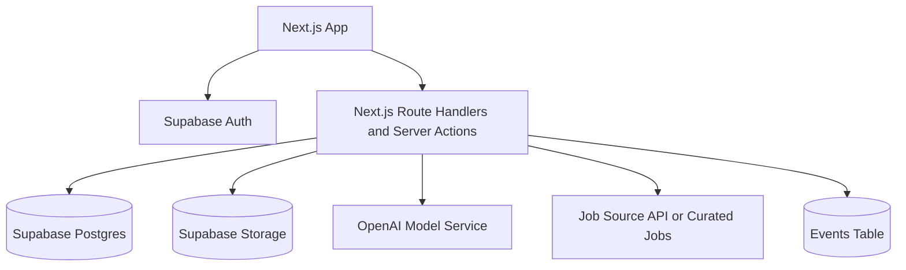

# MVP Tech Stack

## Stack Decision

Use a pragmatic full-stack TypeScript architecture optimized for one developer, fast iteration, and low operations.

Recommended MVP stack:

- Frontend and backend: Next.js App Router with TypeScript.
- UI: Tailwind CSS and a small component library.
- Database: Supabase Postgres.
- Authentication: Supabase Auth with email and Google.
- File storage: Supabase Storage.
- Background jobs: simple scheduled API jobs or lightweight queue first.
- AI provider: OpenAI API behind a small model service abstraction.
- Job data: one compliant job API or curated import source.
- Hosting: Vercel for the Next.js app.
- Analytics: simple product events table plus lightweight analytics later.

## Why This Stack

This stack minimizes infrastructure while preserving room to scale. Next.js supports full-stack application development and server-rendered routes; official Next.js documentation describes App Router pages and layouts as React Server Components by default and supports server-side data workflows. Vercel's official documentation positions Next.js deployment as zero-configuration with preview and production environments. Supabase provides Postgres, Auth, Storage, and Edge Functions, which reduces the number of services a solo developer must integrate.

Reference docs checked:

- Next.js App Router docs: https://nextjs.org/docs/app
- Next.js Server Actions docs: https://nextjs.org/docs/app/api-reference/directives/use-server
- Vercel Next.js deployment docs: https://vercel.com/docs/concepts/next.js/overview
- Vercel environments docs: https://vercel.com/docs/deployments/environments
- Supabase database functions docs: https://supabase.com/docs/guides/database/functions
- Supabase Edge Functions docs: https://supabase.com/docs/guides/functions/quickstart
- Supabase auth headers docs: https://supabase.com/docs/guides/functions/auth-headers
- OpenAI platform docs: https://platform.openai.com/docs

## MVP Architecture

## Alternatives Considered

| Option | Pros | Cons | Decision |
| --- | --- | --- | --- |
| Next.js + Supabase | Fast, one repo, low ops | May need refactor at scale | Choose for MVP |
| Django + Postgres | Stable backend | Slower full-stack iteration | Defer |
| Rails | Productive CRUD | Less aligned with AI TypeScript ecosystem | Defer |
| Separate frontend/backend | Cleaner separation | More overhead for one developer | Defer |
| Firebase | Fast auth/storage | Less relational fit for career data | Defer |
| Custom Kubernetes | Scalable | Absurd for MVP | Exclude |

## AI Stack

MVP should use a single assistant service, not multi-agent orchestration.

Components:

- `modelClient`: wraps provider API.
- `promptTemplates`: career analysis, job match, assistant answer, learning recommendation.
- `contextBuilder`: gathers user profile, resume summary, career analysis, jobs, and applications.
- `aiLogs`: stores request metadata, model, token estimates, and output references.

Do not build:

- Agent workflow engine.
- Tool marketplace.
- Multi-agent planner.
- Browser automation.
- Voice stack.

## Infrastructure Requirements

MVP minimum:

- Vercel project.
- Supabase project.
- OpenAI API key.
- Job source credentials if using an API.
- Domain name.
- Error monitoring.

Estimated monthly infrastructure for first 100 users:

- Low usage: USD 25-100.
- Moderate AI usage: USD 100-300.
- Higher document and assistant usage: USD 300-600.

Actual AI cost depends on model choice, prompt size, and assistant usage. Add usage tracking from week one.

## Stack Risks

- Supabase row-level security must be configured correctly.
- OpenAI usage can become expensive without limits.
- Job API access may be constrained.
- Vercel serverless execution limits may affect long jobs.
- Resume parsing may require a third-party parser later.

## MVP Technical Non-Goals

- No vector database.
- No knowledge graph.
- No streaming event platform.
- No enterprise SSO.
- No multi-region infrastructure.
- No Kubernetes.
- No browser agent runtime.

