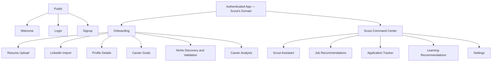

# MVP UI Sitemap

## Purpose

The MVP sitemap keeps the product small enough for one developer while establishing Scout's identity as the entire CareerOS operating system — not a feature bolted onto a dashboard.

## Sitemap

## Screens

### Public

- Welcome (Scout introduction)
- Login
- Signup

### Onboarding

- Resume Upload
- LinkedIn Import
- Profile Details
- Career Goals
- Niche Discovery and Validation (Scout validates the user's direction)
- Career Analysis Loading (with Scout narration)
- Career Analysis Result

### Authenticated App

- Scout Command Center (main operating surface)
- Scout Assistant
- Job Recommendations
- Job Detail
- Application Tracker
- Application Detail
- Learning Recommendations
- Settings

## MVP Navigation

Primary navigation (Scout's domains):

- Command Center
- Jobs
- Applications
- Learning
- Scout (assistant)

Secondary navigation:

- Profile
- Settings
- Logout

## Phase 2 Additions

- Voice entry point (microphone button) in Scout Command Center and Scout Assistant.
- Market Intelligence Hub (once real-time data sources are integrated).

## Excluded Screens in Phase 1

- Market Intelligence Hub (Phase 3)
- AI Agent Workspace (future)
- Enterprise admin
- Billing and subscription management
- Recruiter simulation
- Salary negotiation
- Browser automation console
- Knowledge graph explorer
- Networking Intelligence Hub (Phase 6)
- Proof-of-Work Hub (Phase 5)

## UX Priority

The first screen after onboarding must be the Scout Command Center, not a generic chat page. Scout is present across every screen, but the command center carries the operating system identity through its action feed, analysis summary, job recommendations, learning path, and application tracker.

Voice must be designable in Phase 1 even if not implemented: no UI pattern should structurally prevent voice from being added in Phase 2.
