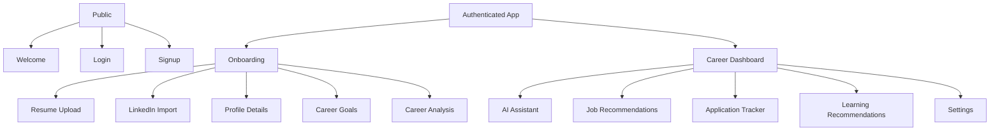

# MVP UI Sitemap

## Purpose

The MVP sitemap keeps the product small enough for one developer while preserving the feeling of an AI-first career operating system.

## Sitemap

## Screens

### Public

- Welcome
- Login
- Signup

### Onboarding

- Resume Upload
- LinkedIn Import
- Profile Details
- Career Goals
- Career Analysis Loading
- Career Analysis Result

### App

- Career Dashboard
- AI Assistant
- Job Recommendations
- Job Detail
- Application Tracker
- Application Detail
- Learning Recommendations
- Settings

## MVP Navigation

Primary navigation:

- Dashboard
- Jobs
- Applications
- Learning
- Assistant

Secondary navigation:

- Profile
- Settings
- Logout

## Excluded Screens

- Market Intelligence Hub
- AI Agent Workspace
- Voice interface
- Enterprise admin
- Billing
- Subscription management
- Recruiter simulation
- Salary negotiation
- Browser automation console
- Knowledge graph explorer

## UX Priority

The first screen after onboarding must be the Career Dashboard, not a generic chat page. The assistant should be visible as part of the operating system, but the dashboard should carry the product value through analysis, recommendations, jobs, learning, and applications.

