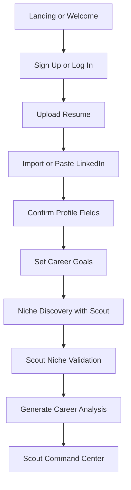
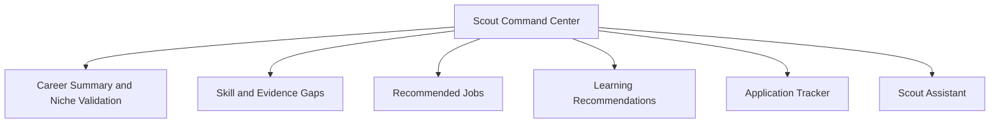
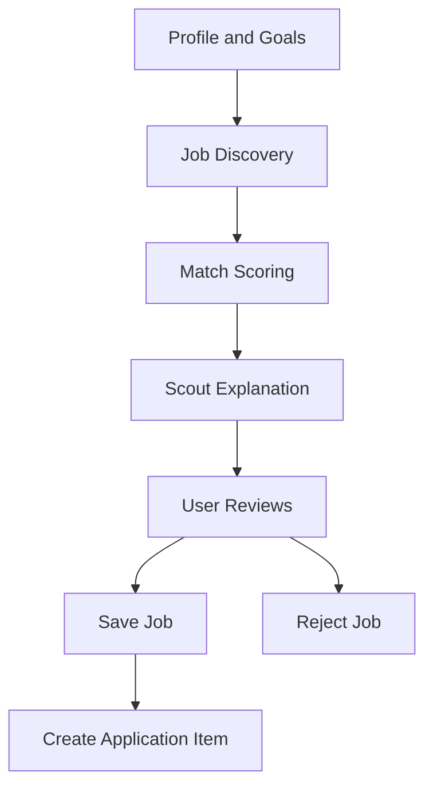
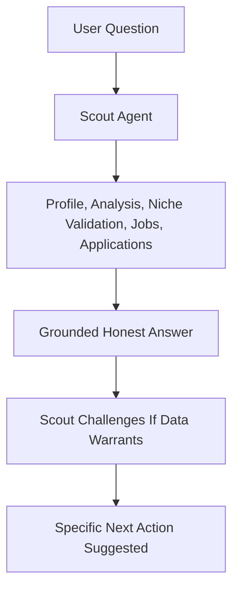
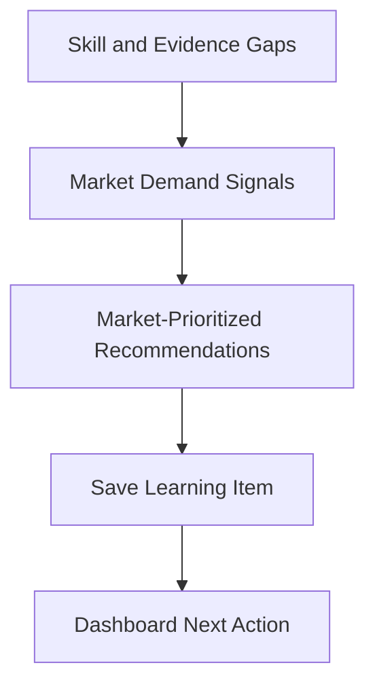
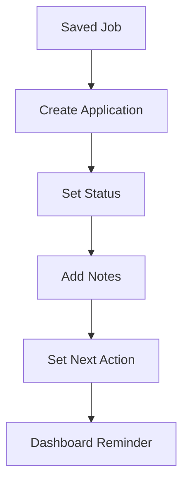

# MVP User Journeys

## Primary Users

The MVP serves individual professionals looking for career clarity, honest guidance, and practical next steps. The first 100 users can include job seekers, career switchers, graduates, early-career professionals, and experienced professionals considering a move.

Scout behaves differently for each stage. A fresh graduate gets guidance on building a first professional identity. A mid-career switcher gets a niche validation and bridge-building plan. An experienced professional gets strategic positioning intelligence. The underlying system is the same; the output is personalised.

## Journey 1: New User Activation

### Goal

Get the user from sign-up to first honest career analysis in one session.

### Flow

### Phase 1 Requirements

- User can sign up with email/password (Better Auth).
- User can upload PDF or DOCX resume.
- User can paste LinkedIn profile text or URL metadata.
- User can edit target role, location, salary expectation, skills, and industries.
- Scout conducts a niche discovery conversation and returns an honest assessment.
- User receives analysis with strengths, gaps, niche assessment, readiness score, and a prescribed next system.

### Success Metric

Career analysis with honest niche assessment generated within 15 minutes of sign-up.

## Journey 2: Scout Command Center Review

### Goal

Help the user understand their career status and Scout's recommended next actions.

### Flow

### Phase 1 Requirements

- Command center shows the user's current target role and niche assessment.
- Command center shows readiness score with evidence breakdown.
- Scout surfaces three to five recommended next actions with reasoning.
- Top job recommendations visible.
- Application tracker summary visible.

### Success Metric

User understands what to do next without asking support.

## Journey 3: Job Recommendation

### Goal

Show users jobs that feel meaningfully matched to their profile, with Scout's reasoning.

### Flow

### Phase 1 Requirements

- User can search jobs by role and location.
- Scout displays recommended jobs with match score.
- Each recommendation includes matched skills, missing skills, and Scout's explanation.
- User can save or reject a job.
- User can convert a saved job into an application tracker item.

### Success Metric

User saves at least one recommended job.

## Journey 4: Scout Career Assistant

### Goal

Let the user ask grounded career questions — including hard ones — and receive honest, evidence-based answers.

### Flow

### Phase 1 Requirements

- Scout answers career, resume, job targeting, learning, niche, and application tracking questions.
- Scout uses stored profile and career analysis context.
- Scout challenges user's direction when the available data supports doing so.
- Scout does not claim to submit applications or perform external actions.
- Scout suggests specific next actions inside CareerOS.

### Success Metric

User asks at least one Scout question after analysis. Bonus: user engages with a contrarian or challenging Scout response.

## Journey 5: Learning Recommendation

### Goal

Convert missing skills and evidence gaps into realistic, market-demand-prioritized learning actions.

### Flow

### Phase 1 Requirements

- Learning recommendations are generated from skill gaps, prioritized by available market demand data.
- Recommendations include title, provider, estimated effort, and reason tied to career goals.
- User can mark learning items as saved or completed.

### Success Metric

User saves or engages with at least one learning recommendation.

## Journey 6: Application Tracking

### Goal

Give users a simple place to manage applications with Scout's context.

### Flow

### Phase 1 Requirements

- User can create manual application entries.
- User can link entries to saved jobs.
- User can set status: saved, preparing, applied, interview, offer, rejected, withdrawn.
- User can add notes and next action.

### Success Metric

User tracks at least one application.
