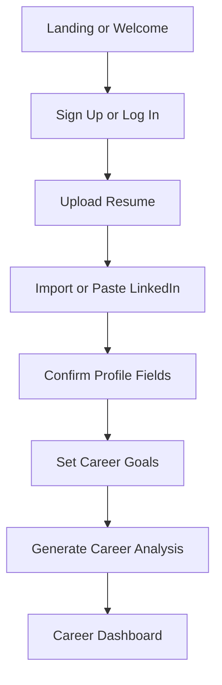
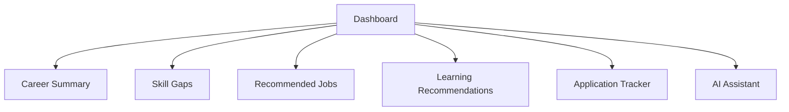
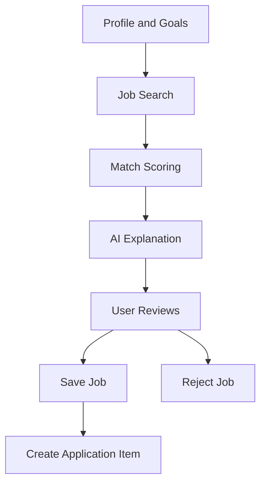
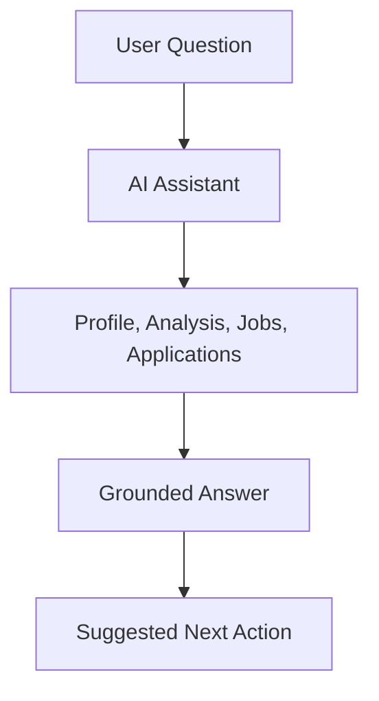
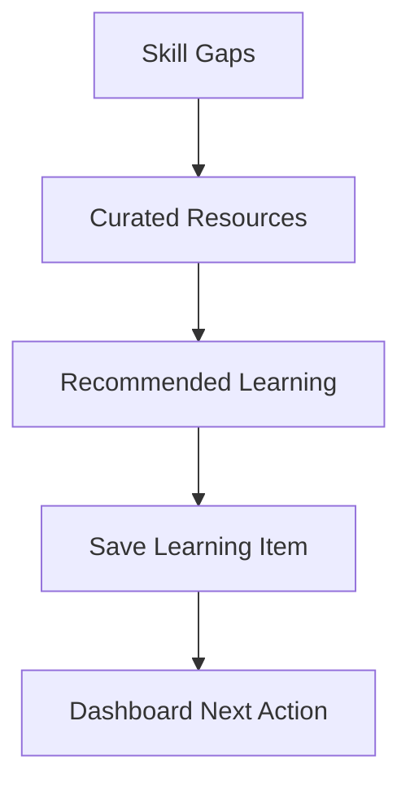
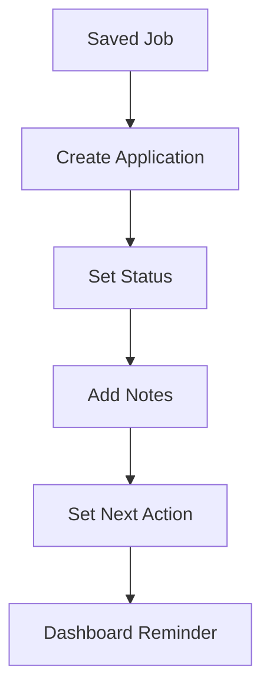

# MVP User Journeys

## Primary User

The MVP serves individual professionals looking for career clarity, better job targeting, and practical next steps. The first 100 users can include job seekers, career switchers, graduates, early-career professionals, and professionals exploring a move.

## Journey 1: New User Activation

### Goal

Get the user from signup to first useful career analysis in one session.

### Flow

### MVP Requirements

- User can sign up with email or Google.
- User can upload PDF or DOCX resume.
- User can paste LinkedIn profile text or URL metadata where available.
- User can edit target role, location, salary expectation, skills, and industries.
- User receives analysis with strengths, gaps, readiness score, and next actions.

### Success Metric

Career analysis generated within 10 minutes of signup.

## Journey 2: Career Dashboard Review

### Goal

Help the user understand their career status and next best actions.

### Flow

### MVP Requirements

- Dashboard shows current target role.
- Dashboard shows readiness score and explanation.
- Dashboard shows 3-5 recommended actions.
- Dashboard shows top job recommendations.
- Dashboard shows application tracker summary.

### Success Metric

User understands what to do next without asking support.

## Journey 3: Job Recommendation

### Goal

Show users jobs that feel meaningfully matched to their profile.

### Flow

### MVP Requirements

- User can search jobs by role and location.
- System can display recommended jobs.
- Each recommendation includes match score, matched skills, missing skills, and explanation.
- User can save or reject a job.
- User can convert a saved job into an application tracker item.

### Success Metric

User saves at least one recommended job.

## Journey 4: AI Career Assistant

### Goal

Let the user ask grounded career questions using their profile context.

### Flow

### MVP Requirements

- Assistant answers career, resume, job targeting, learning, and application tracking questions.
- Assistant uses stored profile and career analysis context.
- Assistant does not claim to submit applications or perform external actions.
- Assistant suggests actions inside the app.

### Success Metric

User asks at least one assistant question after analysis.

## Journey 5: Learning Recommendation

### Goal

Convert missing skills into realistic learning actions.

### Flow

### MVP Requirements

- Learning recommendations are generated from skill gaps.
- Recommendations include title, provider, estimated effort, and reason.
- User can mark learning item as saved or completed.

### Success Metric

User saves or completes at least one learning recommendation.

## Journey 6: Application Tracking

### Goal

Give users a simple place to manage applications.

### Flow

### MVP Requirements

- User can create manual application entries.
- User can link entries to saved jobs.
- User can set status: saved, preparing, applied, interview, offer, rejected, withdrawn.
- User can add notes and next action.

### Success Metric

User tracks at least one application.

