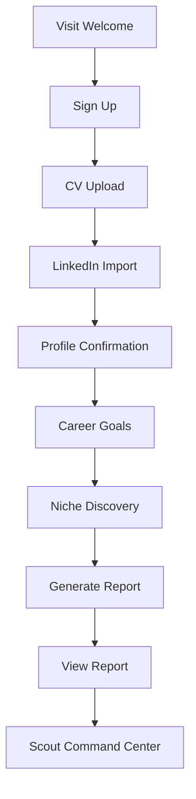

# Onboarding Funnel

## Purpose

The onboarding funnel gets a new user from curiosity to their first Scout Career Intelligence Report with the least friction possible — while ensuring Scout's honest-mentor identity comes through from the very first interaction.

## Funnel Steps



## Screen 1: Welcome

Goal:

- Explain what Scout is and what it will do. Start sign-up.

Wireframe:

```text
[CareerOS]
Scout — your career operating system.

[Scout speaks]
[3 specific value statements]
[Get started] [Log in]
```

Scout says:

> I will analyze your CV, LinkedIn profile, and career goals to build your first Career Intelligence Report. I will also be honest with you about your direction — including when the data tells a different story. Let's begin.

Primary CTA:

- Get started

Success metric:

- Welcome to sign-up conversion.

## Screen 2: Authentication

Goal:

- Create a durable account (Better Auth, email/password).

Wireframe:

```text
[Create your account]
[Email]
[Password]
[Create account]
[Already have an account? Log in]
```

Scout says:

> Your career profile needs a secure account so I can remember your goals, history, and market intelligence over time.

Success metric:

- Sign-up completion.

## Screen 3: CV Upload

Goal:

- Capture the highest-value career context quickly.

Wireframe:

```text
[Upload your CV]
[Drag and drop area]
[Upload button]
[Continue without CV]
[Privacy note]
```

Scout says before upload:

> Upload your CV and I will extract your experience, skills, education, and career signals. You can edit anything I get wrong.

Scout says after upload:

> I found your recent experience and key skills. Next, add LinkedIn context so I can compare how your public profile supports your CV.

Success metric:

- CV upload completion.

## Screen 4: LinkedIn Import

Goal:

- Add public professional positioning context.

Wireframe:

```text
[Add LinkedIn context]
[LinkedIn URL input]
[Paste profile text box]
[How to copy profile text — helper]
[Continue]
[Skip for now]
```

Scout says:

> LinkedIn helps me understand how you present yourself publicly. If direct import is unavailable, paste your profile text here and I will still use it.

After import:

> I added your LinkedIn context. I will now show the profile details I plan to use for your analysis.

Success metric:

- LinkedIn import, paste, or explicit skip.

## Screen 5: Profile Confirmation

Goal:

- Let the user correct Scout's inferences before analysis.

Wireframe:

```text
[Confirm your profile]
[Name]
[Current title]
[Current company]
[Location]
[Skills tags]
[Experience summary]
[Save and continue]
```

Scout says:

> Please review this carefully. I will treat your edits as more reliable than anything I inferred from your CV or LinkedIn profile.

Success metric:

- Profile confirmation completion.

## Screen 6: Career Goals

Goal:

- Focus the analysis and niche validation.

Wireframe:

```text
[What are you aiming for?]
[Target role]
[Preferred locations]
[Remote preference]
[Industries]
[Timeline]
[Salary expectation — optional]
[Continue to niche discovery]
```

Scout says:

> Your goals shape how I judge your readiness and how I validate your direction. A strong profile for one role may need entirely different evidence for another.

Success metric:

- Goal form completion.

## Screen 7: Niche Discovery and Validation

Goal:

- Have Scout honestly validate the stated direction with evidence — core to Scout's identity.

Wireframe:

```text
[Scout is checking your direction]

"Tell me more about what you mean by [stated role] — what draws you to it?"

[User input]

[Scout assessment result]
[Direction: Supported / Needs Context / Challenge]
[Evidence summary with source]
[Continue]
```

Scout says (processing):

> I am checking your stated direction against available market data for your geography and experience level.

Scout says (if supported):

> The data I have access to supports this direction. [Specific evidence]. Here is what the path actually looks like.

Scout says (if concerns):

> I want to give you honest context. [Market concern with evidence]. I am not saying abandon this path — I am making sure you have an accurate picture before you invest in it.

Success metric:

- Niche validation screen engaged with (user reads the result, does not skip).

## Screen 8: Analysis Generation

Goal:

- Maintain trust during the generation wait.

Wireframe:

```text
[Building your Career Intelligence Report]
Step 1: Reading CV
Step 2: Comparing LinkedIn profile
Step 3: Mapping your skills
Step 4: Checking market alignment
Step 5: Identifying evidence gaps
Step 6: Preparing your career system
```

Success metric:

- Report generation completion.

## Screen 9: Report Reveal

Goal:

- Deliver the honest-mentor moment.

Scout says:

> I have your first report. The most important thing I noticed is this: [specific, evidence-grounded insight]. This is your fastest lever.

Success metric:

- User reaches Scout command center or clicks a next action.

## Drop-Off Recovery

- If no CV: allow manual profile path with Scout narrating what is missing.
- If no LinkedIn: continue with CV and manual fields.
- If niche validation is challenged and user disagrees: Scout acknowledges and continues with the user's stated direction.
- If analysis fails: preserve inputs and allow retry.
- If user abandons before report: resume onboarding exactly where they left off.
